% SwiftUI Mastery: From Beginner to Senior Engineer
% A Complete Study & Reference Guide
% July 2026

\newpage

# Preface

This guide takes you from your first SwiftUI view to designing production architecture, writing testable code, optimizing performance, and confidently answering senior-level interview questions. It assumes basic Swift knowledge (types, optionals, closures, protocols) but no prior SwiftUI experience.

Every chapter follows the same teaching pattern: what a concept is, why it exists, how it works internally, when to use it, when not to, diagrams where useful, examples at increasing difficulty, common mistakes, and best practices. Code targets modern Swift and SwiftUI (iOS 17+ for the Observation framework and SwiftData; iOS 26/27 for the newest APIs discussed in Chapter 16), with legacy APIs clearly labeled wherever they appear, since you will encounter them in existing codebases and in interviews.

## How to Use This Guide

Read Chapters 1–11 in order if you are new to SwiftUI — each builds on the last. Chapters 12–19 can be read in any order once you have the fundamentals, and are meant to be revisited throughout your career, not read once. Chapter 20 (Interview Preparation) and Chapter 21 (Mini Projects) are designed for active practice: work through the projects yourself before reading the provided implementation. Chapter 22 is a living checklist — return to it before interviews or architecture reviews.

\newpage


# Chapter 1 — Introduction to SwiftUI

## 1.1 What Is SwiftUI?

SwiftUI is Apple's declarative framework for building user interfaces across every Apple platform: iOS, iPadOS, macOS, watchOS, tvOS, and visionOS. Instead of writing step-by-step instructions that build and mutate screen objects, you describe *what* the UI should look like for a given state, and the framework figures out *how* to make the screen match that description.

SwiftUI was introduced at WWDC 2019 and has been updated every year since. As of iOS 26 (2025) and iOS 27 (2026), SwiftUI is Apple's default recommendation for new app development, and it now powers large parts of Apple's own first-party apps (Settings, Reminders, Health, and more).

A single SwiftUI view is just a small piece of Swift code that conforms to the `View` protocol and returns a description of some UI:

```swift
struct WelcomeView: View {
    var body: some View {
        Text("Hello, SwiftUI!")
            .font(.title)
            .padding()
    }
}
```

Every line here is a *declaration*, not a command:
- `struct WelcomeView: View` — this creates a new type that can act as a piece of UI. Conforming to `View` requires one thing: a `body` property.
- `var body: some View` — this describes what the view looks like. `some View` means "some concrete type that conforms to `View`, but I'm not telling you which one." The compiler knows the real type; you don't need to.
- `Text("Hello, SwiftUI!")` — a value describing a piece of text. It is not "drawn" yet — it's a recipe.
- `.font(.title)` and `.padding()` — modifiers. Each one wraps the previous view in a new view value that adds behavior or styling.

## 1.2 Why Apple Created SwiftUI

Before SwiftUI, Apple UI development used UIKit (iOS) and AppKit (macOS) — imperative frameworks going back to the early 2000s (and NeXTSTEP before that). These frameworks work well but have a few structural problems that grew heavier over 15+ years of iOS development:

1. **State and UI drift apart.** In UIKit, the UI is a mutable object graph (`UIView`, `UILabel`, `UITableView`, ...) that you update by hand whenever your data changes. As apps grow, keeping "what's on screen" in sync with "what the data says" becomes a manual bookkeeping job, and bugs creep in whenever a code path forgets to update a label or reload a cell.
2. **Duplicate platforms.** UIKit and AppKit are similar but not shared. Supporting iOS and macOS from one codebase required either abstraction layers or fully separate UI code.
3. **Boilerplate.** Auto Layout constraints, delegate/data-source patterns, and manual cell registration all require a lot of code to express simple ideas.
4. **Hard-to-preview UI.** Without running the full app (or using Interface Builder, which has its own limits), you could not easily see what a screen looked like while editing code.

SwiftUI addresses all four: it ties UI directly to state (so the two cannot drift apart), it is one API across every Apple platform, it dramatically reduces boilerplate through declarative syntax, and Xcode Previews let you see UI changes in near real time without running the simulator.

## 1.3 Declarative vs. Imperative Programming

This is the single most important mental shift when moving from UIKit to SwiftUI.

**Imperative (UIKit style):** you write instructions for *how* to change the UI, step by step, and you are responsible for keeping the UI updated whenever state changes.

```swift
// UIKit — imperative
let label = UILabel()
label.text = "Count: 0"
view.addSubview(label)

@objc func increment() {
    count += 1
    label.text = "Count: \(count)"   // you must remember to do this
}
```

**Declarative (SwiftUI style):** you describe *what* the UI looks like as a function of state. When the state changes, SwiftUI re-invokes that function and updates only the parts of the screen that actually changed.

```swift
// SwiftUI — declarative
struct CounterView: View {
    @State private var count = 0

    var body: some View {
        Text("Count: \(count)")
            .onTapGesture { count += 1 }
    }
}
```

Notice there is no `label.text = ...` anywhere. You never mutate the screen directly. You mutate `count`, and SwiftUI recomputes `body` and diffs the result against what's currently on screen.

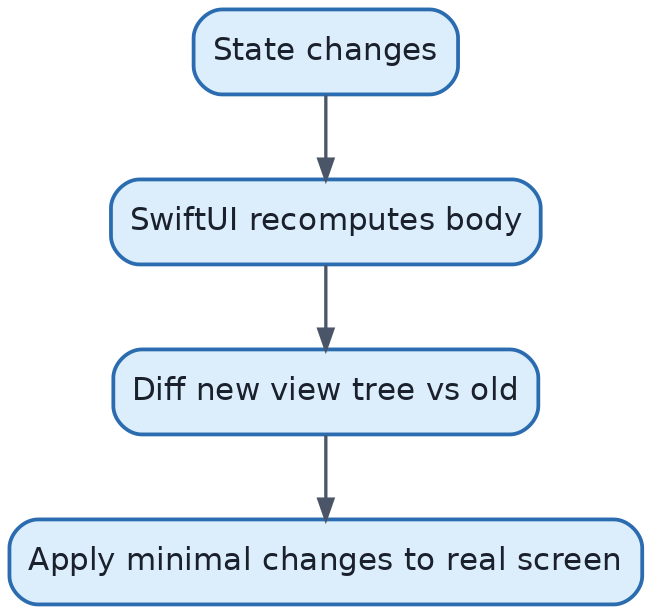{width=85%}

### Why this matters

- **Correctness by construction.** Because the UI is always derived from state, the "UI is stale" class of bugs mostly disappears.
- **Less code.** No delegates, no manual reload calls, no cell reuse bookkeeping for basic lists.
- **Testability.** `body` is a (mostly) pure function of state, so UI structure becomes easier to reason about and, indirectly, test.

The trade-off: declarative frameworks hide the "how," which means when something goes wrong (a view not updating, or updating too often), you need to understand SwiftUI's internal diffing model to debug it. That's covered in section 1.7 and revisited throughout the guide, especially Chapter 13 (Performance).

## 1.4 SwiftUI vs. UIKit — a First Look

| | UIKit | SwiftUI |
|---|---|---|
| Programming style | Imperative | Declarative |
| UI representation | Mutable class instances (`UIView` subclasses) | Immutable value types (`struct`s conforming to `View`) |
| State sync | Manual | Automatic |
| Cross-platform | iOS/iPadOS only (AppKit is separate for macOS) | One API for iOS, iPadOS, macOS, watchOS, tvOS, visionOS |
| Layout | Auto Layout constraints or frames | Declarative layout with stacks, grids, and a layout protocol |
| Preview | Storyboards / manual run | Live Xcode Previews |
| Minimum adoption | N/A (default until 2019) | iOS 13+, best experience iOS 16+ |
| Maturity | 15+ years, extremely stable | Actively evolving every year |

A full, detailed comparison (performance, navigation, animation, testing, scalability, enterprise usage) is in **Chapter 17**.

## 1.5 Benefits of SwiftUI

1. **Less code for the same result.** A list screen with sections, swipe actions, and search can be under 40 lines.
2. **Automatic support for accessibility, Dynamic Type, dark mode, and localization** in most built-in controls — you get these "for free" if you use standard components correctly.
3. **Live Previews** speed up UI iteration enormously, especially for designers working closely with engineers.
4. **One mental model across platforms.** A `NavigationStack` behaves consistently whether you compile for iPhone, iPad, or Mac.
5. **Built for structured concurrency and the Observation framework** — modern Swift concurrency (`async`/`await`, actors) fits naturally into SwiftUI's `.task` modifier.

## 1.6 Limitations of SwiftUI

Being honest about the limits is part of being a senior engineer:

1. **API gaps.** Some UIKit capabilities (fine-grained scroll control, certain camera/AV integrations, complex custom text layout) still require dropping down to UIKit via `UIViewRepresentable`.
2. **Behavior changes across OS versions.** SwiftUI's internals change yearly; a layout quirk fixed in iOS 17 may still be present if you support iOS 15.
3. **Debugging can be less transparent.** Because you don't control exactly when `body` is called, or exactly which properties trigger a re-render, some performance bugs are harder to trace than an equivalent UIKit bug.
4. **Backward compatibility burden.** If your app supports several iOS versions, you often need `if #available` branches for newer APIs (`NavigationStack` needs iOS 16+, for example).
5. **Some UI is still easier in UIKit,** especially highly custom scrolling/paging experiences or apps that need pixel-perfect control over animation timing curves frame-by-frame.

Chapter 17 covers concrete situations where UIKit is still the right tool.

## 1.7 The SwiftUI Rendering System (How It Actually Works)

Understanding the render loop is what separates someone who "uses" SwiftUI from someone who understands it.

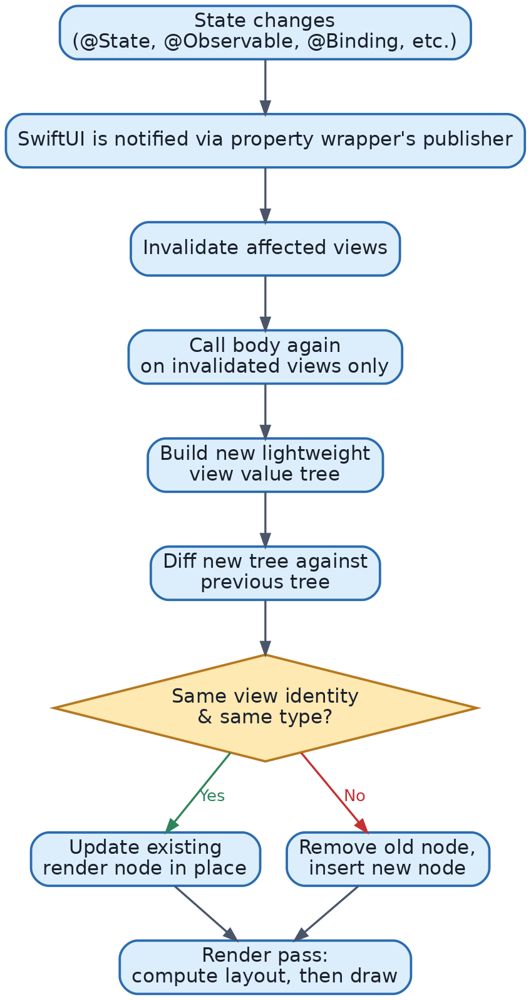{width=85%}

Key facts about this pipeline:

1. **Views are cheap value types, not the actual pixels on screen.** A `Text("Hi")` struct is just a small value describing intent. SwiftUI maintains a separate, persistent tree of render nodes ("attribute graph") behind the scenes; your `View` structs are re-created constantly and thrown away.
2. **`body` can be called far more often than you'd expect,** and that is by design and cheap — because `View` structs are lightweight, recomputing them is fast. What is expensive is unnecessary *layout and drawing* work, which SwiftUI tries to avoid via diffing.
3. **Diffing relies on view *identity*, not just equality.** SwiftUI decides whether an old and new view represent "the same conceptual view over time" (so it should animate/update it) or "a different view" (so it should remove the old and insert the new). This is the concept of **View Identity**, explored fully in Chapter 2.6 and Chapter 13.
4. **Only invalidated subtrees are recomputed.** If a `@State` variable changes in a leaf view, SwiftUI does not recompute the entire app's view tree — it recomputes the smallest subtree that depends on that piece of state.
5. **The actual drawing engine is Core Animation (on Apple platforms).** SwiftUI translates its internal render tree into layer updates, similar to how UIKit does, which is why SwiftUI and UIKit can interoperate (`UIViewRepresentable`, `UIHostingController`).

### A concrete walkthrough

```swift
struct CounterView: View {
    @State private var count = 0

    var body: some View {
        VStack {
            Text("Count: \(count)")
            Button("Increment") { count += 1 }
        }
    }
}
```

When the button is tapped:
1. `count += 1` mutates the value inside the `@State` property wrapper's storage (which lives outside the `CounterView` struct itself, in SwiftUI-managed storage).
2. The property wrapper announces "something changed" to the SwiftUI runtime.
3. SwiftUI marks `CounterView`'s body as needing recomputation.
4. `body` runs again, producing a new `VStack` value containing a new `Text` value and the same `Button` value.
5. SwiftUI diffs: the `VStack` is still a `VStack` (same identity, same position in the tree) → update in place. The `Text` changed its string → update the rendered text. The `Button`'s label and action are unchanged → no visual update needed there.
6. Only the label's text layer is redrawn; the rest of the screen is untouched.

## 1.8 When to Use SwiftUI vs. UIKit (Practical Guidance)

- **New apps in 2026:** default to SwiftUI. Use `UIViewRepresentable`/`UIViewControllerRepresentable` for the few gaps.
- **Existing large UIKit app:** adopt SwiftUI incrementally — new screens in SwiftUI hosted inside UIKit via `UIHostingController`, rather than a risky full rewrite.
- **Heavy custom drawing/scrolling/video** (camera apps, custom video editors): UIKit or a mix, since you get lower-level control.
- **Small-to-medium apps, forms, settings screens, most product apps:** SwiftUI is faster to build and maintain.

## Common Mistakes (Chapter 1)

1. **Treating a `View` struct as "the UI on screen."** It's a description, recreated many times per second; don't be afraid of "creating" views cheaply, and don't try to hold on to a `View` instance as if it were a live object.
2. **Assuming `body` runs only once.** It can run many times; code inside `body` should be cheap and side-effect-free (no network calls, no heavy computation directly inside `body`).
3. **Expecting immediate imperative control** (e.g., trying to call a method to "refresh the screen now"). In SwiftUI you change state and trust the diffing engine.

## Best Practices (Chapter 1)

- Think in terms of "UI = f(state)" for every screen you build.
- Keep `body` implementations declarative and side-effect-free; push logic into models, view models, or modifiers like `.task`/`.onChange`.
- Learn to read SwiftUI's rendering model early — it pays off in every later chapter, especially Performance (Ch. 13) and State Management (Ch. 4).


# Chapter 2 — SwiftUI Fundamentals

## 2.1 Views

**What it is.** A `View` in SwiftUI is any type conforming to the `View` protocol, which requires only an associated `body` that itself returns `some View`. Views are structs (value types), not classes.

**Why it exists.** Value-type views are cheap to create and destroy, safe to compare, and easy to compose — you can nest, wrap, and combine them freely without worrying about shared mutable state or reference cycles.

**How it works internally.** The `View` protocol looks roughly like this:

```swift
protocol View {
    associatedtype Body: View
    @ViewBuilder var body: Self.Body { get }
}
```

The `@ViewBuilder` attribute is a **result builder** — special compiler support that lets you write multiple statements/expressions inside `body` and have them combined into a single composite view (e.g., turning a sequence of views into a tuple view, or handling `if`/`else` branches into a conditional view type). This is why you can write:

```swift
var body: some View {
    Text("Top")
    Text("Bottom")   // no comma, no array — @ViewBuilder stitches these together
}
```

**When to use it.** Every screen and every reusable piece of UI should be its own `View` type. Favor small, focused views over one giant `body`.

**When NOT to use it.** Don't create a `View` for things that aren't actually UI (e.g., a pure data transformation) — that belongs in a plain function or model type.

### Beginner example
```swift
struct Greeting: View {
    var name: String
    var body: some View {
        Text("Hello, \(name)!")
    }
}
```

### Intermediate example
```swift
struct ProfileCard: View {
    let username: String
    let bio: String

    var body: some View {
        VStack(alignment: .leading, spacing: 4) {
            Text(username).font(.headline)
            Text(bio).font(.subheadline).foregroundStyle(.secondary)
        }
        .padding()
        .background(.thinMaterial, in: RoundedRectangle(cornerRadius: 12))
    }
}
```
Line-by-line: `VStack(alignment: .leading, spacing: 4)` stacks children vertically, left-aligned, 4pt apart. `.foregroundStyle(.secondary)` applies a semantic (adaptive) color instead of a hardcoded one. `.background(.thinMaterial, in:)` draws a translucent material clipped to a rounded rectangle — one line replacing what would be several `CALayer` configuration calls in UIKit.

### Real-world example
A reusable `SectionHeader` view used across a settings screen, a profile screen, and a store screen — write once, parameterize with a title and optional trailing action, and reuse everywhere. This is the composition mindset SwiftUI encourages: build a vocabulary of small views, then assemble screens from them.

## 2.2 Modifiers

**What it is.** A modifier is a method (usually on `View`) that takes an existing view and returns a *new* view wrapping it with additional behavior or styling — `.padding()`, `.font()`, `.background()`, `.onTapGesture()`, etc.

**Why it exists.** Instead of a giant configuration object with dozens of optional properties (as in UIKit, where a `UILabel` has dozens of settable properties), SwiftUI composes behavior through chained wrapper types. Each modifier is its own small, focused, reusable piece.

**How it works internally.** `.padding()` doesn't mutate `Text`; it returns a new value of a different type, e.g., `ModifiedContent<Text, _PaddingLayout>`. Every modifier call adds one more layer to a tree of nested generic types. This is why view types in SwiftUI can look intimidating when you hover over `some View` in Xcode — under the hood it might be `ModifiedContent<ModifiedContent<Text, _PaddingLayout>, _BackgroundStyleModifier<...>>`. You never need to write that type out yourself; `some View` hides it.

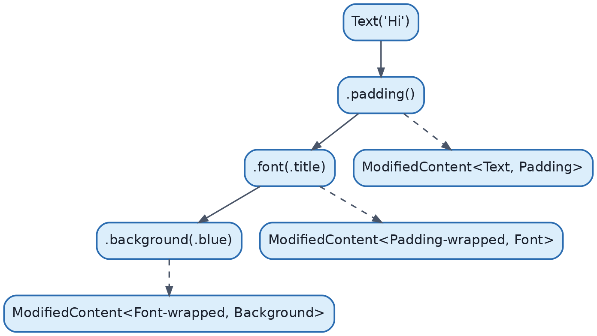{width=85%}

**Order matters.** Because each modifier wraps the previous result, applying modifiers in a different order produces a different final view.

```swift
Text("Hi").padding().background(.red)   // padding is inside the red background (red box bigger)
Text("Hi").background(.red).padding()   // red background is only behind the text, padding adds space outside it
```

**When to use it.** Always — modifiers are the primary way you configure views.

**When NOT to use it.** Avoid chaining dozens of modifiers directly in a screen's `body`; extract a custom `ViewModifier` (section below) or a helper view when a combination of modifiers repeats across your app.

### Custom ViewModifier (intermediate example)
```swift
struct CardStyle: ViewModifier {
    func body(content: Content) -> some View {
        content
            .padding()
            .background(.thinMaterial, in: RoundedRectangle(cornerRadius: 12))
            .shadow(radius: 2)
    }
}

extension View {
    func cardStyle() -> some View { modifier(CardStyle()) }
}

// Usage
Text("Reusable card").cardStyle()
```
This is a best practice for design-system consistency: define styling once, apply everywhere with `.cardStyle()`.

## 2.3 View Hierarchy

**What it is.** The nested structure of views forming a screen — a tree, with container views (like `VStack`) as branches and leaf views (like `Text`, `Image`) as leaves.

**Why it exists.** UI is naturally hierarchical (a screen contains sections, which contain rows, which contain labels). SwiftUI's tree mirrors this directly in code structure, unlike UIKit's separate view hierarchy (`addSubview`) and layout hierarchy (constraints).

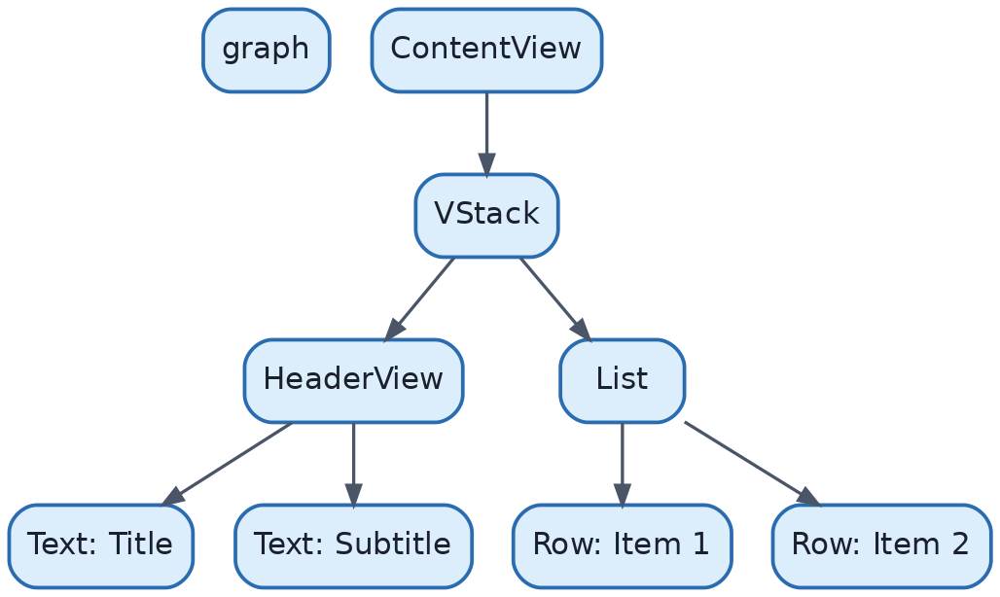{width=85%}

**How it works internally.** SwiftUI maintains this tree as an internal data structure sometimes called the "attribute graph." Every node knows its dependencies (which state it reads) so invalidation can be targeted precisely — a change deep in `Row2` does not require recomputing `Header`.

**When to use it / when not to.** You don't choose to use a hierarchy — every SwiftUI app has one. The skill is keeping it shallow and well-organized: extract subviews once nesting gets deep (more than ~4-5 levels in one `body` is a sign to refactor).

## 2.4 The `body` Property

**What it is.** The single required property of `View`. It's a *computed* property, not a stored one — it has no backing storage; it's recomputed on demand.

**Why it exists.** It's the seam between "your description of the UI" and "SwiftUI's rendering engine." Every time SwiftUI decides a view might need updating, it re-invokes `body`.

**How it works internally.** `body` is called by the SwiftUI runtime, not by your code. You never call `someView.body` yourself. The runtime tracks which `@State`/`@Observable`/`@Environment` properties were *read* while `body` ran last time; if any of those change, `body` is scheduled to run again.

**When NOT to use it.** Never put expensive computation, networking, or logging with side effects directly inside `body` — since it can run many times, side effects there can fire unpredictably and repeatedly. Use `.onAppear`, `.task`, or a view model for that logic instead.

### Common mistake
```swift
// BAD: expensive work runs every time body is recomputed
var body: some View {
    let sorted = hugeArray.sorted()   // recalculated on every re-render!
    List(sorted) { ... }
}
```
```swift
// GOOD: compute once, store as state or in the model
@State private var sorted: [Item] = []
var body: some View {
    List(sorted) { ... }
        .task { sorted = hugeArray.sorted() }
}
```

## 2.5 The Layout System (Overview)

SwiftUI layout is a **negotiation between parent and child**, not fixed frames:

1. A parent proposes a size to each child ("here's how much space you *could* use").
2. Each child responds with the size it actually wants, given that proposal.
3. The parent positions children based on their reported sizes and its own layout rules (e.g., `VStack` stacks children top-to-bottom and centers them horizontally by default).

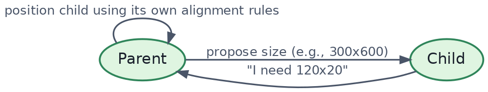{width=85%}

This two-pass negotiation (propose → report) repeats recursively down the tree and is why SwiftUI layout adapts naturally to Dynamic Type, different screen sizes, and rotation — every view answers "how big do I need to be" fresh, every time. Chapter 3 covers this in full depth, including custom layouts via the `Layout` protocol.

## 2.6 Containers

**What they are.** Views whose job is to arrange other views: `VStack`, `HStack`, `ZStack`, `List`, `ScrollView`, `Grid`, `Form`, `NavigationStack`, etc.

**Why they exist.** Composability — instead of one framework doing all layout math, small container types each implement one layout algorithm, and you nest them to build arbitrarily complex arrangements.

**When to use which** is the subject of Chapter 3 in detail.

## 2.7 View Identity

**What it is.** *Identity* answers the question: "Is this new view value, produced by the latest `body` call, the same conceptual view as one that existed before (so it should be updated/animated), or a different view (so the old one should be removed and a new one inserted)?"

**Why it exists.** SwiftUI needs identity to know what to animate, what state to preserve (e.g., a `TextField`'s cursor position, a `@State` variable inside a child view), and what to throw away.

**How it works internally.** SwiftUI uses two forms of identity:

1. **Structural (implicit) identity** — based on the view's *type* and its *position* in the view tree (its "path" through parent containers, conditionals, and loops). Two views of the same type in the same structural position across two `body` calls are treated as the same view.
2. **Explicit identity** — supplied by you via `.id(_:)` or by conforming to `Identifiable` and providing stable `id`s in a `ForEach`.

```swift
// Structural identity: switching between these two Text views
// in an if/else DESTROYS and RECREATES state, because the type
// changes structurally even though both are `Text`.
if isEditing {
    TextField("Name", text: $name)   // one type in this branch
} else {
    Text(name)                      // different type in this branch
}
```

```swift
// Explicit identity in a list — CRITICAL for correctness
ForEach(items) { item in         // items: [Item] where Item: Identifiable
    ItemRow(item: item)
}
```
If `id` values aren't stable (e.g., using array index as `id` when the array can reorder), SwiftUI may reuse rows for the wrong data, causing state (like which row is expanded) to jump to the wrong item.

**When to use `.id()` explicitly.** Force a full reset of a subview's internal state (e.g., resetting a form when switching between two different users):

```swift
UserFormView(user: user)
    .id(user.id)   // new id -> SwiftUI treats it as a brand-new view, discarding old @State
```

**When NOT to use it.** Don't sprinkle `.id()` everywhere as a "fix" for animation glitches without understanding why — it can cause views to reset state and lose animations unexpectedly, and it can hurt performance since it forces teardown/rebuild instead of an in-place update.

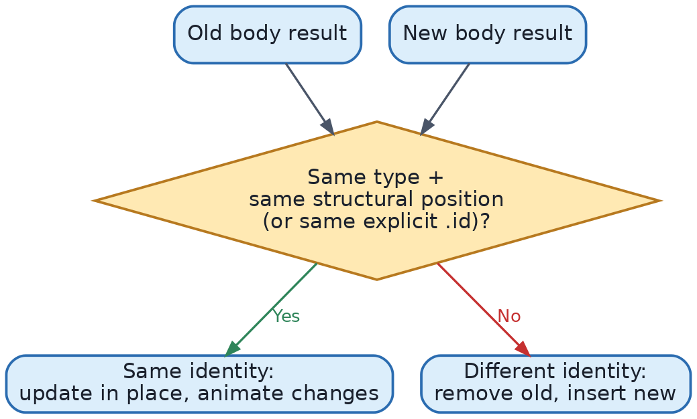{width=85%}

## Common Mistakes (Chapter 2)

1. **Using array index as `id` in `ForEach`** when items can be inserted/removed/reordered — causes state to attach to the wrong row.
2. **Putting side effects in `body`.**
3. **Over-nesting modifiers/views in one giant `body`** instead of extracting subviews — hurts readability and can hurt compiler type-checking time.
4. **Misunderstanding `some View`** as "any View" — it actually means a single, specific (but hidden) concrete type; a function using `some View` must always return the *same* concrete type from every return path.

## Best Practices (Chapter 2)

- Give `ForEach`/`List` data stable, meaningful `Identifiable` conformance — never index-based identity for mutable collections.
- Extract subviews aggressively; small views are easier to read, test, and preview.
- Reach for custom `ViewModifier`s once a modifier chain repeats 2–3 times.
- Reserve `.id()` for deliberate "reset this subtree" situations, not as a generic animation fix.


# Chapter 3 — The Layout System

## 3.1 VStack, HStack, ZStack

**What they are.** The three basic stacking containers: `VStack` arranges children top-to-bottom, `HStack` arranges children left-to-right, `ZStack` layers children back-to-front on top of each other.

**Why they exist.** Almost all UI can be decomposed into rows, columns, and overlays. These three primitives, composed recursively, can express the overwhelming majority of app layouts without needing constraint math.

**How they work internally.** Each stack proposes a size to its children based on the stack's own proposed size, an even split adjusted for children with fixed/intrinsic sizes, then positions children according to `alignment` and `spacing`. `VStack`/`HStack` divide space along their primary axis; `ZStack` gives every child the full proposed size and aligns them per the `alignment` parameter (default `.center`).

```swift
VStack(alignment: .leading, spacing: 8) {
    Text("Title").font(.title)
    Text("Subtitle").font(.subheadline)
}

HStack {
    Image(systemName: "star.fill")
    Text("Favorite")
}

ZStack(alignment: .bottomTrailing) {
    Color.blue.frame(width: 100, height: 100)
    Text("Badge").padding(4).background(.red)
}
```

**When to use / not use.** Use stacks for anything with a clear linear or layered structure. Avoid deeply nested stacks (`VStack` inside `HStack` inside `VStack`...) when a `Grid` (3.7) would express the same layout more clearly.

## 3.2 Spacer

**What it is.** An invisible view that expands to fill available space along its container's primary axis, pushing sibling views apart.

**How it works.** `Spacer` has the lowest layout priority by default — it takes whatever space is left over after siblings report their desired sizes.

```swift
HStack {
    Text("Left")
    Spacer()
    Text("Right")
}
```
This pins "Left" to the leading edge and "Right" to the trailing edge, with `Spacer` consuming everything in between.

**When NOT to use it.** Inside a `ScrollView`'s scrolling axis, a `Spacer` has no bounded space to expand into and effectively becomes zero-size — use fixed spacing (`Spacer(minLength:)` won't help you push content off-screen there either). For scrollable content, use explicit spacing or padding instead.

## 3.3 Divider

A thin visual line (`Divider()`) that automatically orients itself perpendicular to its container's axis — horizontal in a `VStack`, vertical in an `HStack`. Used for lightweight visual separation without needing a `Rectangle` and manual sizing.

## 3.4 ScrollView

**What it is.** A container that allows content larger than the screen to scroll, along one or both axes (`.vertical`, `.horizontal`, `[.vertical, .horizontal]`).

**How it works internally.** `ScrollView` gives its content the size it *wants* (essentially unbounded along the scroll axis) rather than clipping it to screen bounds, then manages an offset and clips visually. Critically: a plain `ScrollView` with a `VStack` inside **builds every child eagerly**, even off-screen ones — that's why large lists use `LazyVStack` instead (3.8).

```swift
ScrollView {
    VStack(spacing: 12) {
        ForEach(items) { item in ItemRow(item: item) }
    }
    .padding()
}
```

## 3.5 Grid (iOS 16+)

**What it is.** `Grid` arranges children in rows and columns with per-column alignment, similar to a lightweight table layout, and unlike `LazyVGrid`, it loads all content eagerly and can align across rows (e.g., matching column widths across different `GridRow`s).

```swift
Grid(alignment: .leading, horizontalSpacing: 12, verticalSpacing: 8) {
    GridRow {
        Text("Name").bold()
        Text("Score").bold()
    }
    GridRow {
        Text("Alice")
        Text("92")
    }
    GridRow {
        Text("Bob")
        Text("85")
    }
}
```
Here, `Grid` automatically aligns the "Name" column widths across rows — something `VStack`+`HStack` combinations cannot do without manual width management.

**When to use.** Small, known-size tabular data (settings rows, comparison tables, forms). Not for large or dynamically-sized collections — use lazy grids for that.

## 3.6 LazyVStack / LazyHStack

**What they are.** Stack containers that only create and lay out children as they approach the visible scroll area, instead of all at once.

**Why they exist.** A plain `VStack` inside a `ScrollView` with 10,000 rows would instantiate all 10,000 child views immediately — extremely wasteful. `LazyVStack`/`LazyHStack` solve this by deferring child creation.

```swift
ScrollView {
    LazyVStack(spacing: 0) {
        ForEach(hugeArray) { item in
            ItemRow(item: item)
        }
    }
}
```

**Trade-off:** because children are created lazily, `LazyVStack` cannot compute things that require knowing every child's size up front (like perfectly matching column widths in a `Grid`). It also means `.onAppear`/`.onDisappear` fire as rows scroll in/out, which is useful for pagination but must be written carefully to avoid redundant work.

**When to use / not use.** Use lazy stacks for any list-like content with more than a screenful of items. Use plain stacks for small, fixed content (headers, toolbars, forms with under ~20 elements) where eager layout is actually simpler and slightly faster to reason about.

## 3.7 Lazy Grids: LazyVGrid / LazyHGrid

**What they are.** Grid layouts (like a photo gallery) that create items lazily, defined by an array of `GridItem` describing each column's (or row's) sizing rule.

```swift
let columns = [
    GridItem(.flexible()),
    GridItem(.flexible()),
    GridItem(.flexible())
]

ScrollView {
    LazyVGrid(columns: columns, spacing: 12) {
        ForEach(photos) { photo in
            PhotoThumbnail(photo: photo)
        }
    }
}
```
`GridItem(.flexible())` means "divide remaining space evenly among all flexible columns." Other options: `.fixed(100)` (exact width), `.adaptive(minimum: 80)` (as many columns as fit, each at least 80pt — great for responsive photo grids across device sizes).

## 3.8 Custom Layout (the `Layout` protocol, iOS 16+)

**What it is.** A protocol that lets you write your own layout algorithm — the same low-level mechanism `VStack`/`HStack`/`Grid` are built on.

**Why it exists.** Some UIs (flow layouts / wrapping tag clouds, circular arrangements, custom masonry grids) don't fit any built-in container. Before iOS 16, achieving this required `GeometryReader` hacks; the `Layout` protocol makes it a first-class, reusable, and *lazy-compatible* solution.

**How it works internally.** You implement two methods:
```swift
struct FlowLayout: Layout {
    var spacing: CGFloat = 8

    func sizeThatFits(proposal: ProposedViewSize, subviews: Subviews, cache: inout ()) -> CGSize {
        // Compute total size needed, given the proposal, by simulating wrapping.
        let width = proposal.width ?? .infinity
        var x: CGFloat = 0, y: CGFloat = 0, rowHeight: CGFloat = 0
        for subview in subviews {
            let size = subview.sizeThatFits(.unspecified)
            if x + size.width > width { x = 0; y += rowHeight + spacing; rowHeight = 0 }
            x += size.width + spacing
            rowHeight = max(rowHeight, size.height)
        }
        return CGSize(width: width, height: y + rowHeight)
    }

    func placeSubviews(in bounds: CGRect, proposal: ProposedViewSize, subviews: Subviews, cache: inout ()) {
        var x = bounds.minX, y = bounds.minY, rowHeight: CGFloat = 0
        for subview in subviews {
            let size = subview.sizeThatFits(.unspecified)
            if x + size.width > bounds.maxX { x = bounds.minX; y += rowHeight + spacing; rowHeight = 0 }
            subview.place(at: CGPoint(x: x, y: y), proposal: .unspecified)
            x += size.width + spacing
            rowHeight = max(rowHeight, size.height)
        }
    }
}
```
`sizeThatFits` answers "how big do I need to be, given this proposal" (participating in the propose/report negotiation from Ch. 2.5). `placeSubviews` actually positions each child. Because this conforms to the same protocol SwiftUI's built-ins use, your custom layout gets animatable transitions between layouts for free (e.g., animating between a `FlowLayout` and a `VStack` using `AnyLayout`).

**When to use.** Genuinely custom arrangements not covered by stacks/grids — tag clouds, radial menus, masonry grids.
**When NOT to use.** Don't reach for `Layout` if a `Grid`/`LazyVGrid`/stack combination already expresses what you need — it's more code and more responsibility (you own the math).

## 3.9 Layout Priority

**What it is.** A hint (`.layoutPriority(_:)`) telling a stack which children should get first claim on available space when there isn't enough room for everyone's ideal size. Default priority is 0; higher numbers get space first.

```swift
HStack {
    Text("A very long piece of text that might get truncated")
        .layoutPriority(1)
    Text("Short")
}
```
Without the priority, both `Text` views might get squeezed evenly, truncating both. With priority 1, the long text gets first claim on space, and "Short" shrinks/wraps first if needed.

**When to use.** Anytime siblings compete for space and you have a clear intent about which should be preserved (e.g., a label vs. a value in a settings row).

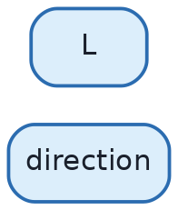{width=85%}

## Common Mistakes (Chapter 3)

1. Using a plain `VStack` + `ScrollView` for a list of hundreds/thousands of items instead of `LazyVStack` or `List` — causes slow initial render and memory bloat.
2. Using `Spacer()` inside a `ScrollView`'s scroll axis expecting it to push content off screen — it collapses to near-zero because there's no bounded space to expand into.
3. Reaching for `GeometryReader` for simple proportional sizing when a `Grid`/stack + `.frame(maxWidth: .infinity)` would do it more simply and with fewer layout side effects (`GeometryReader` takes all available space by default and can cause surprising layout issues).
4. Forgetting `.id()` correctness inside `ForEach` within lazy stacks/grids — same identity pitfalls as Chapter 2.7, but consequences are worse because rows are recycled more aggressively.

## Best Practices (Chapter 3)

- Default to `List` for scrolling collections with standard row/section semantics (Ch. 6); reach for `LazyVStack`/`LazyVGrid` when you need a fully custom look `List` can't achieve.
- Use `Grid` for small, aligned tabular layouts; use lazy grids for large, scrollable galleries.
- Reserve custom `Layout` implementations for genuinely custom arrangements; test them at multiple Dynamic Type sizes.
- Use `.layoutPriority` deliberately in `HStack`s that mix labels and values of unpredictable length.


# Chapter 4 — State Management

State management is the most important topic in this entire guide. Nearly every SwiftUI bug and interview question traces back to a misunderstanding of one of these property wrappers.

## 4.1 The Core Idea: State Ownership and Data Flow

**What it is.** "State" is any value that, when it changes, should cause part of the UI to update. SwiftUI's property wrappers each answer two questions differently: *who owns this piece of state* (where does the source of truth actually live), and *how does a view get notified when it changes*.

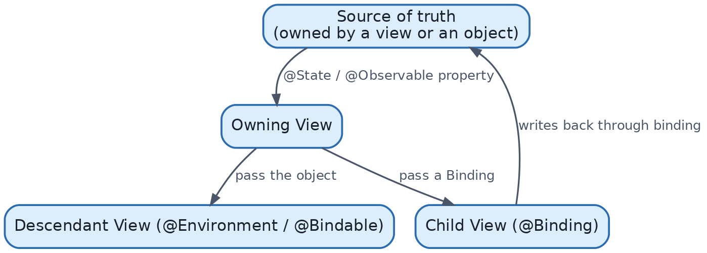{width=85%}

**Why this matters.** Get ownership wrong and you get one of two classic bugs: (1) two views each think they own the truth and drift out of sync, or (2) a view holds a *copy* of data instead of a *reference/binding* to it, so edits silently vanish.

## 4.2 @State

**What it is.** A property wrapper for simple, value-type state that is *owned by the view itself* — local, private, transient UI state.

**Why it exists.** Structs can't have "self-mutating" stored properties survive across `body` recomputation the way you'd expect, because a `View` struct is recreated on every re-render. `@State` solves this by storing the actual value in memory *managed by SwiftUI*, outside the view struct, and only handing the view a reference to it.

**How it works internally.** As of recent Swift/SwiftUI releases, `@State` is implemented as a property wrapper (and, since a recent SwiftUI update, partially macro-based) that allocates persistent storage tied to the view's identity in the tree — not to the struct instance. When the view struct is thrown away and recreated (as happens constantly), SwiftUI looks up the *same* persistent storage using the view's position/identity, so the value survives.

```swift
struct CounterView: View {
    @State private var count = 0   // owned here, persists across re-renders

    var body: some View {
        VStack {
            Text("Count: \(count)")
            Button("Increment") { count += 1 }
        }
    }
}
```

**When to use.** Local, view-owned, transient UI state: a toggle's on/off value, text field content local to a form, whether a sheet is presented, an animation flag.

**When NOT to use.** Never use `@State` for data that needs to be shared across unrelated views, or data that represents your app's actual business/domain model (that belongs in an `@Observable` model, Section 4.4). Always mark `@State` properties `private` — they are implementation details of the view that owns them.

**Memory implications.** The value lives as long as the view's identity persists in the tree. When the view is removed (e.g., popped off a navigation stack, or its `if` branch stops being true), its `@State` storage is released.

## 4.3 @Binding

**What it is.** A two-way reference to state owned by *someone else* — a `Binding<T>` lets a child view read and write a value without owning it.

**Why it exists.** Child views often need to mutate a parent's state (a custom toggle component, a text field wrapped in a validation view) without becoming the owner — ownership should stay in one place (Section 4.1).

**How it works internally.** A `Binding` is a small struct holding a `get` closure and a `set` closure. `$count` (the dollar-sign prefix on a `@State` property) produces a `Binding<Int>` whose `get`/`set` read and write the original `@State` storage directly — not a copy.

```swift
struct ParentView: View {
    @State private var isOn = false
    var body: some View {
        CustomToggle(isOn: $isOn)   // pass a Binding, not the Bool itself
    }
}

struct CustomToggle: View {
    @Binding var isOn: Bool   // does not own the value
    var body: some View {
        Button(isOn ? "ON" : "OFF") { isOn.toggle() }
    }
}
```
Explanation: `$isOn` creates the binding; `CustomToggle` mutates `isOn.toggle()`, which calls the binding's `set` closure, which writes back into `ParentView`'s `@State` storage, which triggers `ParentView`'s `body` to recompute.

**When to use.** Any reusable component (custom controls, form fields) that needs to both read and mutate a value it doesn't own.

**When NOT to use.** Don't use `@Binding` to pass read-only data down — just pass the plain value. Bindings imply "I can write back," which is a real API contract; don't offer it if the child never writes.

## 4.4 @Observable (Modern Observation, iOS 17+)

**What it is.** A macro (`@Observable`) you apply to a reference type (`class`) to make its properties automatically trackable by SwiftUI, without wrapping each property individually.

**Why it exists.** This is Apple's modern replacement for `ObservableObject` + `@Published` (Section 4.7). The old system published a change notification whenever *any* `@Published` property changed, forcing every view observing the object to recompute, even if it only read one unrelated property. `@Observable` tracks property access **per-property**, so a view only recomputes if a property it actually *read* changes.

**How it works internally.** The `@Observable` macro rewrites your class at compile time, adding storage and access tracking to every stored property. When a SwiftUI view reads `model.username` inside `body`, the runtime records "this view depends on `username`." When `username` later changes, only views that read it are invalidated — a view that only reads `model.email` is left alone.

```swift
@Observable
class UserProfile {
    var username: String = ""
    var email: String = ""
    var isVerified: Bool = false
}

struct ProfileView: View {
    let profile: UserProfile   // no property wrapper needed to observe it

    var body: some View {
        Text(profile.username)   // this view re-renders only when `username` changes
    }
}
```
Note: `ProfileView` doesn't need `@ObservedObject` or any wrapper at all — plain property access is automatically tracked because `UserProfile` itself is `@Observable`. This is a major simplification vs. the legacy system.

**When to use.** Any shared, reference-type model: view models, app-wide settings, domain models shared across several views. This should be your default in new code (iOS 17+ minimum deployment).

**When NOT to use.** Don't apply `@Observable` to simple value types used locally in one view (`@State` is simpler and cheaper there). Also be mindful: if your app must support iOS 15/16, you need the legacy `ObservableObject` system instead (or a compatibility shim).

## 4.5 @Environment

**What it is.** A mechanism for injecting a value (system-provided or custom) into the environment of a view subtree, so any descendant can read it without it being passed explicitly through every intermediate view's initializer.

**Why it exists.** Passing a theme, a logged-in user session, or a color scheme through 10 layers of initializers ("prop drilling") is tedious and brittle. The environment is SwiftUI's answer to dependency injection for widely-needed, read-mostly values.

**How it works internally.** SwiftUI stores environment values in a dictionary-like structure attached to each point in the view tree; `.environment(\.keyPath, value)` inserts a value at that point in the tree, and every descendant reads the nearest ancestor's value for that key via `@Environment(\.keyPath)`. As of iOS 17+, you can also inject and read `@Observable` model objects directly through the environment:

```swift
@Observable
class AppSettings {
    var isDarkModeEnabled = false
}

// Injected high in the tree:
ContentView()
    .environment(AppSettings())

// Read anywhere below, with no explicit passing:
struct DeepChildView: View {
    @Environment(AppSettings.self) private var settings
    var body: some View {
        Text(settings.isDarkModeEnabled ? "Dark" : "Light")
    }
}
```

**When to use.** App-wide or subtree-wide dependencies: theming, locale, a networking client, an authenticated session, feature flags.

**When NOT to use.** Don't use the environment for state that's local to one screen or component — that's over-engineering and makes data flow harder to trace. Environment is for genuinely cross-cutting concerns.

## 4.6 @EnvironmentObject (Legacy Pattern, Pre-Observable)

**What it is.** The `ObservableObject`-era way to inject a reference type into the environment: `.environmentObject(model)` to inject, `@EnvironmentObject var model: Model` to read.

**Why it's now considered legacy.** It required the object to conform to `ObservableObject`, and reading it via `@EnvironmentObject` subscribed the view to *all* of that object's `@Published` changes — the same over-invalidation problem described in 4.4. Since iOS 17, plain `@Observable` classes injected via `.environment(_:)` and read via `@Environment(Type.self)` (Section 4.5) supersede this pattern.

```swift
// Legacy
class Settings: ObservableObject {
    @Published var isDarkModeEnabled = false
}
ContentView().environmentObject(Settings())
struct Child: View {
    @EnvironmentObject var settings: Settings
}
```

**When to still use it.** Only when supporting iOS versions before 17, or maintaining an existing legacy codebase not yet migrated.

## 4.7 ObservableObject and @Published (Legacy)

**What they are.** Pre-iOS-17 state observation: a class conforms to `ObservableObject`; properties that should trigger updates are marked `@Published`; views observe it with `@ObservedObject` (if passed in) or `@StateObject` (if the view creates and owns it).

```swift
// LEGACY — still valid, still seen in existing codebases and older interview questions
class CounterModel: ObservableObject {
    @Published var count = 0
}

struct CounterView: View {
    @StateObject private var model = CounterModel()   // view owns the lifecycle
    var body: some View {
        Button("Count: \(model.count)") { model.count += 1 }
    }
}

struct ChildView: View {
    @ObservedObject var model: CounterModel   // passed in, doesn't own lifecycle
    var body: some View { Text("\(model.count)") }
}
```

**`@StateObject` vs `@ObservedObject` (critical legacy distinction):** `@StateObject` creates and owns the object's lifecycle tied to the view's identity (the object is created once and survives re-renders of the *parent*); `@ObservedObject` assumes the object is owned elsewhere and merely observes it. Using `@ObservedObject` where you should use `@StateObject` is a classic legacy bug: if the parent view re-renders and re-creates the object inline (`ChildView(model: CounterModel())`), an `@ObservedObject` won't prevent that recreation, silently resetting state.

**Migration note.** With `@Observable` (4.4), this entire ownership distinction (`@StateObject` vs `@ObservedObject`) collapses: you just hold a plain reference (`let model = Model()` combined with `@State` if the *view* creates it, or a plain `let`/property if passed in), and `@Observable` handles fine-grained tracking regardless. This is one of the most common "old vs. new" interview questions — see Chapter 16.4.

## 4.8 @Bindable

**What it is.** A property wrapper that lets you create `Binding`s to individual properties of an `@Observable` object — the modern equivalent of the flexibility `@ObservedObject` used to provide for bindings.

**Why it exists.** A plain `@Observable` reference doesn't automatically give you `$model.username`-style bindings; `@Bindable` unlocks that.

```swift
@Observable
class ProfileModel {
    var username = ""
}

struct EditProfileView: View {
    @Bindable var model: ProfileModel   // enables $model.username

    var body: some View {
        TextField("Username", text: $model.username)
    }
}
```

**When to use.** Whenever a view needs a `Binding` into a property of an `@Observable` object (e.g., wiring it directly into a `TextField`, `Toggle`, or `Picker`).

## 4.9 Full Property Wrapper Comparison

| Wrapper | Owns data? | Type | Modern/Legacy | Typical use |
|---|---|---|---|---|
| `@State` | Yes | Value type | Modern (still current) | Local, transient UI state |
| `@Binding` | No (reference to owner) | Value type via get/set | Modern (still current) | Child mutates parent's state |
| `@Observable` (macro) | N/A — applied to the model class | Reference type | Modern (iOS 17+) | Shared/domain models, view models |
| `@Bindable` | No | Reference type property access | Modern (iOS 17+) | Binding into an `@Observable` property |
| `@Environment` | No | Either | Modern (iOS 17+ for objects) | Cross-cutting dependencies |
| `@EnvironmentObject` | No | Reference type | Legacy | Pre-iOS-17 environment injection |
| `ObservableObject` | N/A (protocol) | Reference type | Legacy | Pre-iOS-17 observable models |
| `@Published` | N/A (property wrapper inside model) | Value type property | Legacy | Marks observable properties pre-iOS-17 |
| `@StateObject` | Yes (lifecycle) | Reference type | Legacy | View-owned legacy observable object |
| `@ObservedObject` | No | Reference type | Legacy | Externally-owned legacy observable object |

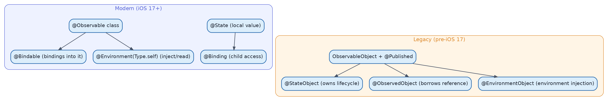{width=85%}

## Common Mistakes (Chapter 4)

1. Making a `@State` property non-private, letting other views read/write it directly instead of via `@Binding`.
2. Creating an `@StateObject`/`@Observable` model inline in a parent's `body` and passing it down as `@ObservedObject`/plain reference — if the parent re-renders and the model creation isn't guarded by `@StateObject`/`@State`, it gets recreated, silently resetting state.
3. Using `@EnvironmentObject` and forgetting to inject it with `.environmentObject()` anywhere up the tree — this crashes at runtime with "No ObservableObject of type X found."
4. Applying `@Published` to *every* property "just in case," causing broad, unnecessary view invalidation under the legacy system (this is one of the strongest reasons to migrate to `@Observable`).
5. Treating `@Binding` as if it copies the value — it doesn't; mutating through it always writes back to the original source.

## Best Practices (Chapter 4)

- New projects targeting iOS 17+: default to `@Observable` + `@State`/`@Bindable`/`@Environment`. Avoid the legacy stack unless supporting older OS versions.
- Keep `@State` private and scoped to the smallest view that needs it.
- Model your domain/business state in `@Observable` classes; keep pure UI-only flags (`isShowingSheet`, `isEditing`) in `@State`.
- Use `@Environment` for things that are genuinely global/cross-cutting; resist using it as a shortcut around clean data flow for screen-local state.


# Chapter 5 — Navigation

## 5.1 NavigationStack (iOS 16+)

**What it is.** The modern container for push/pop navigation, replacing the older `NavigationView`. It manages a stack of screens and drives push/pop transitions from changes to its data, not from imperative calls.

**Why it exists.** `NavigationView` (pre-iOS-16) had serious problems at scale: no reliable way to programmatically control the stack, ambiguous behavior with multiple `NavigationLink`s, and poor support for state restoration/deep linking. `NavigationStack` fixes this by making navigation **state-driven**: the stack's contents are a value (an array or `NavigationPath`) that you own and can inspect, mutate, save, and restore.

**How it works internally.** `NavigationStack` observes a bound path (array of values or a type-erased `NavigationPath`). Pushing a screen means appending a value to that array; popping means removing from the end. SwiftUI translates changes to this array into push/pop animations automatically — you never manually trigger "push," you just mutate data.

```swift
struct ContentView: View {
    @State private var path: [Int] = []   // stack of "screen identifiers"

    var body: some View {
        NavigationStack(path: $path) {
            List(1...20, id: \.self) { number in
                NavigationLink("Item \(number)", value: number)
            }
            .navigationDestination(for: Int.self) { number in
                DetailView(number: number)
            }
        }
    }
}
```
Line-by-line: `path: [Int]` is the source of truth for "which screens are pushed" — here, simply which integers were tapped, in order. `NavigationLink("Item \(number)", value: number)` doesn't point at a destination view directly; it appends `number` to the path when tapped. `.navigationDestination(for: Int.self)` tells the stack "whenever an `Int` appears in the path, render it using `DetailView`." This separation (link declares *intent*, destination declares *how to render*) is what enables deep linking (5.9): you can push five screens at once just by setting `path = [1, 5, 12]`.

## 5.2 NavigationPath

**What it is.** A type-erased, heterogeneous stack container for `NavigationStack`, used when a single stack needs to hold *different types* of destinations (not just one type like `Int` above).

```swift
@State private var path = NavigationPath()

NavigationStack(path: $path) {
    HomeView()
        .navigationDestination(for: Product.self) { ProductDetailView(product: $0) }
        .navigationDestination(for: Order.self) { OrderDetailView(order: $0) }
}

// Elsewhere:
path.append(someProduct)   // pushes a ProductDetailView
path.append(someOrder)     // pushes an OrderDetailView on top of that
```
**Why it exists.** Real apps rarely navigate through only one data type. `NavigationPath` erases the underlying types into a single stack while `.navigationDestination(for:)` overloads still dispatch based on the actual runtime type pushed.

**When to use plain `[T]` vs `NavigationPath`.** Use `[T]` when the whole stack is one destination type (simpler, `Codable` for state restoration, easier to unit test). Use `NavigationPath` when a stack must mix several unrelated destination types.

## 5.3 TabView

**What it is.** The container for tab-bar-based navigation (iOS) or sidebar-tab navigation (iPadOS/macOS with the `.tabViewStyle(.sidebarAdaptable)` API).

```swift
TabView {
    Tab("Home", systemImage: "house") {
        HomeView()
    }
    Tab("Search", systemImage: "magnifyingglass") {
        SearchView()
    }
    Tab("Profile", systemImage: "person") {
        ProfileView()
    }
}
```
The `Tab(_:systemImage:)` initializer (introduced to replace `.tabItem`) lets each tab declare its own `NavigationStack` internally, so each tab keeps an independent navigation history — a common real-world requirement (switching tabs and back should preserve where you were).

## 5.4 Sheets

**What it is.** A modal presentation sliding up from the bottom, driven by a `Bool` or an `Optional`/`Identifiable` binding.

```swift
struct ContentView: View {
    @State private var showingSettings = false
    var body: some View {
        Button("Settings") { showingSettings = true }
            .sheet(isPresented: $showingSettings) {
                SettingsView()
            }
    }
}

// Item-driven sheet — great for "which item was tapped" flows
struct ContentView2: View {
    @State private var selectedItem: Item?
    var body: some View {
        List(items) { item in
            Button(item.name) { selectedItem = item }
        }
        .sheet(item: $selectedItem) { item in
            ItemDetailView(item: item)
        }
    }
}
```
The item-driven form (`.sheet(item:)`) is often cleaner than a separate `Bool` + separately-stored "which item" state, because the presented item and the presentation flag are the same piece of state.

## 5.5 Popovers

`.popover(isPresented:)` shows contextual content anchored to a source view — on iPad/Mac it renders as a true floating popover with an arrow; on iPhone it typically adapts to a sheet-like presentation. Good for lightweight contextual pickers/menus that don't need a full-screen commitment.

## 5.6 Alerts

`.alert(_:isPresented:actions:)` presents a system alert. Prefer the `Text`/actions-builder form over the older string-only initializers for full control over button roles:

```swift
.alert("Delete Item?", isPresented: $showingDeleteConfirm) {
    Button("Delete", role: .destructive) { deleteItem() }
    Button("Cancel", role: .cancel) { }
} message: {
    Text("This action cannot be undone.")
}
```
`role: .destructive` gives the button red styling and correct semantics for VoiceOver and platform conventions automatically.

## 5.7 ConfirmationDialog

**What it is.** The SwiftUI equivalent of `UIAlertController` with `.actionSheet` style — a bottom-sheet list of action buttons, better suited than `.alert` for presenting 3+ choices.

```swift
.confirmationDialog("Choose an option", isPresented: $showingOptions, titleVisibility: .visible) {
    Button("Share") { share() }
    Button("Duplicate") { duplicate() }
    Button("Delete", role: .destructive) { delete() }
}
```
**When to use vs. `.alert`:** use `.alert` for a simple confirm/cancel/destructive decision; use `.confirmationDialog` when offering several distinct actions.

## 5.8 Full Screen Covers

`.fullScreenCover(isPresented:)` presents content that covers the entire screen with no visible dismiss affordance by default (unlike sheets, which show a grabber and can be swiped down) — appropriate for onboarding flows, paywalls, or camera/media capture screens where accidental dismissal should be prevented.

```swift
.fullScreenCover(isPresented: $showingOnboarding) {
    OnboardingFlow()
}
```

## 5.9 Deep Linking

**What it is.** Programmatically navigating to a specific screen (or stack of screens) in response to an external trigger: a push notification, a Universal Link, a widget tap, or restored app state.

**How it works with `NavigationStack`.** Because the navigation stack's contents are just a value you own (`path`), deep linking becomes "set `path` to the right sequence of values" rather than imperative "present this, then push that, then push that" chains.

```swift
@main
struct MyApp: App {
    @State private var path = NavigationPath()

    var body: some Scene {
        WindowGroup {
            NavigationStack(path: $path) {
                HomeView()
                    .navigationDestination(for: Route.self) { route in
                        route.destinationView
                    }
            }
            .onOpenURL { url in
                path = Route.parse(from: url)   // decode URL into a sequence of Route values
            }
        }
    }
}
```
This pattern — a `Route` enum representing every possible destination, parsed from a URL and pushed directly onto `path` — is the standard senior-level approach and is discussed further in Chapter 12 (Architecture).

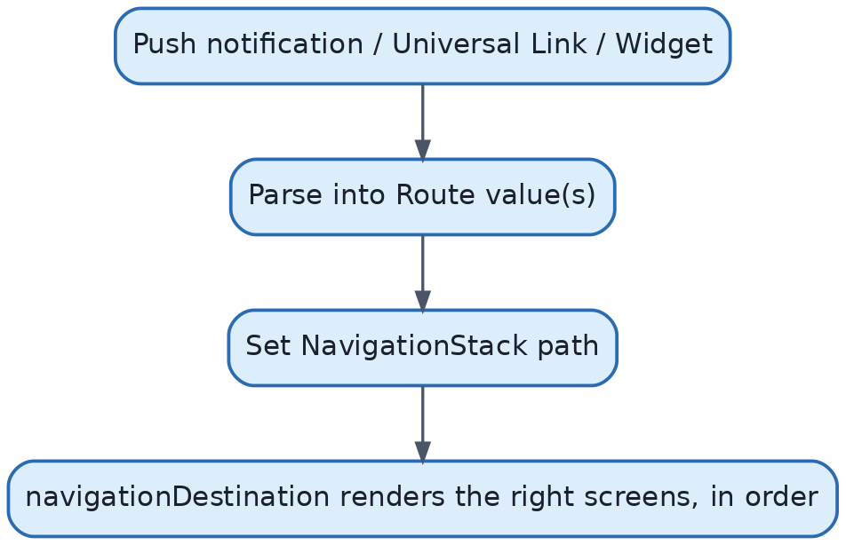{width=85%}

## Common Mistakes (Chapter 5)

1. Still using the deprecated `NavigationView` in new code — it lacks reliable programmatic control and is superseded by `NavigationStack`.
2. Managing sheet-presented item state as two separate variables (`isPresented: Bool` + `selectedItem`) when `.sheet(item:)` collapses them into one, removing a whole class of "flag is true but item is nil" bugs.
3. Using `.alert` for menus with 3+ unrelated actions instead of `.confirmationDialog`.
4. Building deep linking as a chain of imperative "present, then after delay push" calls instead of driving it from a single `path`/`NavigationPath` value.
5. Nesting `NavigationStack` inside each `TabView` tab incorrectly (or not at all), leading to either shared/incorrect back-stacks or losing per-tab navigation history.

## Best Practices (Chapter 5)

- Give each `TabView` tab its own `NavigationStack` so navigation history persists correctly per tab.
- Model navigation destinations as an enum (`Route`) implementing `Hashable`, and use one `NavigationPath` or typed array as the single source of truth.
- Prefer `.sheet(item:)`/`.fullScreenCover(item:)` over boolean flags whenever the presented content is tied to a specific piece of data.
- Reserve `.fullScreenCover` for flows that intentionally block casual dismissal.


# Chapter 6 — Lists & Collections

## 6.1 List

**What it is.** `List` is SwiftUI's built-in, platform-native scrollable collection view — the direct declarative equivalent of `UITableView`, with automatic cell recycling, section support, swipe actions, and platform-appropriate styling built in.

**Why it exists.** Rather than manually managing cell reuse identifiers, data sources, and delegates (`UITableViewDataSource`/`UITableViewDelegate`), `List` derives its rows directly from your data and view-building closure, with SwiftUI managing recycling internally.

**How it works internally.** `List` is backed by `UITableView`/`UICollectionView` under the hood on iOS (an implementation detail, but useful to know for performance intuition — it inherits real cell-reuse behavior, not just "lazy layout" like `LazyVStack`). This is why `List` handles very large datasets efficiently by default.

```swift
struct Item: Identifiable {
    let id = UUID()
    let name: String
}

struct ItemListView: View {
    let items: [Item]
    var body: some View {
        List(items) { item in
            Text(item.name)
        }
    }
}
```

**When to use.** Any standard scrolling collection of rows — settings, feeds, search results, contact lists.
**When NOT to use.** Highly custom visual layouts that don't resemble rows (e.g., a Pinterest-style masonry grid) — use `LazyVGrid`/custom `Layout` instead.

## 6.2 ForEach

**What it is.** Not a view container itself, but a mechanism for generating a sequence of views from a collection — usable inside `List`, stacks, and grids alike.

```swift
List {
    ForEach(items) { item in
        Text(item.name)
    }
}
```

**Critical detail (ties to Ch. 2.7 View Identity):** `ForEach` requires each element to be `Identifiable` (or you supply an explicit `id:` key path). This identity is what SwiftUI uses to know which row is which across data changes — essential for correct animations, correct swipe-action targeting, and correct state per row.

```swift
// BAD — index-based identity breaks when the array reorders
ForEach(items.indices, id: \.self) { index in
    Text(items[index].name)
}

// GOOD — stable identity tied to the actual item
ForEach(items) { item in   // Item: Identifiable
    Text(item.name)
}
```

## 6.3 Sections

`Section` groups rows under (optional) headers/footers within a `List`, matching native table-view section semantics, including sticky headers on some platforms:

```swift
List {
    Section("Personal") {
        Text("Name")
        Text("Email")
    }
    Section("Account") {
        Text("Password")
        Text("Two-Factor Auth")
    }
}
```

## 6.4 Swipe Actions

`.swipeActions(edge:allowsFullSwipe:)` attaches leading/trailing swipe buttons to a row — the declarative equivalent of `UITableViewDelegate`'s `trailingSwipeActionsConfigurationForRowAt`.

```swift
ForEach(items) { item in
    Text(item.name)
        .swipeActions(edge: .trailing) {
            Button(role: .destructive) { delete(item) } label: { Label("Delete", systemImage: "trash") }
            Button { archive(item) } label: { Label("Archive", systemImage: "archivebox") }
                .tint(.orange)
        }
}
```
`role: .destructive` automatically applies red coloring and correct accessibility semantics.

## 6.5 Delete (onDelete)

`.onDelete(perform:)` attaches the standard "swipe-to-delete" gesture with the system's leading trash affordance, hooked to a closure receiving an `IndexSet`:

```swift
List {
    ForEach(items) { item in Text(item.name) }
        .onDelete { indexSet in items.remove(atOffsets: indexSet) }
}
.toolbar { EditButton() }   // enables the Edit mode that reveals delete/move controls
```
Modern apps increasingly prefer explicit `.swipeActions` (6.4) for more control (custom icons, colors, multiple actions), reserving `.onDelete` for simple, single-action list editing.

## 6.6 Move (onMove)

`.onMove(perform:)` enables drag-to-reorder within Edit mode:
```swift
ForEach(items) { item in Text(item.name) }
    .onMove { indices, newOffset in items.move(fromOffsets: indices, toOffset: newOffset) }
```
As of iOS 26/27, SwiftUI also introduced broader **reorderable container** support so drag-to-reorder can work more generally, outside of strict `List` Edit-mode semantics — covered in Chapter 16.

## 6.7 Search

`.searchable(text:)` attaches a system search bar to a `NavigationStack`-hosted view, with automatic placement (below the nav bar on iOS, in the toolbar on macOS):

```swift
struct SearchableListView: View {
    @State private var query = ""
    let items: [Item]

    var filtered: [Item] {
        query.isEmpty ? items : items.filter { $0.name.localizedCaseInsensitiveContains(query) }
    }

    var body: some View {
        NavigationStack {
            List(filtered) { Text($0.name) }
                .searchable(text: $query, prompt: "Search items")
        }
    }
}
```
Filtering here happens in a computed property reacting to `query`; for expensive filtering (e.g., large datasets, server-side search) debounce using `.task(id: query)` (see Chapter 10) rather than filtering synchronously on every keystroke.

## 6.8 Refreshable (Pull-to-Refresh)

`.refreshable` attaches native pull-to-refresh, and — importantly — it's built for Swift Concurrency: the closure is `async`, and the refresh spinner stays visible until your `async` work completes.

```swift
List(items) { Text($0.name) }
    .refreshable {
        await viewModel.reload()
    }
```
No manual `UIRefreshControl` target/action wiring, and no manual "stop refreshing" call — SwiftUI manages the spinner lifecycle tied to the `async` function's completion.

## 6.9 Infinite Lists / Infinite Scrolling & Pagination

**What it is.** A "list that keeps growing" — the pattern behind almost every feed (social timeline, product catalog, search results): you load the first page of data, and as the user scrolls near the bottom, you fetch and append the next page automatically, instead of loading thousands of items up front.

**Why it exists.** Loading an entire dataset (potentially thousands of server records) at once wastes bandwidth, memory, and startup time. Pagination fetches only what the user is actually about to see, matching network cost to real scroll behavior.

**How it works internally.** SwiftUI has no dedicated "infinite list" API — you build it from parts you already know: `List`/`LazyVStack` (Ch. 3, 6.1) only creates rows near the visible area, so attaching `.onAppear`/`.task` to one of the *last few* rows gives you a natural, cheap "approaching the end" signal, since that row's `onAppear` only fires once it's about to scroll into view.

```swift
@MainActor @Observable
class FeedViewModel {
    var items: [Article] = []
    private var currentPage = 1
    private var isLoadingPage = false
    private var reachedEnd = false

    func loadNextPageIfNeeded(currentItem: Article) async {
        // Trigger when the user is a few rows from the end, not just the very last one —
        // this hides network latency instead of showing a spinner right at the bottom edge.
        let thresholdIndex = items.index(items.endIndex, offsetBy: -3, limitedBy: items.startIndex) ?? items.startIndex
        guard let currentIndex = items.firstIndex(where: { $0.id == currentItem.id }),
              currentIndex >= thresholdIndex,
              !isLoadingPage, !reachedEnd else { return }

        isLoadingPage = true
        defer { isLoadingPage = false }

        let nextItems = try? await ArticleService.fetchPage(currentPage + 1)
        if let nextItems, !nextItems.isEmpty {
            items += nextItems
            currentPage += 1
        } else {
            reachedEnd = true
        }
    }
}

struct FeedView: View {
    @State private var viewModel = FeedViewModel()

    var body: some View {
        List(viewModel.items) { article in
            ArticleRow(article: article)
                .task { await viewModel.loadNextPageIfNeeded(currentItem: article) }
        }
        .task { await viewModel.loadNextPageIfNeeded(currentItem: viewModel.items.last ?? .placeholder) }
    }
}
```
Line-by-line: `thresholdIndex` computes a row a few positions before the end, so the next page starts loading *before* the user hits the bottom — avoiding a visible stall. `isLoadingPage`/`reachedEnd` guard against firing duplicate requests (a single `.task` can otherwise re-trigger many times as rows scroll in and out and back in). `.task` (not `.onAppear { Task { } }`, Ch. 10.3) ties each row's load-more check to that row's own lifecycle, so it's automatically cancelled if the row disappears before the request resolves — e.g., if the user scrolls back up quickly.

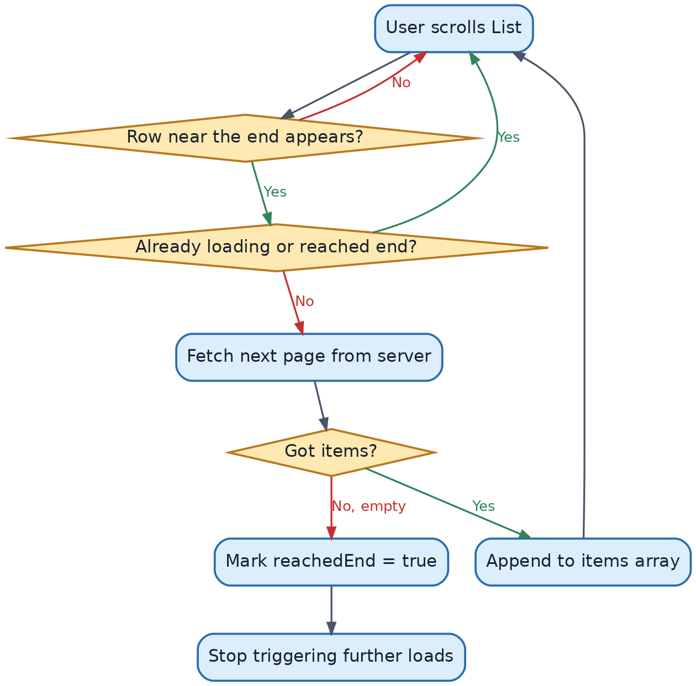{width=85%}

**When to use.** Any feed/catalog/search-results screen backed by a paged API — the standard pattern for social feeds, e-commerce browsing, and search results.
**When NOT to use.** Small, fully-known datasets (a settings list, a fixed list of 20 categories) — pagination there is pure overhead; just load everything once.

## Common Mistakes (Chapter 6)

1. Using array indices as `ForEach`/`List` identity, breaking swipe actions, animations, and per-row state after reordering or deletion.
2. Filtering large datasets synchronously on every keystroke inside `.searchable` without debouncing, causing UI stutter.
3. Forgetting `role: .destructive` on delete-style swipe actions, losing the correct red styling/accessibility semantics.
4. Mixing `.onDelete`/`.onMove` (Edit-mode-based) with `.swipeActions` inconsistently across a list, creating a confusing interaction model.
5. Using `List` when the visual design doesn't actually resemble rows/sections at all — fighting the component instead of choosing `ScrollView` + `LazyVStack`/custom layout.
6. Triggering a "load next page" check without an `isLoadingPage`/`reachedEnd` guard, causing dozens of duplicate page requests as rows scroll in and out repeatedly.
7. Only checking for "load more" on the very last row instead of a few rows before the end, producing a visible loading stall right as the user hits the bottom.

## Best Practices (Chapter 6)

- Always back `List`/`ForEach` with genuinely stable `Identifiable` conformance.
- Use `.searchable` combined with `.task(id:)`-based debouncing for anything beyond trivial in-memory filtering.
- Prefer `.swipeActions` for anything beyond a single delete action; reserve `.onDelete`/`.onMove` for simple Edit-mode flows.
- Always use `.refreshable`'s `async` closure rather than wrapping legacy completion-handler APIs awkwardly — bridge old APIs with `withCheckedContinuation` if needed (Chapter 10).
- For infinite/paginated lists, trigger the next page a few rows before the end, and always guard with an `isLoadingPage`/`reachedEnd` flag to prevent duplicate requests.


# Chapter 7 — Forms & User Input

## 7.1 Form

`Form` is a container that renders platform-appropriate grouped input styling (grouped list style on iOS, an aligned settings-style layout on macOS). It's typically the outermost container for input screens:

```swift
Form {
    Section("Profile") {
        TextField("Name", text: $name)
        Toggle("Notifications", isOn: $notificationsEnabled)
    }
}
```

## 7.2 TextField

**What it is.** A single-line editable text input bound to a `String` (or, via a `FormatStyle`, to a typed value like `Double`).

```swift
TextField("Email", text: $email)
    .textInputAutocapitalization(.never)
    .keyboardType(.emailAddress)
    .autocorrectionDisabled()
```
Each modifier configures a specific keyboard/text behavior: `.textInputAutocapitalization(.never)` stops auto-capitalizing (appropriate for emails), `.keyboardType(.emailAddress)` shows the `@` key prominently, `.autocorrectionDisabled()` prevents autocorrect from mangling addresses.

**Typed input (iOS 15+):**
```swift
TextField("Price", value: $price, format: .currency(code: "USD"))
```
This binds directly to a `Double`/`Decimal` via a `FormatStyle`, avoiding manual string↔number parsing.

## 7.3 SecureField

Identical API to `TextField` but masks input — used for passwords:
```swift
SecureField("Password", text: $password)
```

## 7.4 Toggle

A boolean switch:
```swift
Toggle("Enable Notifications", isOn: $notificationsEnabled)
```

## 7.5 Picker

**What it is.** A selection control with multiple presentation styles (`.menu`, `.segmented`, `.wheel`, `.inline`) chosen via `.pickerStyle`.

```swift
enum Plan: String, CaseIterable, Identifiable {
    case free, pro, enterprise
    var id: Self { self }
}

@State private var selectedPlan: Plan = .free

Picker("Plan", selection: $selectedPlan) {
    ForEach(Plan.allCases) { plan in
        Text(plan.rawValue.capitalized).tag(plan)
    }
}
.pickerStyle(.segmented)
```
`.tag(plan)` is what ties each option's underlying value to the `selection` binding — without matching tags, the picker cannot report which case was selected.

## 7.6 DatePicker

```swift
DatePicker("Birthday", selection: $birthday, displayedComponents: .date)
```
`displayedComponents` controls whether date, time, or both are shown/editable. `in:` can constrain the selectable range (e.g., `in: ...Date()` to disallow future dates).

## 7.7 Slider

```swift
Slider(value: $volume, in: 0...100, step: 1)
```
Binds to a continuous `Double`/`Float`; `step` snaps to increments.

## 7.8 Stepper

```swift
Stepper("Quantity: \(quantity)", value: $quantity, in: 1...10)
```
Increments/decrements a bound numeric value within a range — commonly paired with a `Text` showing the current value, since `Stepper` itself has no built-in numeric display.

## 7.9 TextEditor

A multi-line, scrollable plain-text editor (the multi-line counterpart to `TextField`):
```swift
TextEditor(text: $notes)
    .frame(minHeight: 150)
```
Unlike `TextField`, `TextEditor` has no built-in placeholder support pre-iOS 17; on iOS 17+ you can overlay a placeholder conditionally, or use the newer `.overlay(alignment:)` pattern checking if the bound text is empty.

## 7.10 FocusState

**What it is.** A property wrapper (`@FocusState`) that tracks and controls which input field currently has keyboard focus.

**Why it exists.** Before this, controlling focus programmatically (auto-advancing between fields, dismissing the keyboard) required dropping to UIKit's `becomeFirstResponder`. `@FocusState` makes focus a piece of declarative state like any other.

```swift
enum Field: Hashable { case name, email }

struct SignupForm: View {
    @State private var name = ""
    @State private var email = ""
    @FocusState private var focusedField: Field?

    var body: some View {
        Form {
            TextField("Name", text: $name)
                .focused($focusedField, equals: .name)
                .onSubmit { focusedField = .email }
                .submitLabel(.next)
            TextField("Email", text: $email)
                .focused($focusedField, equals: .email)
                .submitLabel(.done)
        }
        .onAppear { focusedField = .name }
    }
}
```
Explanation: `focusedField` holds an optional `Field` — `nil` means no field is focused. `.focused($focusedField, equals: .name)` binds that specific field's focus state two ways: tapping it sets `focusedField = .name`; setting `focusedField = .name` programmatically focuses it. `.onSubmit` (triggered by the keyboard's return/next key) advances focus to the next field, and `.submitLabel(.next)`/`.submitLabel(.done)` change the keyboard's return key label to match.

## 7.11 Keyboard Management

Beyond focus, common needs: dismissing the keyboard (`focusedField = nil`, or on iOS 16+, `.scrollDismissesKeyboard(.interactively)` on a `ScrollView`/`List`), and avoiding keyboard overlap (SwiftUI's `Form`/`List`/`ScrollView` automatically adjust for the keyboard on standard layouts — a major advantage over UIKit, where you historically had to observe `keyboardWillShow`/`keyboardWillHide` notifications and adjust content insets manually).

## 7.12 Validation

There's no built-in "form validation" API — validation is standard Swift logic layered on top of your bound state, typically in a view model:

```swift
@Observable
class SignupViewModel {
    var email = ""
    var password = ""

    var emailError: String? {
        email.isEmpty ? nil : (email.contains("@") ? nil : "Enter a valid email")
    }
    var isValid: Bool {
        !email.isEmpty && emailError == nil && password.count >= 8
    }
}

struct SignupView: View {
    @State private var viewModel = SignupViewModel()
    var body: some View {
        Form {
            TextField("Email", text: $viewModel.email)
            if let error = viewModel.emailError {
                Text(error).foregroundStyle(.red).font(.caption)
            }
            SecureField("Password", text: $viewModel.password)
            Button("Sign Up") { /* submit */ }
                .disabled(!viewModel.isValid)
        }
    }
}
```
Keeping validation as computed properties on the view model (rather than scattered `if` checks inside `body`) keeps it testable independent of any UI (Chapter 14).

## Common Mistakes (Chapter 7)

1. Binding a `TextField` to a `Double`/`Int` by manually converting strings back and forth instead of using the typed `value:format:` initializer — leads to crash-prone force-unwraps and awkward edge cases (e.g., a trailing "." while typing a decimal).
2. Forgetting `.tag()` values on `Picker` options, causing the picker to fail to reflect/update selection correctly.
3. Doing form validation inline inside `body` with scattered `if`s rather than centralizing it in a testable model.
4. Not using `@FocusState` for multi-field forms, leaving no way to auto-advance focus or programmatically dismiss the keyboard cleanly.
5. Overusing `disabled(true)` on a submit button without also showing *why* (inline error text) — hurts usability.

## Best Practices (Chapter 7)

- Use typed `TextField(_:value:format:)` bindings for numeric/currency/date input over manual string parsing.
- Centralize validation logic in an `@Observable` view model as computed properties, so it's unit-testable without rendering UI.
- Use `@FocusState` with an enum of fields for any form with more than one input, wiring `.onSubmit`/`.submitLabel` for a smooth keyboard flow.
- Combine `.disabled(!isValid)` with visible inline validation messages, not just a silently-disabled button.


# Chapter 8 — Animations

## 8.1 The Animation Model, Conceptually

SwiftUI animation is fundamentally about **interpolating between two states of a view over time**. You never animate "an action" — you animate the *difference between an old value and a new value*.

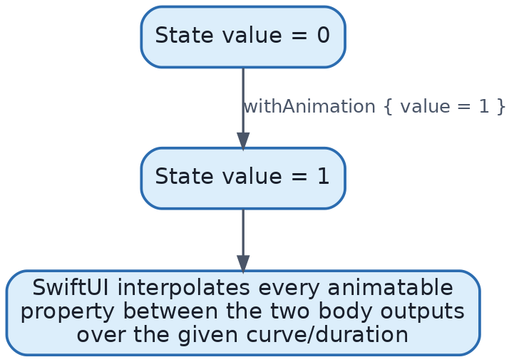{width=85%}

Any property that conforms to `Animatable` (positions, sizes, colors, opacity, rotation, and custom numeric properties) can be interpolated. Non-animatable changes (e.g., swapping between two entirely different views) are handled through **transitions** instead (8.3).

## 8.2 withAnimation vs. .animation Modifier

**`withAnimation(_:)`** wraps a state *change*, animating every resulting visual difference caused by that change:
```swift
withAnimation(.easeInOut(duration: 0.3)) {
    isExpanded.toggle()
}
```
**`.animation(_:value:)`** attaches an animation to a *view*, automatically animating whenever the specified `value` changes, regardless of where that change originated:
```swift
Circle()
    .frame(width: isExpanded ? 200 : 100)
    .animation(.spring, value: isExpanded)
```
**Why both exist / when to use which.** `withAnimation` gives you control at the *call site* — useful when only some state changes in a scope should animate and others shouldn't. `.animation(value:)` gives you control at the *view* — useful when a specific view should always animate a specific property change, regardless of which code path changed it. Modern SwiftUI (iOS 15+) requires the explicit `value:` parameter; the older valueless `.animation(_:)` (animating *any* change to the view) is deprecated because it caused hard-to-predict animations across unrelated state changes.

**Common mistake:** applying `.animation()` high up a large view tree, causing unrelated child updates to animate unintentionally. Best practice: scope `.animation(value:)` as close as possible to the specific view/property that should animate, or use `withAnimation` at the state-mutation site for broader control.

## 8.3 Transitions

**What they are.** Rules for how a view animates *in* when it's inserted into the tree and *out* when removed — used for views appearing/disappearing (via `if`, `ForEach` changes, etc.), as opposed to animating a continuous property change.

```swift
if showBanner {
    Text("Welcome!")
        .transition(.move(edge: .top).combined(with: .opacity))
}
```
```swift
withAnimation { showBanner.toggle() }
```
Built-in transitions: `.opacity`, `.scale`, `.move(edge:)`, `.slide`, `.asymmetric(insertion:removal:)` (different animations for appearing vs. disappearing). `.combined(with:)` layers multiple transitions together.

**Internal note:** transitions rely on view *identity* (Ch. 2.7) — SwiftUI must recognize that a view was inserted/removed (not just resized) to apply a transition rather than a plain interpolation.

## 8.4 Matched Geometry Effect

**What it is.** `.matchedGeometryEffect(id:in:)` lets two *different* views (in different parts of the tree, or across a screen transition) share the same underlying frame/geometry, animating smoothly between the two positions/sizes — the classic "hero" or "shared element" transition.

```swift
@Namespace private var animation

if isExpanded {
    LargeCardView()
        .matchedGeometryEffect(id: "card", in: animation)
} else {
    SmallCardView()
        .matchedGeometryEffect(id: "card", in: animation)
}
```

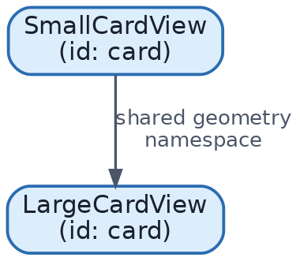{width=85%}

When `isExpanded` toggles inside a `withAnimation`, SwiftUI computes the position/size delta between the outgoing and incoming views sharing the same `id`/`namespace`, and animates that delta smoothly rather than cross-fading two unrelated views.

## 8.5 PhaseAnimator (iOS 17+)

**What it is.** A declarative way to step a view through a sequence of discrete "phases," each with its own visual state, automatically looping or advancing — without manually managing a state machine of animation steps.

```swift
enum PulsePhase: CaseIterable {
    case shrunk, normal, grown
}

Circle()
    .fill(.blue)
    .phaseAnimator(PulsePhase.allCases) { content, phase in
        content.scaleEffect(phase == .grown ? 1.3 : phase == .shrunk ? 0.8 : 1.0)
    } animation: { phase in
        .easeInOut(duration: 0.4)
    }
```
This automatically cycles through `.shrunk → .normal → .grown → .shrunk → ...`, applying the given animation between each phase — ideal for looping attention-getting effects (pulsing icons, "listening" indicators) without hand-rolled `Timer`/`DispatchQueue` code.

## 8.6 Keyframe Animation (iOS 17+)

**What it is.** `.keyframeAnimator` lets you specify multiple animatable properties (scale, rotation, offset, opacity) each with their *own independent timeline* of keyframes — useful for complex, choreographed multi-property animations that phase-based or single-curve animations can't express cleanly.

```swift
struct BounceValues {
    var scale = 1.0
    var verticalOffset = 0.0
}

Image(systemName: "star.fill")
    .keyframeAnimator(initialValue: BounceValues()) { content, value in
        content
            .scaleEffect(value.scale)
            .offset(y: value.verticalOffset)
    } keyframes: { _ in
        KeyframeTrack(\.scale) {
            SpringKeyframe(1.2, duration: 0.15)
            SpringKeyframe(1.0, duration: 0.15)
        }
        KeyframeTrack(\.verticalOffset) {
            LinearKeyframe(-20, duration: 0.15)
            LinearKeyframe(0, duration: 0.15)
        }
    }
```
Each `KeyframeTrack` independently animates one property along its own timing — `scale` and `verticalOffset` can have entirely different curves and durations, composited together.

## 8.7 Symbol Effects (iOS 17+)

**What it is.** Built-in, semantically named animations specifically for SF Symbols: `.bounce`, `.pulse`, `.variableColor`, `.wiggle` (iOS 18+), `.rotate`, `.breathe` (iOS 26+).

```swift
Image(systemName: "bell.fill")
    .symbolEffect(.bounce, value: notificationCount)
```
This triggers a bounce animation each time `notificationCount` changes — commonly used for badge-style feedback (a new notification arrived). Symbol effects are hand-tuned by Apple per-symbol, so they look correct without you needing to design the animation curve yourself.

## Common Mistakes (Chapter 8)

1. Applying `.animation()` without a `value:` argument (or applying it far too high in the view tree), causing unrelated changes to animate unintentionally.
2. Forgetting that transitions require a view to actually be inserted/removed (identity change) — applying `.transition()` to a view that's merely resizing does nothing; use `.animation(value:)` for continuous property changes instead.
3. Using two different namespaces (or mismatched `id`s) with `.matchedGeometryEffect`, silently breaking the shared-geometry animation.
4. Building elaborate looping animations with manual `Timer`s instead of `PhaseAnimator`, missing out on automatic scheduling/cleanup.
5. Overusing heavy animations on frequently-updating views (e.g., animating every character typed in a live-updating list), hurting performance and perceived responsiveness.

## Best Practices (Chapter 8)

- Scope `.animation(value:)` tightly to the specific property/view that should animate.
- Use `.transition` for insert/remove, `.animation`/`withAnimation` for continuous property changes — know which tool fits which situation.
- Reach for `PhaseAnimator`/`.keyframeAnimator` (iOS 17+) instead of manual `Timer`-driven state machines for anything beyond a single two-state animation.
- Use symbol effects for SF Symbol feedback rather than hand-rolled scale/rotation animations — they're accessibility-aware (respecting Reduce Motion) automatically.


# Chapter 9 — Drawing

## 9.1 Shapes

**What they are.** Types conforming to the `Shape` protocol (`Rectangle`, `Circle`, `Capsule`, `RoundedRectangle`, `Ellipse`) that describe a path to be filled or stroked, and can be used anywhere a `View` can.

```swift
RoundedRectangle(cornerRadius: 16)
    .fill(.blue)
    .frame(width: 200, height: 100)

Circle()
    .stroke(.red, lineWidth: 3)
    .frame(width: 60, height: 60)
```
**How it works internally.** `Shape` conforms to `View` via a default `body` that fills the shape with the current foreground style. `Shape` additionally requires a `path(in:) -> Path` method describing the actual geometry, which is what `.stroke`/`.fill` render.

## 9.2 Canvas (iOS 15+)

**What it is.** An immediate-mode drawing context for high-performance custom graphics — closer to `CoreGraphics`/`Core Graphics` drawing than to composing view hierarchies.

**Why it exists.** Building complex custom graphics (charts, visualizations, particle effects) as dozens/hundreds of individual `Shape`/`View` values is slow, because each one is a real node in SwiftUI's view tree with its own diffing overhead. `Canvas` instead gives you a single view that draws directly, bypassing per-element view-tree overhead — appropriate when you need to draw many primitives efficiently.

```swift
Canvas { context, size in
    for i in 0..<50 {
        let rect = CGRect(x: Double(i) * 4, y: 0, width: 3, height: Double.random(in: 10...size.height))
        context.fill(Path(rect), with: .color(.blue))
    }
}
.frame(height: 100)
```
`context` is a drawing context (fill, stroke, draw text/images, apply blend modes); `size` is the canvas's allotted size. Nothing here is a `View` subtree — it's all drawn directly into a bitmap-backed layer, which is far cheaper for large numbers of primitives (e.g., a waveform, a custom chart with thousands of points).

**When to use.** High-volume custom drawing: waveforms, custom charts, particle/generative effects.
**When NOT to use.** Simple static shapes/icons — plain `Shape`s or `Image`/SF Symbols are simpler and get standard SwiftUI interactivity (gestures, accessibility) far more easily than `Canvas` content, which is not automatically accessible.

## 9.3 Paths

**What it is.** `Path` is a geometric description built from lines, curves, and arcs — the lower-level primitive `Shape` and `Canvas` both build on.

```swift
struct Triangle: Shape {
    func path(in rect: CGRect) -> Path {
        Path { path in
            path.move(to: CGPoint(x: rect.midX, y: rect.minY))
            path.addLine(to: CGPoint(x: rect.minX, y: rect.maxY))
            path.addLine(to: CGPoint(x: rect.maxX, y: rect.maxY))
            path.closeSubpath()
        }
    }
}
```
`move(to:)` starts a new subpath at a point; `addLine(to:)` draws a straight segment; `closeSubpath()` connects back to the start. This custom `Triangle` can now be used exactly like `Circle`/`Rectangle`: `Triangle().fill(.green)`.

## 9.4 Gradients

Three built-in gradient styles, usable anywhere a `ShapeStyle` is accepted (`.fill()`, `.background()`, `.foregroundStyle()`):

```swift
LinearGradient(colors: [.blue, .purple], startPoint: .top, endPoint: .bottom)
RadialGradient(colors: [.yellow, .orange], center: .center, startRadius: 5, endRadius: 100)
AngularGradient(colors: [.red, .blue, .red], center: .center)
```

## 9.5 Images

**What it is.** `Image` displays bitmap content from assets, SF Symbols, or raw data.

```swift
Image("photo")              // from asset catalog
    .resizable()
    .aspectRatio(contentMode: .fill)
    .frame(width: 100, height: 100)
    .clipShape(Circle())
```
`.resizable()` is required before `.frame()` will actually resize the underlying bitmap (without it, `Image` renders at its native pixel size, ignoring the frame constraint on the image content itself). `.aspectRatio(contentMode: .fill)` crops to fill the frame while preserving aspect ratio (vs. `.fit`, which letterboxes).

For remote images, `AsyncImage` handles download and placeholder/loading states declaratively:
```swift
AsyncImage(url: url) { phase in
    switch phase {
    case .empty: ProgressView()
    case .success(let image): image.resizable().aspectRatio(contentMode: .fit)
    case .failure: Image(systemName: "photo.badge.exclamationmark")
    @unknown default: EmptyView()
    }
}
```

## 9.6 SF Symbols

Apple's system icon library, deeply integrated with SwiftUI: automatic Dynamic Type scaling, weight/scale matching surrounding text, multicolor/hierarchical/palette rendering modes, and symbol effects (Ch. 8.7).

```swift
Image(systemName: "star.fill")
    .font(.title)                      // scales the symbol with Dynamic Type
    .symbolRenderingMode(.hierarchical)
    .foregroundStyle(.yellow)
```
**Best practice:** prefer SF Symbols over custom icon assets whenever a suitable symbol exists — you get free accessibility (VoiceOver labels derived from the symbol name), Dynamic Type scaling, and visual consistency with the rest of iOS.

## Common Mistakes (Chapter 9)

1. Forgetting `.resizable()` before `.frame()` on an `Image`, resulting in the frame having no visible effect on the image's rendered size.
2. Using `Canvas` for a handful of static shapes where plain `Shape` views would be simpler and automatically accessible.
3. Building dozens/hundreds of individual `Shape` views for a data visualization instead of a single `Canvas`, causing real performance problems at scale.
4. Forgetting that `Canvas` content isn't automatically exposed to VoiceOver — custom accessibility labels/values must be added manually via `.accessibilityLabel`/`.accessibilityValue` on the `Canvas` view itself.

## Best Practices (Chapter 9)

- Use `Shape`/`Path` for anything simple, interactive, or that needs standard accessibility; use `Canvas` for high-volume custom drawing.
- Prefer SF Symbols to custom icon assets for standard UI iconography.
- Always pair `.resizable()` with `.frame()`/`.aspectRatio()` when displaying images at a controlled size.
- Add explicit accessibility labels to any `Canvas`-drawn content that conveys information (charts, custom graphics).


# Chapter 10 — Swift Concurrency in SwiftUI

## 10.1 async/await Fundamentals

**What it is.** Swift's structured concurrency model: an `async` function can suspend at `await` points without blocking the underlying thread, and the calling code reads top-to-bottom like synchronous code instead of nested completion handlers.

**Why it exists.** Completion-handler-based async code ("callback hell") is hard to read, easy to get wrong (calling completion twice, forgetting to call it, retain cycles in closures), and impossible for the compiler to check for correct thread usage. `async`/`await` fixes readability; structured concurrency (`Task`, task groups, actors) fixes safety.

```swift
func fetchUser(id: String) async throws -> User {
    let (data, _) = try await URLSession.shared.data(from: url(for: id))
    return try JSONDecoder().decode(User.self, from: data)
}
```

## 10.2 Task

**What it is.** `Task` creates a new unit of concurrent work, bridging synchronous (non-async) code — like a button action — into the async world.

```swift
Button("Load") {
    Task {
        do {
            user = try await fetchUser(id: "42")
        } catch {
            errorMessage = error.localizedDescription
        }
    }
}
```
**How it works.** A `Task` inherits the priority and (crucially) the actor context of where it's created — a `Task` started from a SwiftUI view's button action inherits `@MainActor` isolation, meaning code inside it runs on the main actor unless it explicitly awaits work on another actor.

## 10.3 The .task Modifier

**What it is.** A view modifier that starts an async operation tied to the view's *lifecycle*: it begins when the view appears and is **automatically cancelled** when the view disappears.

**Why it exists over `.onAppear { Task { ... } }`.** Manually starting a `Task` inside `.onAppear` doesn't automatically cancel that task when the view goes away — you'd have to store the `Task` handle and cancel it yourself in `.onDisappear`. `.task` does this bookkeeping for you.

```swift
struct UserDetailView: View {
    let userID: String
    @State private var user: User?

    var body: some View {
        Group {
            if let user { Text(user.name) } else { ProgressView() }
        }
        .task {
            do {
                user = try await fetchUser(id: userID)
            } catch {
                // handle error
            }
        }
    }
}
```

**`.task(id:)` — re-running when a value changes:**
```swift
.task(id: searchQuery) {
    results = try? await search(searchQuery)
}
```
Whenever `searchQuery` changes, SwiftUI cancels the *previous* running task tied to this modifier and starts a fresh one with the new value — this is the standard, correct way to implement debounced/live search without manual `Task` cancellation bookkeeping.

## 10.4 Task Cancellation

**What it is.** Cooperative cancellation: a `Task` isn't forcibly killed; it's marked cancelled, and well-behaved async code checks for cancellation and stops early.

```swift
func loadLargeDataset() async throws -> [Item] {
    var results: [Item] = []
    for page in 1...100 {
        try Task.checkCancellation()   // throws CancellationError if cancelled
        let items = try await fetchPage(page)
        results += items
    }
    return results
}
```
Structured APIs like `URLSession`'s `async` methods, and `.task`'s automatic cancellation on view disappearance, propagate cancellation through `await` points automatically — this is why long network requests kicked off in `.task` stop consuming resources once you navigate away.

## 10.5 @MainActor

**What it is.** An actor (a special global one) representing the main thread. Marking a type or function `@MainActor` guarantees, at compile time, that its code only ever runs on the main thread.

**Why it exists.** UI frameworks are not thread-safe; historically, forgetting `DispatchQueue.main.async` before touching UI from a background thread was a common runtime crash/bug. `@MainActor` turns this into a *compile-time* guarantee.

```swift
@MainActor
@Observable
class ProfileViewModel {
    var user: User?

    func load() async {
        // Because the whole class is @MainActor, this function
        // runs on the main actor by default...
        let fetched = try? await NetworkClient.fetchUser()   // ...but `await` can suspend
        user = fetched   // ...and resumes back on the main actor automatically
    }
}
```
SwiftUI views are implicitly main-actor-isolated, so `@Observable`/`ObservableObject` view models that update `@Published`/observable properties read by views should almost always be `@MainActor` to guarantee safe, glitch-free UI updates.

## 10.6 Actors

**What they are.** A reference type (`actor`) that protects its mutable state by ensuring only one task can access that state at a time — a language-level solution to data races, replacing manual locks/queues.

```swift
actor ImageCache {
    private var cache: [URL: UIImage] = [:]

    func image(for url: URL) -> UIImage? { cache[url] }
    func store(_ image: UIImage, for url: URL) { cache[url] = image }
}
```
Calling into an actor from outside requires `await` (`await cache.image(for: url)`), because the call might need to wait its turn if the actor is busy with another call — this `await` is what makes the safety visible and enforced at compile time.

**When to use.** Shared mutable state accessed from multiple concurrent contexts (a cache, a connection pool, a rate limiter).
**When NOT to use.** Don't make every model an actor "just in case" — if a type's state is only ever touched from the main actor (which is true for most SwiftUI view models), plain `@MainActor` classes are simpler and avoid unnecessary `await` noise.

## 10.7 Sendable

**What it is.** A protocol marking types safe to pass across concurrency boundaries (between actors/tasks) without data races — value types with only `Sendable` properties are automatically `Sendable`; reference types must be explicitly audited (immutable classes, or classes with internal synchronization).

```swift
struct User: Sendable, Codable {
    let id: String
    let name: String
}
```
The compiler enforces `Sendable` at actor/task boundaries: passing a non-`Sendable` mutable class into a `Task` or across an `await` boundary produces a compile error (in Swift's strict concurrency mode) — catching data races before they ever run, rather than debugging a crash in production.

## 10.8 AsyncSequence

**What it is.** The async counterpart to `Sequence` — a type you can iterate with `for await` instead of `for`, representing values that arrive over time (WebSocket messages, live location updates, `NotificationCenter` events via `.notifications(named:)`).

```swift
for await location in locationUpdates {
    currentLocation = location
}
```
Used inside `.task { }` so the loop is properly tied to the view's lifecycle and cancelled automatically when the view disappears.

## 10.9 Loading States (Production Pattern)

A robust, reusable pattern for representing "not started / loading / loaded / failed":

```swift
enum LoadState<Value> {
    case idle
    case loading
    case loaded(Value)
    case failed(Error)
}

@MainActor
@Observable
class ArticleListViewModel {
    var state: LoadState<[Article]> = .idle

    func load() async {
        state = .loading
        do {
            state = .loaded(try await ArticleService.fetchAll())
        } catch {
            state = .failed(error)
        }
    }
}

struct ArticleListView: View {
    @State private var viewModel = ArticleListViewModel()

    var body: some View {
        Group {
            switch viewModel.state {
            case .idle, .loading:
                ProgressView()
            case .loaded(let articles):
                List(articles) { ArticleRow(article: $0) }
            case .failed(let error):
                ContentUnavailableView("Couldn't Load Articles",
                                        systemImage: "exclamationmark.triangle",
                                        description: Text(error.localizedDescription))
            }
        }
        .task { await viewModel.load() }
    }
}
```
This enum-based state machine (rather than three separate booleans like `isLoading`/`hasError`/`data`) makes impossible states (e.g., `isLoading == true` *and* `hasError == true` simultaneously) unrepresentable — a senior-level best practice covered again in Chapter 12.

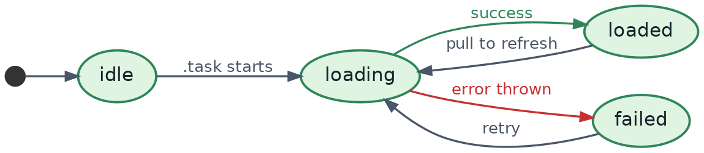{width=85%}

## Common Mistakes (Chapter 10)

1. Starting async work in `.onAppear { Task { ... } }` instead of `.task { }`, missing automatic cancellation when the view disappears.
2. Forgetting `@MainActor` on a view model that updates observable properties, risking non-deterministic UI updates from background threads.
3. Modeling loading state as multiple independent booleans instead of one enum, producing impossible/contradictory states.
4. Not checking `Task.isCancelled`/`Task.checkCancellation()` in long-running loops, wasting work (and sometimes money, for paid API calls) after a user navigates away.
5. Passing a non-`Sendable` mutable class across actor boundaries and suppressing the resulting compiler warning instead of fixing the underlying design.

## Best Practices (Chapter 10)

- Default view models to `@MainActor @Observable class`.
- Use `.task`/`.task(id:)` for view-lifecycle-bound async work; use `Task { }` explicitly only for fire-and-forget work triggered by discrete user actions (button taps).
- Model async UI state as a single enum (`LoadState`), not scattered booleans.
- Mark simple data/DTO types `Sendable` and `Codable` together; reserve `actor` for genuinely shared mutable state accessed concurrently from multiple places.


# Chapter 11 — Networking

This chapter builds a production-grade networking layer end to end: a typed API service, JSON decoding, error handling, loading UI, and retry logic.

## 11.1 Designing the API Service

**Why a dedicated service layer.** Scattering `URLSession` calls directly inside views or view models makes testing and reuse hard, and hides your network layer's contract. A dedicated, protocol-based service is the standard production pattern.

```swift
protocol APIClient {
    func request<T: Decodable>(_ endpoint: Endpoint) async throws -> T
}

struct Endpoint {
    let path: String
    let method: String = "GET"
    let queryItems: [URLQueryItem] = []
}

final class URLSessionAPIClient: APIClient {
    private let session: URLSession
    private let baseURL: URL
    private let decoder: JSONDecoder

    init(baseURL: URL, session: URLSession = .shared) {
        self.baseURL = baseURL
        self.session = session
        self.decoder = JSONDecoder()
        self.decoder.keyDecodingStrategy = .convertFromSnakeCase
    }

    func request<T: Decodable>(_ endpoint: Endpoint) async throws -> T {
        var components = URLComponents(url: baseURL.appendingPathComponent(endpoint.path), resolvingAgainstBaseURL: false)!
        components.queryItems = endpoint.queryItems.isEmpty ? nil : endpoint.queryItems
        guard let url = components.url else { throw NetworkError.invalidURL }

        var request = URLRequest(url: url)
        request.httpMethod = endpoint.method

        let (data, response) = try await session.data(for: request)

        guard let httpResponse = response as? HTTPURLResponse else {
            throw NetworkError.invalidResponse
        }
        guard (200...299).contains(httpResponse.statusCode) else {
            throw NetworkError.serverError(statusCode: httpResponse.statusCode)
        }

        do {
            return try decoder.decode(T.self, from: data)
        } catch {
            throw NetworkError.decodingFailed(underlying: error)
        }
    }
}
```
Line-by-line highlights: the `APIClient` **protocol** is what makes this testable — view models depend on the protocol, not the concrete `URLSessionAPIClient`, so tests can inject a fake (Chapter 14). `URLComponents` builds the URL safely, correctly percent-encoding query items. `session.data(for:)` is the `async` `URLSession` API — no completion handlers. Checking `HTTPURLResponse.statusCode` explicitly matters because `URLSession` does *not* throw an error just because the server returned a 404/500 — only actual transport failures throw by default.

## 11.2 Error Handling

```swift
enum NetworkError: Error, LocalizedError {
    case invalidURL
    case invalidResponse
    case serverError(statusCode: Int)
    case decodingFailed(underlying: Error)
    case noConnection

    var errorDescription: String? {
        switch self {
        case .invalidURL: return "The request URL was invalid."
        case .invalidResponse: return "Received an invalid response from the server."
        case .serverError(let code): return "Server returned an error (\(code))."
        case .decodingFailed: return "Failed to read the server's response."
        case .noConnection: return "You appear to be offline."
        }
    }
}
```
Conforming to `LocalizedError` and implementing `errorDescription` means `error.localizedDescription` produces a user-presentable string automatically anywhere in the UI layer, instead of leaking technical error details to users.

## 11.3 JSON Decoding

```swift
struct Article: Codable, Identifiable, Sendable {
    let id: Int
    let title: String
    let publishedAt: Date

    enum CodingKeys: String, CodingKey {
        case id, title
        case publishedAt = "published_at"
    }
}
```
For dates, configure the decoder explicitly rather than relying on defaults:
```swift
decoder.dateDecodingStrategy = .iso8601
```
**Common real-world issue:** APIs rarely return perfectly clean JSON. Use `decodeIfPresent`-friendly optional fields and custom `init(from:)` when a field can be missing, null, or in an inconsistent format, rather than letting the whole decode fail on one bad field.

## 11.4 Loading UI

Combining the `LoadState` pattern from Chapter 10.9 with the API client:

```swift
@MainActor
@Observable
class ArticleListViewModel {
    private let client: APIClient
    var state: LoadState<[Article]> = .idle

    init(client: APIClient) { self.client = client }

    func load() async {
        state = .loading
        do {
            let articles: [Article] = try await client.request(Endpoint(path: "articles"))
            state = .loaded(articles)
        } catch {
            state = .failed(error)
        }
    }
}
```
The view (identical shape to Chapter 10.9's example) reacts to `state` with a `ProgressView`, a `List`, or a `ContentUnavailableView` for errors — giving users a retry button wired to `Task { await viewModel.load() }`.

## 11.5 Retry Logic

**Why it matters.** Mobile networks are unreliable; a transient failure (a dropped packet, a momentary server hiccup) shouldn't always surface as a hard error to the user. A simple exponential backoff retry wrapper:

```swift
func withRetry<T>(
    maxAttempts: Int = 3,
    initialDelay: Duration = .seconds(1),
    operation: @escaping () async throws -> T
) async throws -> T {
    var attempt = 0
    var delay = initialDelay
    while true {
        do {
            return try await operation()
        } catch {
            attempt += 1
            if attempt >= maxAttempts { throw error }
            try await Task.sleep(for: delay)
            delay = delay * 2   // exponential backoff
        }
    }
}

// Usage
let articles: [Article] = try await withRetry {
    try await client.request(Endpoint(path: "articles"))
}
```
**When NOT to retry.** Never blindly retry on client errors (4xx like 401/403/404) — those won't succeed on retry and retrying wastes time/battery/data. Only retry on transient failures: timeouts, 5xx server errors, connectivity errors. A production `withRetry` should inspect the thrown `NetworkError` and only loop for retryable cases.

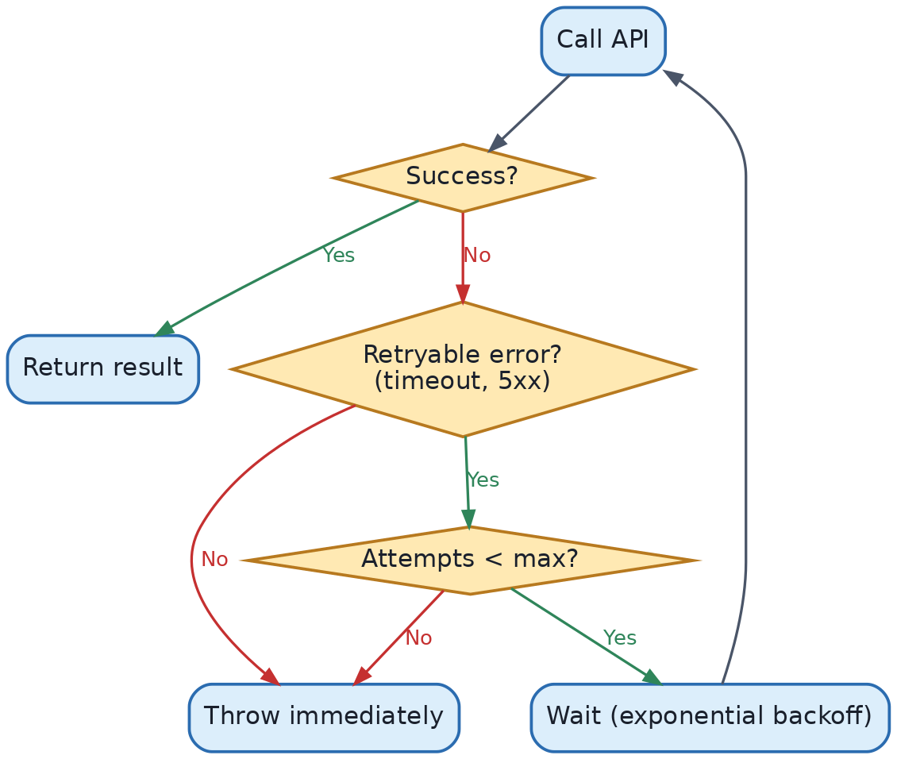{width=85%}

## Common Mistakes (Chapter 11)

1. Not checking `HTTPURLResponse.statusCode`, treating a 404/500 response as "success" because `URLSession` didn't throw.
2. Force-unwrapping `URL(string:)` or JSON fields, crashing on malformed input instead of surfacing a clean error.
3. Retrying every error unconditionally, including permanent client errors (401 unauthorized) that will never succeed on retry.
4. Putting networking code directly inside SwiftUI views instead of behind a protocol-based service, making the code untestable.
5. Ignoring `Task` cancellation in long-running requests — not propagating cancellation means wasted work when a user navigates away mid-request.

## Best Practices (Chapter 11)

- Define networking behind a protocol (`APIClient`) so it can be mocked in tests.
- Centralize a typed `NetworkError` with `LocalizedError` conformance for user-facing messages.
- Configure `JSONDecoder` explicitly (date strategy, key strategy) rather than relying on defaults.
- Implement retry with exponential backoff, and only for genuinely transient failures.
- Drive all network-triggered UI through an explicit `LoadState` enum, not scattered booleans.


# Chapter 12 — Architecture

## 12.1 Where SwiftUI Fits

SwiftUI is a **view layer**, not a full application architecture. It has strong opinions about how state flows *into* views (Chapter 4), but no opinion about how you organize business logic, networking, or persistence. This is precisely why architecture choices still matter in a SwiftUI app.

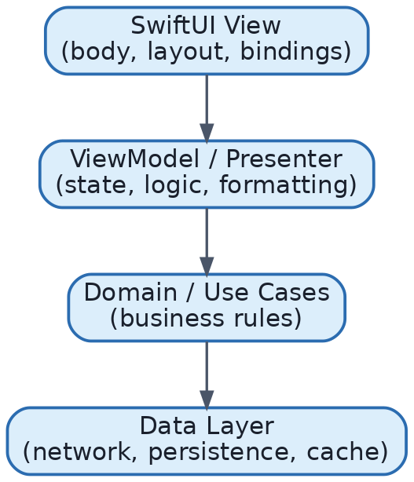{width=85%}

## 12.2 MVVM with SwiftUI

**What it is.** Model-View-ViewModel: the `View` is the SwiftUI struct; the `ViewModel` holds presentation state and logic; the `Model` is your domain/data types.

**Why it fits SwiftUI naturally.** `@Observable` classes (Chapter 4.4) are, structurally, exactly what a view model needs: a reference type holding state that views react to, decoupled from the view itself.

```swift
@MainActor
@Observable
class ProductListViewModel {
    private let repository: ProductRepository
    var state: LoadState<[Product]> = .idle
    var searchQuery = ""

    var filteredProducts: [Product] {
        guard case .loaded(let products) = state else { return [] }
        return searchQuery.isEmpty ? products : products.filter {
            $0.name.localizedCaseInsensitiveContains(searchQuery)
        }
    }

    init(repository: ProductRepository) { self.repository = repository }

    func load() async {
        state = .loading
        do { state = .loaded(try await repository.fetchAll()) }
        catch { state = .failed(error) }
    }
}

struct ProductListView: View {
    @State private var viewModel: ProductListViewModel

    init(viewModel: ProductListViewModel) { _viewModel = State(initialValue: viewModel) }

    var body: some View {
        List(viewModel.filteredProducts) { ProductRow(product: $0) }
            .searchable(text: $viewModel.searchQuery)
            .task { await viewModel.load() }
    }
}
```
Note the view holds the view model via `@State` (the view *owns* its lifecycle, tied to view identity) rather than creating it inline in `body`, which would recreate it on every re-render (Chapter 4's "common mistake" #2).

**When to use MVVM.** Almost every SwiftUI app benefits from at least a light MVVM split, once a screen has any non-trivial logic (filtering, validation, networking). For genuinely trivial screens (a static settings row), a plain `View` with `@State` is enough — introducing a view model for every single view is over-engineering.

## 12.3 The Composable Architecture (TCA) — High-Level Overview

**What it is.** A third-party architecture (from Point-Free) built around: a single `State` struct per feature, an `Action` enum describing every possible event, a `Reducer` (pure function `(inout State, Action) -> Effect`) that's the *only* place state can change, and `Effect`s representing side effects (network calls, timers) fed back in as further actions.

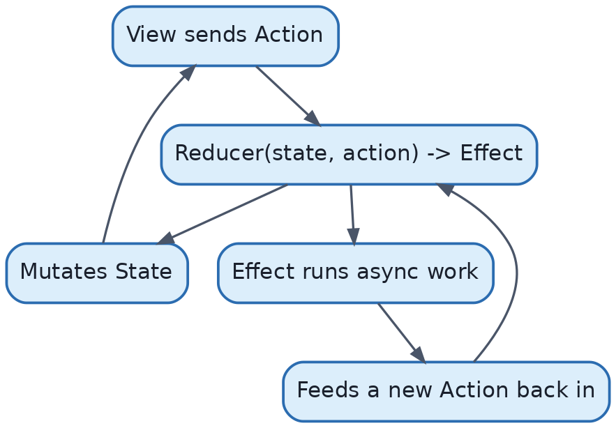{width=85%}

**Why teams choose it.** Unidirectional data flow makes state changes fully traceable and highly testable (you can assert an exact sequence of state mutations for a given sequence of actions), and composition of reducers scales well for very large apps with many contributors.

**Trade-offs vs. plain MVVM.** TCA introduces real learning curve and boilerplate (actions, reducers, dependency injection via its `Dependencies` system) — appropriate for large teams and long-lived apps where strict predictability and testability outweigh the extra ceremony; often overkill for small apps or small teams.

## 12.4 Clean Architecture in a SwiftUI App

**What it is.** Layered architecture emphasizing dependency direction: inner layers (domain/business rules) know nothing about outer layers (UI, frameworks, databases); outer layers depend on inner layers, never the reverse.

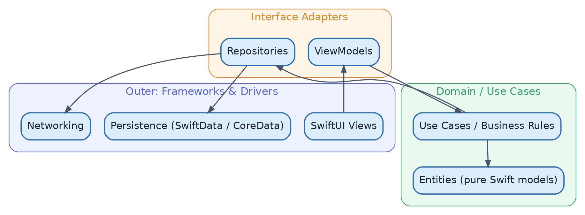{width=85%}

Applied to SwiftUI: `Entities`/`UseCase` types are plain Swift, with zero import of `SwiftUI` or `Foundation`'s networking types — this is what makes them trivially unit-testable and reusable outside the app (e.g., in a widget extension or shared package). `Repo`(sitory) protocols live in the domain layer but are *implemented* in the outer data layer, so use cases depend only on the abstraction.

**When to use full Clean Architecture.** Large, long-lived, multi-team apps where testability and the ability to swap data sources (e.g., mock vs. real backend, or migrating from REST to GraphQL) justify the extra layering. For small apps, a lighter MVVM + repository-protocol split (as in 12.2's `ProductRepository`) gets most of the benefit with far less ceremony.

## Common Mistakes (Chapter 12)

1. Putting networking/persistence code directly in views "because it's quick," creating an untestable, unmaintainable mess as the app grows.
2. Adopting TCA (or full Clean Architecture) for a small app/team where the ceremony far outweighs the benefit.
3. Creating a view model per view even for trivial static screens, adding indirection without value.
4. Letting view models import/depend on SwiftUI-specific types unnecessarily (beyond what's needed for `@Observable`/`Bindable`), blurring the view/logic boundary.

## Best Practices (Chapter 12)

- Default to MVVM with `@Observable` view models and protocol-based repositories/services for most apps.
- Reserve TCA/full Clean Architecture for large teams/apps where strict unidirectional flow and layered testability pay for their complexity.
- Keep domain/business logic free of `import SwiftUI`.
- Model async state as an enum (Chapter 10.9) inside view models regardless of which architecture you choose.


# Chapter 13 — Performance

## 13.1 How Rendering Cost Actually Breaks Down

Recomputing a view's `body` is cheap. The expensive parts of the pipeline are: **layout** (the propose/report negotiation across a subtree, Chapter 2.5) and **drawing** (rasterizing to layers). Performance work in SwiftUI is mostly about *avoiding unnecessary layout and draw passes*, not avoiding `body` calls per se.

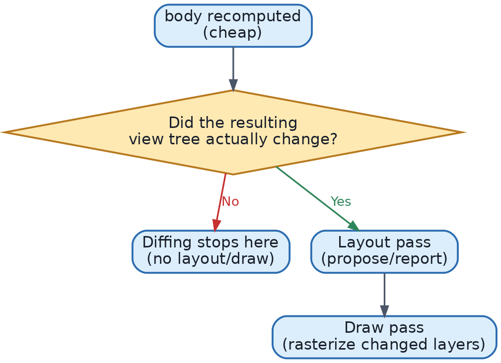{width=85%}

## 13.2 View Identity and Performance

As covered in Chapter 2.7, identity determines whether SwiftUI updates a view in place or tears it down and rebuilds it. Rebuilding is far more expensive than updating (it discards `@State`, restarts animations, and forces a fresh layout/draw of that entire subtree). Two practical implications:

- **Stable `ForEach` identity is a performance issue, not just a correctness issue** — unstable IDs cause SwiftUI to treat rows as entirely new views on data changes, discarding and rebuilding instead of cheaply updating.
- **Avoid unnecessary `.id()` calls** (Chapter 2.7) — each one is a potential full subtree rebuild.

## 13.3 EquatableView and the `Equatable` Optimization

**What it is.** `.equatable()` (available on any `View` conforming to `Equatable`) tells SwiftUI to skip recomputing a view's body if the new value is `==` to the old one, even if the parent recomputed.

```swift
struct ExpensiveRow: View, Equatable {
    let item: Item
    static func == (lhs: Self, rhs: Self) -> Bool { lhs.item == rhs.item }
    var body: some View {
        // expensive layout/computation here
        ComplexChartView(data: item.dataPoints)
    }
}

// Usage:
ExpensiveRow(item: item).equatable()
```
**Why it exists.** By default, SwiftUI can't know whether re-invoking a view's `body` would produce an identical result — it just re-invokes it (cheap) and diffs the output. For *expensive* `body` implementations, skipping the recomputation entirely via a cheap `Equatable` check is a worthwhile trade.

**When to use.** Views with genuinely expensive `body` computation (heavy layout math, large `Canvas` drawing) that re-render often due to a frequently-changing parent, but whose *own* relevant data rarely changes.
**When NOT to use.** Don't reach for this by default — for typical lightweight views, the `Equatable` check itself can cost more than just letting `body` re-run.

## 13.4 Lazy Loading

Covered in depth in Chapter 3 (`LazyVStack`, `LazyHStack`, `LazyVGrid`/`LazyHGrid`) and Chapter 6 (`List`'s built-in cell recycling). The performance principle: **never eagerly materialize views for off-screen content** in a large collection. Prefer `List`/lazy stacks over plain `VStack`+`ScrollView` for anything beyond a small, fixed number of items.

## 13.5 Avoiding Unnecessary Updates

**Read only what you need, where you need it.** Because `@Observable` tracks property-level reads (Chapter 4.4), a view that reads `model.username` inside `body` is only invalidated when `username` changes — but if you read the *whole object* in a way that touches many properties (e.g., logging the entire object, or passing it to a function that reads everything), you widen your view's dependency surface unnecessarily.

**Split large views into smaller subviews aligned with data dependencies**, so that a change to one piece of state only invalidates the small subview that actually reads it, not a giant parent `body`.

```swift
// Less optimal: entire row re-renders whenever ANY part of `item` changes
struct BigRow: View {
    let item: Item
    var body: some View {
        HStack {
            Image(item.thumbnailURL)
            Text(item.title)
            Text(item.price, format: .currency(code: "USD"))
            FavoriteButton(item: item)   // has its own frequently-changing @State
        }
    }
}

// Better: extract the volatile piece so its changes don't force sibling layout
struct BetterRow: View {
    let item: Item
    var body: some View {
        HStack {
            Image(item.thumbnailURL)
            Text(item.title)
            Text(item.price, format: .currency(code: "USD"))
            FavoriteButton(item: item)   // isolated; its internal state changes don't recompute siblings' bodies
        }
    }
}
```
(In practice, extracting `FavoriteButton` as its own `View` type is what matters — SwiftUI already scopes invalidation to it specifically as a subview, as long as it's a distinct `View` rather than inline logic sharing `BigRow`'s own state.)

## 13.6 Performance Optimization Checklist

1. Use `List`/lazy containers for anything beyond a small, fixed collection.
2. Ensure stable, meaningful `Identifiable` conformance everywhere `ForEach` is used.
3. Reserve `.equatable()` for views with genuinely expensive `body` work.
4. Keep expensive computation out of `body` — precompute in the view model, or gate behind `.task`.
5. Use Instruments' **SwiftUI** template (view body counts, "Long View Body Updates") to find real bottlenecks empirically — don't guess.
6. Prefer `.task(id:)` over manual `Task` + `onChange` bookkeeping to avoid redundant concurrent work when a dependency changes rapidly (Chapter 10.3).
7. Avoid unnecessarily broad `@Environment`/`@Observable` dependency surfaces in leaf views — read only the specific properties a subview needs.

## Common Mistakes (Chapter 13)

1. Assuming `body` being "called a lot" is inherently a problem — the real cost is unnecessary layout/draw, not `body` invocation itself.
2. Reaching for `.equatable()` everywhere as a default optimization, adding overhead without benefit on cheap views.
3. Using unstable `ForEach` identity, causing expensive full-subtree rebuilds instead of cheap in-place updates.
4. Never profiling with Instruments and instead "optimizing" based on guesses.
5. One giant `body` for an entire complex screen instead of composed subviews, widening invalidation scope unnecessarily.

## Best Practices (Chapter 13)

- Profile first (Instruments' SwiftUI template), then optimize the actual bottleneck.
- Compose views so invalidation scope matches data-change scope.
- Keep `ForEach`/`List` identity stable and meaningful.
- Reach for lazy containers, `.equatable()`, and `Canvas` deliberately, only where profiling shows they help.


# Chapter 14 — Testing

## 14.1 Unit Testing

**What to test.** Business logic, validation, formatting, and view-model state transitions — not SwiftUI's own rendering (that's Apple's job to have already tested). Using the modern **Swift Testing** framework (`import Testing`, iOS 17/Xcode 16+):

```swift
import Testing
@testable import MyApp

@Suite
struct ProductListViewModelTests {
    @Test
    func loadSuccessUpdatesStateToLoaded() async throws {
        let mockRepo = MockProductRepository(result: .success([Product.sample]))
        let viewModel = ProductListViewModel(repository: mockRepo)

        await viewModel.load()

        guard case .loaded(let products) = viewModel.state else {
            Issue.record("Expected loaded state")
            return
        }
        #expect(products.count == 1)
    }

    @Test
    func loadFailureUpdatesStateToFailed() async throws {
        let mockRepo = MockProductRepository(result: .failure(NetworkError.noConnection))
        let viewModel = ProductListViewModel(repository: mockRepo)

        await viewModel.load()

        guard case .failed = viewModel.state else {
            Issue.record("Expected failed state")
            return
        }
    }
}
```
`@Test` marks a test function (replacing XCTest's `test`-prefixed method convention); `#expect` records a non-fatal assertion (multiple can fail in one test, unlike `XCTAssert`'s traditional behavior); `async` test functions can directly `await` your `async` view model methods without wrapping in expectations, which XCTest historically required (`XCTestExpectation`/`waitForExpectations`).

Because `ProductListViewModel` depends on the `ProductRepository` **protocol** (Chapter 12.2), the test injects a `MockProductRepository` instead of hitting the real network — this dependency-inversion is precisely why protocol-based service layers matter for testability.

## 14.2 Mocking ViewModels / Dependencies

```swift
struct MockProductRepository: ProductRepository {
    let result: Result<[Product], Error>
    func fetchAll() async throws -> [Product] {
        try result.get()
    }
}
```
A simple `Result`-backed mock lets a single type represent both success and failure test scenarios, configured per-test.

## 14.3 UI Testing

**What it is.** End-to-end tests driving the actual compiled app through the accessibility tree, using `XCUIApplication`/`XCUIElement` (still XCTest-based, since UI tests run out-of-process against a real running app).

```swift
import XCTest

final class LoginFlowUITests: XCTestCase {
    func testSuccessfulLogin() throws {
        let app = XCUIApplication()
        app.launch()

        app.textFields["emailField"].tap()
        app.textFields["emailField"].typeText("user@example.com")
        app.secureTextFields["passwordField"].tap()
        app.secureTextFields["passwordField"].typeText("password123")
        app.buttons["Sign In"].tap()

        XCTAssertTrue(app.staticTexts["Welcome back!"].waitForExistence(timeout: 5))
    }
}
```
This requires each interactive element to have a stable accessibility identifier (`.accessibilityIdentifier("emailField")`) so the test can locate it reliably regardless of visible text/localization.

**When to use.** Critical end-to-end flows (login, checkout, onboarding) where you want confidence the *whole* stack (UI + navigation + real view models) works together. UI tests are slow and comparatively brittle — use them sparingly, for the highest-value flows, not for every screen.

## 14.4 Preview Testing

**What it is.** Xcode Previews (`#Preview`) aren't just a design tool — they're a fast, lightweight way to visually verify a view across states, sizes, and Dynamic Type settings without running the full simulator.

```swift
#Preview("Loaded") {
    ProductListView(viewModel: .init(repository: MockProductRepository(result: .success(Product.samples))))
}

#Preview("Error") {
    ProductListView(viewModel: .init(repository: MockProductRepository(result: .failure(NetworkError.noConnection))))
}

#Preview("Dynamic Type - Accessibility XXL") {
    ProfileCard(username: "alice", bio: "iOS engineer")
        .environment(\.sizeCategory, .accessibilityExtraExtraExtraLarge)
}
```
Multiple named previews per view, covering loaded/error/empty states and extreme accessibility settings, catch layout bugs (truncation, overlap) far earlier and faster than manually navigating the running app.

## 14.5 Testing Strategy Summary

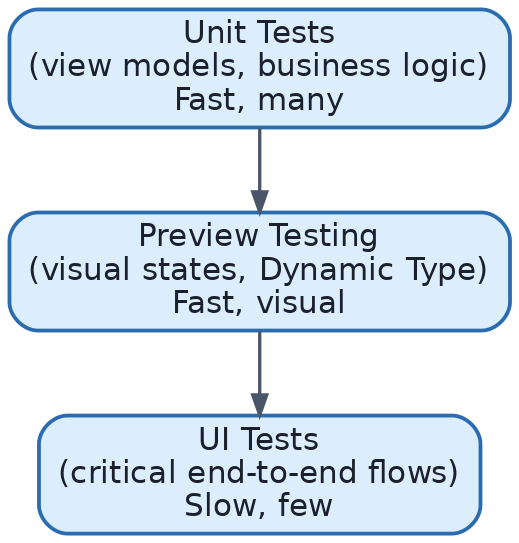{width=85%}

This is the standard "testing pyramid" applied to SwiftUI: most tests are cheap unit tests on view models/logic, a moderate number of previews cover visual states, and a small number of UI tests cover the most critical flows end-to-end.

## Common Mistakes (Chapter 14)

1. Trying to unit test SwiftUI view rendering directly instead of testing the view model/logic behind it.
2. Writing UI tests for every screen instead of reserving them for a handful of critical flows — leads to a slow, flaky test suite.
3. Forgetting `.accessibilityIdentifier()` on interactive elements, making UI tests fragile (matching on visible/localized text instead).
4. Not using previews to check extreme Dynamic Type sizes and dark mode, catching layout bugs only after they reach QA/production.
5. Testing concrete networking classes directly instead of testing through a protocol/mock, coupling tests to real network behavior.

## Best Practices (Chapter 14)

- Depend on protocols in view models so tests can inject mocks (ties directly to Chapter 12's architecture guidance).
- Use Swift Testing's `@Test`/`#expect` for new test code; understand XCTest for existing UI test suites and legacy projects.
- Add multiple `#Preview`s per view covering realistic states: loading, loaded, empty, error, and extreme accessibility settings.
- Reserve `XCUIApplication`-based UI tests for the highest-value end-to-end flows.


# Chapter 15 — Accessibility

## 15.1 Why Accessibility Matters (Beyond Compliance)

Accessible apps reach more users (aging populations, temporary impairments like a broken arm, situational impairments like bright sunlight or noisy environments), and in many regions accessibility is a legal requirement (e.g., ADA-related litigation in the US, EN 301 549 in the EU). SwiftUI gives you strong accessibility defaults for free with standard components — the skill is not breaking them, and filling gaps in custom UI.

## 15.2 VoiceOver

**What it is.** Apple's built-in screen reader, which reads UI aloud and lets users navigate by swiping between accessible elements instead of looking at the screen.

**How SwiftUI supports it by default.** Standard controls (`Text`, `Button`, `Toggle`, `TextField`) automatically expose a sensible accessibility label, value, and traits (e.g., a `Toggle` announces "Notifications, switch, on"). Custom composed views often need explicit annotation:

```swift
HStack {
    Image(systemName: "star.fill")
    Text("4.8")
    Text("(1,204 reviews)")
}
.accessibilityElement(children: .combine)
.accessibilityLabel("Rated 4.8 out of 5, 1,204 reviews")
```
Without `.accessibilityElement(children: .combine)`, VoiceOver would announce three separate elements ("star", "4.8", "1,204 reviews") as the user swipes through them individually — combining them into one coherent announcement is far better UX for VoiceOver users.

## 15.3 Dynamic Type

**What it is.** User-controlled text size settings (Settings → Accessibility → Display & Text Size), ranging from small to accessibility-large sizes.

**How SwiftUI supports it.** Any text using semantic fonts (`.font(.body)`, `.font(.headline)`, etc., rather than a fixed `.system(size: 14)`) scales automatically with the user's setting.

```swift
Text("Welcome").font(.body)          // scales with Dynamic Type
Text("Welcome").font(.system(size: 14))   // does NOT scale — avoid for user-facing text
```
**Testing it.** Use `#Preview` with `.environment(\.sizeCategory, .accessibilityExtraExtraExtraLarge)` (Chapter 14.4) to catch truncation/overlap at the largest sizes during development, not after a support ticket.

## 15.4 Accessibility Labels, Values, and Traits

- `.accessibilityLabel(_:)` — what VoiceOver announces as the element's name (essential for icon-only buttons: `Image(systemName: "trash").accessibilityLabel("Delete")`).
- `.accessibilityValue(_:)` — the element's current value, separate from its label (e.g., a slider's label is "Volume," its value is "50%").
- `.accessibilityHint(_:)` — additional context about what happens on activation ("Double tap to delete this item").
- `.accessibilityAddTraits(.isButton)` / `.isHeader` / `.isSelected` — informs VoiceOver how to describe interaction semantics.

```swift
Button {
    delete(item)
} label: {
    Image(systemName: "trash")
}
.accessibilityLabel("Delete \(item.name)")
.accessibilityHint("Removes this item from your list")
```

## 15.5 Accessibility Actions

**What they are.** Custom actions exposed to VoiceOver/Switch Control beyond the default "activate," accessible via the rotor without requiring extra visible on-screen buttons.

```swift
Text(item.name)
    .accessibilityActions {
        Button("Mark as Favorite") { toggleFavorite(item) }
        Button("Share") { share(item) }
    }
```
This lets VoiceOver users trigger swipe-action-equivalent behaviors (favorite, share) without needing to physically swipe — valuable since some gesture-based interactions (like `.swipeActions`, Chapter 6.4) are already exposed via the rotor automatically, but custom gestures often are not and need explicit accessibility actions.

## 15.6 Localization

**What it is.** Adapting text (and formatting: dates, numbers, currency, pluralization) to the user's language and region.

**How SwiftUI supports it.** `Text` initialized with a string literal automatically looks it up in `Localizable.strings`/String Catalogs (the modern `.xcstrings` format, Xcode 15+):

```swift
Text("welcome_message")   // looked up in the String Catalog, per-locale
Text("You have \(count) new messages")   // supports automatic pluralization via String Catalog plural rules
```
Modern String Catalogs (`.xcstrings`) provide a visual editor for all localizable strings in a project, including automatic detection of new/unused strings and native pluralization rule editing per language — a significant improvement over hand-maintained `.strings` files.

**Formatting dates/numbers/currency** should always use locale-aware formatters (`.formatted()`, `Text(date, format: .dateTime)`, `.formatted(.currency(code:))`) rather than manually building strings, so output automatically adapts (date order, decimal separators, currency symbol placement) per locale.

## 15.7 Right-to-Left (RTL) Support

**What it is.** Support for languages read right-to-left (Arabic, Hebrew).

**How SwiftUI supports it by default.** Layout direction (`.leading`/`.trailing` alignment, not `.left`/`.right`) automatically mirrors for RTL locales — this is precisely why SwiftUI's stack alignment options are named `.leading`/`.trailing` instead of `.left`/`.right`: they're direction-aware.

```swift
HStack {
    Image(systemName: "chevron.left")   // BAD: literal left-pointing icon, wrong in RTL
    Text("Back")
}
```
For icons with inherent directionality (like a back-chevron), use `Image(systemName: "chevron.backward")`/`.imageScale` style symbols that Apple provides with RTL-aware mirroring, or apply `.environment(\.layoutDirection, ...)`-aware logic; test any custom directional icon under Scheme → Options → App Language/RTL pseudo-language in Xcode.

## Common Mistakes (Chapter 15)

1. Using fixed-size fonts (`.system(size:)`) for body text, breaking Dynamic Type scaling for low-vision users.
2. Icon-only buttons with no `.accessibilityLabel`, so VoiceOver announces something unhelpful like "button" with no context.
3. Composed views (rating + count, price + strikethrough original price) left unmerged, causing VoiceOver to read fragmented, confusing announcements.
4. Hardcoding directional icons/text (`"left"`/`"right"`, manually built date strings) instead of direction-aware and locale-aware APIs.
5. Never testing at the largest accessibility text sizes or with VoiceOver actually turned on before shipping.

## Best Practices (Chapter 15)

- Use semantic fonts and `.leading`/`.trailing` alignment, never fixed sizes or `.left`/`.right`, for anything user-facing.
- Add `.accessibilityLabel`/`.accessibilityHint` to every icon-only or gesture-only interactive element.
- Use `.accessibilityElement(children: .combine)` to merge related, adjacent pieces of information into one coherent announcement.
- Adopt String Catalogs (`.xcstrings`) for localization and always use locale-aware formatters for dates/numbers/currency.
- Test regularly with VoiceOver on, at large Dynamic Type sizes, and (if supporting RTL languages) under the RTL pseudo-language setting.


# Chapter 16 — Latest SwiftUI Features

This chapter tracks what has changed recently and why — critical both for building modern apps and for interviews, where "what's new in SwiftUI" is an increasingly common senior-level question. Apple now uses year-based OS naming: **iOS 26** shipped September 2025; **iOS 27** was announced at WWDC 2026 (June 2026) and ships around September 2026. Everything below distinguishes what arrived in each.

## 16.1 The Modern Observation Framework (iOS 17+): What Changed and Why

**Old approach (legacy, pre-iOS 17):**
```swift
class CounterModel: ObservableObject {
    @Published var count = 0
}
struct CounterView: View {
    @StateObject private var model = CounterModel()
    var body: some View { Text("\(model.count)") }
}
```
**New approach (iOS 17+):**
```swift
@Observable
class CounterModel {
    var count = 0
}
struct CounterView: View {
    @State private var model = CounterModel()
    var body: some View { Text("\(model.count)") }
}
```

**What changed.** No more `ObservableObject` protocol conformance, no more `@Published` on every property, no more distinguishing `@StateObject` (owns) vs `@ObservedObject` (borrows) — a plain `@State` (if the view creates it) or a plain reference (if passed in) works uniformly, because `@Observable` tracks dependencies per-property automatically.

**Why Apple changed it.** The old system over-invalidated views: any `@Published` change on an object caused *every* view observing that object to recompute, even if it only read an unrelated property. `@Observable`'s macro-based, per-property tracking fixes this at the root, improving performance without any extra code from you.

**Migration strategy.** (1) Replace `class X: ObservableObject` with `@Observable class X`. (2) Remove `@Published` from every property (plain `var` is enough). (3) Replace `@StateObject private var x = X()` with `@State private var x = X()`. (4) Replace `@ObservedObject var x: X` with a plain `let x: X` or `var x: X`. (5) Replace `.environmentObject(x)` / `@EnvironmentObject var x: X` with `.environment(x)` / `@Environment(X.self) var x`. (6) Only where a view needs to *write* into a property via a `Binding`, add `@Bindable var x: X` at that use site. This can be done incrementally, file by file, since both systems can coexist during migration.

**Interview implications.** Expect to be asked to explain *why* `@Observable` is more efficient than `ObservableObject`, and to spot legacy code (`@StateObject`/`@ObservedObject`/`@Published`) and explain how you'd modernize it — this is one of the most common "old vs. new" SwiftUI interview questions (see Chapter 20).

## 16.2 SwiftData Integration

**What it is.** SwiftData (introduced iOS 17) is Apple's modern persistence framework, replacing Core Data's verbose NSManagedObject boilerplate with plain Swift model classes annotated `@Model`.

```swift
import SwiftData

@Model
class Task {
    var title: String
    var isDone: Bool = false
    init(title: String) { self.title = title }
}

struct TaskListView: View {
    @Query(sort: \Task.title) private var tasks: [Task]
    @Environment(\.modelContext) private var context

    var body: some View {
        List(tasks) { task in
            Text(task.title)
        }
        .toolbar {
            Button("Add") {
                context.insert(Task(title: "New Task"))
            }
        }
    }
}
```
`@Query` is a property wrapper that fetches and *automatically re-renders the view* whenever underlying data matching the query changes — directly analogous to `@FetchRequest` in Core Data's SwiftUI integration, but with far less setup (no `.xcdatamodeld` file, no generated subclasses).

**WWDC 2026 (iOS 27) SwiftData additions:** sectioned fetching moved directly into `@Query` via a `sectionBy:` parameter (grouping results without manual post-processing), `@Attribute(.codable)` as an explicit opt-in for persisting types SwiftData doesn't natively model (at the cost of losing query/sort/migration awareness on that field), a `ResultsObserver` API bringing `@Query`-style fetching/observation to non-SwiftUI code (e.g., background services), and a `HistoryObserver` for reacting to persistent-history changes (useful for sync engines).

## 16.3 New Navigation APIs

`NavigationStack`/`NavigationPath` (Chapter 5) remain the modern foundation. Toolbar APIs gained meaningful upgrades in iOS 26/27: `visibilityPriority` lets you rank which toolbar buttons stay visible first as space shrinks, less-used actions can be pushed into an automatic overflow menu, and specific actions can be pinned so they're always visible regardless of available space — directly addressing toolbar crowding as apps accumulate more actions over time.

```swift
.toolbar {
    ToolbarItem { Button("Share", systemImage: "square.and.arrow.up") { share() } }
        .visibilityPriority(.high)
    ToolbarItem { Button("Archive", systemImage: "archivebox") { archive() } }
        .visibilityPriority(.low)   // moves to overflow menu first under space pressure
}
```

## 16.4 New Presentation APIs

iOS 26/27 expanded presentation ergonomics: swipe actions can now be attached to *any* view, not just `List` rows (Chapter 6.4's `.swipeActions` generalized beyond lists); item-binding confirmation dialogs and alerts let you present confirmation UI tied directly to an optional/`Identifiable` value (the same ergonomic improvement `.sheet(item:)` brought to sheets, Chapter 5.4, now extended to confirmation flows); and `AsyncImage` gained improved caching behavior, reducing redundant re-downloads of the same remote image across a session.

## 16.5 Reorderable Containers & List/Grid Improvements

Historically, drag-to-reorder (`.onMove`, Chapter 6.6) was tied specifically to `List` in Edit mode. iOS 26/27 generalized this into **reorderable containers** usable more broadly — drag-to-reorder support in more container types, plus full-fidelity text selection within lists on iOS (previously more limited than on macOS).

## 16.6 The Document Protocol (iOS 26/27)

**What it is.** A new `WritableDocument`/`ReadableDocument` protocol pair giving apps a structured, asynchronous, incremental way to read/write files to disk — with built-in progress reporting via Foundation's `Subprogress` API, rather than hand-rolled `FileHandle`/`Data` plumbing plus manual progress tracking.

**Why it matters.** Document-based apps (`DocumentGroup`, introduced earlier) previously required more manual work to report load/save progress and to stream large files incrementally; this protocol standardizes that pattern.

## 16.7 Compiler & Performance Changes: ContentBuilder and Lazy Observable Init

Two changes matter for senior-level understanding of "why is my build faster/slower":

1. **`ContentBuilder`** (2027-era toolchain) unifies what used to be many per-container result-builder overloads (separate builder logic for `VStack`, `HStack`, `List`, etc.) into a single builder type, reducing the type-checker's work to one decision path instead of many — translating directly into faster compile times for view-heavy files.
2. **Lazy state initialization for `@Observable` types.** Previously, an `@Observable` model referenced by a view could, in some cases, be initialized eagerly even when not yet needed; newer SwiftUI defers this initialization until first access, reducing unnecessary upfront work — a free performance win requiring no code changes.

Also notable: **Liquid Glass** (introduced iOS 26, refined in 26/27) is a system-wide material/appearance update; apps built with standard SwiftUI materials and controls pick it up automatically, including responding to the system-level Liquid Glass intensity slider, with zero required code changes — a strong argument for using standard components rather than fully custom-drawn chrome.

## 16.8 Deprecated APIs and Recommended Replacements

| Deprecated / Legacy | Replacement | Since |
|---|---|---|
| `NavigationView` | `NavigationStack` / `NavigationSplitView` | iOS 16 |
| `ObservableObject` + `@Published` | `@Observable` macro | iOS 17 (legacy still works) |
| `@StateObject` / `@ObservedObject` | `@State` / plain reference + `@Bindable` | iOS 17 |
| `@EnvironmentObject` | `.environment(_:)` + `@Environment(Type.self)` | iOS 17 |
| `.animation(_:)` (valueless) | `.animation(_:value:)` | iOS 15 |
| `.onChange(of:)` (single-parameter closure) | `.onChange(of:initial:_:)` two-parameter closure | iOS 17 |
| Core Data (for new projects) | SwiftData | iOS 17 |
| Manual `.tabItem` per view | `Tab(_:systemImage:)` builder | iOS 18 |
| `.onMove` only within `List` Edit mode | Generalized reorderable containers | iOS 26/27 |

## 16.9 Interview Implications Summary

Interviewers increasingly probe for *awareness of change over time*, not just current syntax: be ready to explain what `@Observable` fixed versus `ObservableObject`, why `NavigationStack` replaced `NavigationView`, what SwiftData simplifies versus Core Data, and to recognize legacy code on sight and describe a safe, incremental migration path. See Chapter 20 for concrete Q&A on this material.

## Common Mistakes (Chapter 16)

1. Writing brand-new code in 2026 using `ObservableObject`/`@Published`/`@StateObject` out of habit, when `@Observable` is simpler and more efficient.
2. Still reaching for `NavigationView` in new projects.
3. Assuming SwiftData replaces Core Data everywhere without checking feature parity for advanced needs (e.g., very complex migrations) on your minimum deployment target.
4. Not knowing the *reason* behind a migration (e.g., reciting "`@Observable` is newer" without being able to explain the per-property invalidation improvement) — interviewers probe for understanding, not memorization.

## Best Practices (Chapter 16)

- Target iOS 17+ where feasible for new projects specifically to unlock `@Observable`/SwiftData/the modern `onChange` signature.
- Track deprecations proactively each WWDC cycle (via Apple's release notes and WWDC "What's new in SwiftUI" sessions) rather than discovering them via compiler warnings years later.
- When maintaining legacy code, migrate incrementally (file by file), since old and new observation systems can coexist during transition.


# Chapter 17 — SwiftUI vs. UIKit: Detailed Comparison

## 17.1 Comparison Tables

### Performance

| Aspect | UIKit | SwiftUI |
|---|---|---|
| Raw rendering ceiling | Highest — direct `CALayer`/manual control | Very good, occasionally behind hand-tuned UIKit for extreme cases (huge custom scroll views, complex text layout) |
| Update granularity | Manual (you control exactly what redraws) | Automatic diffing; usually efficient, occasionally over-invalidates without care (Ch. 13) |
| Startup/compile | Mature, predictable | Improving each year (e.g., `ContentBuilder`, Ch. 16.7); historically had slower type-checking on complex `body`s |

### Learning Curve

| Aspect | UIKit | SwiftUI |
|---|---|---|
| Initial ramp-up | Steeper (delegates, data sources, Auto Layout constraints) | Gentler — declarative syntax closer to describing the UI you see |
| Mastery ceiling | Very deep (15+ years of APIs) | Also deep, but a smaller surface area reaches production-quality results faster |
| Debugging model | Very transparent (you wrote every step) | Requires understanding diffing/identity internals to debug fully (Ch. 1.7, 13) |

### Navigation

| Aspect | UIKit | SwiftUI |
|---|---|---|
| Model | `UINavigationController` push/pop, imperative | `NavigationStack` + `NavigationPath`, state-driven (Ch. 5) |
| Deep linking | Manual, imperative reconstruction of the stack | Set a `path` value directly; simpler and more testable |
| Flexibility | Extremely flexible, battle-tested for complex custom transitions | Good for standard patterns; complex custom transitions may need UIKit interop |

### Animations

| Aspect | UIKit | SwiftUI |
|---|---|---|
| Model | `UIView.animate`, Core Animation directly | Declarative (`withAnimation`, `.animation`, transitions, Ch. 8) |
| Fine-grained control | Maximum (frame-by-frame, custom timing functions) | High-level constructs (`PhaseAnimator`, `.keyframeAnimator`) cover most cases; extreme custom control still favors Core Animation directly |
| Shared-element transitions | Manual, non-trivial | `.matchedGeometryEffect` (Ch. 8.4), much simpler to express |

### State Management

| Aspect | UIKit | SwiftUI |
|---|---|---|
| Source of truth | Wherever you choose to put it; no enforced pattern | Explicit property wrappers (`@State`, `@Observable`, etc., Ch. 4) with framework-enforced flow |
| Sync bugs | Common (manual `reloadData`, manual label updates) | Structurally reduced by declarative binding to state |

### Testing

| Aspect | UIKit | SwiftUI |
|---|---|---|
| Unit testing | Mature; view controllers can be harder to isolate from UIKit lifecycle | View models are naturally isolated from `View` structs, easing unit testing (Ch. 14) |
| UI testing | `XCUIApplication`, mature and identical approach | Same `XCUIApplication` approach works identically |
| Preview-driven iteration | Limited (Interface Builder, or manual runs) | Strong (`#Preview`, multiple states, Ch. 14.4) |

### Scalability & Enterprise Usage

| Aspect | UIKit | SwiftUI |
|---|---|---|
| Large team conventions | Extremely well-established over 15+ years | Still maturing; teams often need to establish their own conventions (Ch. 18) |
| Legacy codebase size | Enormous existing codebases at most large companies | Growing adoption; incremental adoption via `UIHostingController` is standard |
| Third-party library maturity | Very mature ecosystem | Rapidly maturing; some gaps remain for specialized needs |

## 17.2 When UIKit Is Still Preferred

1. **Extremely custom, high-performance scrolling/paging** (e.g., a custom video feed with frame-perfect scroll-linked animations) where you need full control over the render loop.
2. **Advanced camera/AV capture UI** with tight custom overlays and precise gesture-to-frame synchronization.
3. **Very large legacy codebases** where a full rewrite isn't justified — SwiftUI is adopted incrementally via `UIHostingController`, not as a wholesale replacement.
4. **Apps needing to support iOS versions SwiftUI doesn't adequately cover** (pre-iOS 13, or relying on APIs only added in very recent SwiftUI versions while supporting older minimums).
5. **Highly specialized custom text editors/rich text layout** where `TextKit` (UIKit) offers finer control than SwiftUI's text APIs currently provide.

## 17.3 Interoperability (The Practical Reality)

Most production apps in 2026 are not "pure SwiftUI" or "pure UIKit" — they interoperate:

```swift
// Hosting SwiftUI inside UIKit
let hostingController = UIHostingController(rootView: MyDetailView())
navigationController?.pushViewController(hostingController, animated: true)

// Hosting UIKit inside SwiftUI
struct CameraViewControllerWrapper: UIViewControllerRepresentable {
    func makeUIViewController(context: Context) -> CameraViewController {
        CameraViewController()
    }
    func updateUIViewController(_ uiViewController: CameraViewController, context: Context) {}
}
```
This bidirectional interop is precisely why "SwiftUI vs. UIKit" is rarely an all-or-nothing decision in practice — the senior-level skill is choosing the right tool per-screen and interoperating cleanly, not dogmatically picking one framework for an entire large app.

## Common Mistakes (Chapter 17)

1. Treating the choice as binary/permanent instead of recognizing most real apps mix both, adopting SwiftUI incrementally.
2. Rewriting an entire mature UIKit app in SwiftUI in one large effort instead of an incremental, screen-by-screen migration.
3. Assuming SwiftUI can't interoperate with UIKit at all (or vice versa) and therefore avoiding SwiftUI entirely in an existing UIKit app.

## Best Practices (Chapter 17)

- For new apps, default to SwiftUI; interoperate with UIKit only where a genuine gap exists.
- For existing UIKit apps, adopt SwiftUI incrementally via `UIHostingController`, starting with new, self-contained screens.
- Know the specific, concrete situations where UIKit still wins (17.2) so you can make a deliberate choice, not a default one.


# Chapter 18 — Best Practices

## 18.1 Folder Structure

A scalable, common structure for a mid-to-large SwiftUI app organizes by **feature**, not by type, once the app grows past a trivial size:

```
MyApp/
├── App/
│   ├── MyApp.swift              (the @main App struct)
│   └── AppDependencies.swift    (composition root / DI container)
├── Features/
│   ├── ProductList/
│   │   ├── ProductListView.swift
│   │   ├── ProductListViewModel.swift
│   │   └── ProductListViewTests.swift
│   ├── ProductDetail/
│   └── Checkout/
├── Domain/
│   ├── Models/                  (Product, Order, User — plain Swift)
│   └── Repositories/            (protocols, e.g. ProductRepository)
├── Data/
│   ├── Networking/               (APIClient, Endpoint, NetworkError)
│   └── Persistence/              (SwiftData models/repositories)
├── DesignSystem/
│   ├── Components/              (CardView, PrimaryButton, ...)
│   ├── Modifiers/                (CardStyle, ...)
│   └── Theme.swift
└── Resources/
    ├── Assets.xcassets
    └── Localizable.xcstrings
```
**Why feature-based over type-based** (avoiding a single giant `Views/`, `ViewModels/`, `Models/` folder each with 200 files): related code changes together, new contributors can find everything about one feature in one place, and it scales naturally as features are added or removed.

## 18.2 File Organization Within a Feature

Keep each `View` and its `ViewModel` co-located and roughly matched in scope — one primary view per file, with small private subviews either in the same file (if tightly coupled and short) or split out once they're reused elsewhere.

## 18.3 Reusable Components

Build a small internal "component library" (`DesignSystem/Components`) for anything appearing more than twice: buttons, cards, badges, section headers. Parameterize with the minimum necessary inputs and prefer composition (accepting a `@ViewBuilder` content closure) over dozens of boolean flags:

```swift
struct SectionHeader<Trailing: View>: View {
    let title: String
    @ViewBuilder var trailing: Trailing

    var body: some View {
        HStack {
            Text(title).font(.headline)
            Spacer()
            trailing
        }
    }
}
```

## 18.4 Dependency Injection

Favor **initializer injection** over global singletons for testability:

```swift
// Avoid: hidden global dependency, hard to test
class ProductListViewModel {
    func load() async { let products = try? await NetworkManager.shared.fetchProducts() }
}

// Prefer: explicit, testable dependency
@MainActor @Observable
class ProductListViewModel {
    private let repository: ProductRepository
    init(repository: ProductRepository) { self.repository = repository }
}
```
A lightweight composition root (`AppDependencies`) constructs concrete implementations once, at app launch, and hands them down to feature view models — avoiding a heavyweight DI framework for small-to-medium apps while still keeping dependencies explicit and swappable in tests.

## 18.5 Design Systems

Centralize colors, fonts, and spacing as semantic tokens (not raw hex values scattered across the app) so a rebrand or dark-mode adjustment is a one-file change:

```swift
extension Color {
    static let brandPrimary = Color("BrandPrimary")   // defined once in the asset catalog
}
extension Font {
    static let cardTitle = Font.system(.headline, design: .rounded)
}
```

## 18.6 Naming Conventions

- Views: noun/description + `View` suffix (`ProductListView`, not `ProductList`).
- View models: matching name + `ViewModel` suffix (`ProductListViewModel`).
- Booleans: read as an assertion (`isLoading`, `hasError`, `canSubmit`), not ambiguous nouns.
- Protocols describing capability: often an `-able`/`-ing` form (`Fetchable`) or a plain noun for a role (`ProductRepository`), matching Swift API design guidelines.

## 18.7 Code Readability

- Keep `body` implementations under roughly 30–40 lines; extract subviews once it grows past that.
- Extract complex conditional logic and computed properties out of `body` into named computed properties on the view or (better) the view model.
- Prefer explicit, named types (`LoadState<T>`, `Route`) over deeply nested optionals/tuples for clarity.

## 18.8 Production Architecture Checklist

1. Views are thin: layout and bindings only, no business logic.
2. View models own state and logic, depend on protocols (not concrete networking/persistence types).
3. Domain models are plain Swift, free of `import SwiftUI`.
4. Async state is modeled as an explicit enum (`LoadState`), not scattered booleans.
5. Navigation is driven by a single, inspectable source of truth (`NavigationPath`/`Route` array).
6. Dependencies are injected via initializers, composed once at app launch.
7. Design tokens (colors, fonts, spacing) are centralized, not hardcoded per-view.

## Common Mistakes (Chapter 18)

1. Organizing a growing app by type (`Views/`, `Models/`, `ViewModels/` each with hundreds of files) instead of by feature.
2. Relying on global singletons (`NetworkManager.shared`) instead of injected, protocol-based dependencies.
3. Hardcoding colors/fonts per-view instead of centralizing a design system.
4. Giant `body` implementations mixing layout, business logic, and formatting in one 200-line block.
5. Inconsistent naming (some views without a `View` suffix, some view models without a consistent suffix), making a codebase harder to navigate for new contributors.

## Best Practices (Chapter 18)

- Organize by feature once an app grows beyond a handful of screens.
- Inject dependencies through initializers; reserve `@Environment` for genuinely cross-cutting concerns (Ch. 4.5).
- Build and reuse a small design-system component/token library from day one.
- Keep views thin and push logic/state into testable view models and domain types.


# Chapter 19 — 50 Common SwiftUI Mistakes

Each mistake shows incorrect code, corrected code, and why it matters. Grouped by topic for easier reference.

### State Management

**1. Non-private `@State`.**
```swift
// Wrong
struct CounterView: View { @State var count = 0 }
// Right
struct CounterView: View { @State private var count = 0 }
```
`@State` is an implementation detail of the owning view; exposing it invites other views to read/write it directly instead of via `@Binding`, breaking ownership (Ch. 4.2).

**2. Creating a model inline and passing it as `@ObservedObject`.**
```swift
// Wrong: recreated every time the parent re-renders
ChildView(model: SomeModel())
// Right
@StateObject private var model = SomeModel()   // or @State with @Observable
ChildView(model: model)
```

**3. Overusing `@Published` on every property (legacy).**
Marking every property `@Published` causes broad invalidation. Migrate to `@Observable` (Ch. 16.1) for per-property tracking.

**4. Treating `@Binding` as a copy.**
```swift
// Wrong assumption: "editing isOn in the child won't affect the parent"
// Right: it always writes back to the source — that's the point of a Binding.
```

**5. Forgetting to inject `@EnvironmentObject`/`@Environment` dependencies.**
```swift
// Wrong: crashes at runtime, "No ObservableObject of type X found"
ChildView().environmentObject(Settings())  // injected on the wrong branch of the tree
// Right: inject at a common ancestor of every view that needs it.
```

**6. Using `@State` for shared/business data.**
```swift
// Wrong
@State private var currentUser: User?   // needed by five unrelated screens
// Right: model as an @Observable service injected via @Environment.
```

### View Identity & ForEach

**7. Index-based `ForEach` identity.**
```swift
// Wrong
ForEach(items.indices, id: \.self) { i in Text(items[i].name) }
// Right
ForEach(items) { item in Text(item.name) }   // Item: Identifiable
```

**8. Non-unique or unstable custom `id`.**
```swift
// Wrong: two items with the same name collide
ForEach(items, id: \.name) { ... }
// Right: use a genuinely unique field (server ID, UUID).
```

**9. Overusing `.id()` to "fix" animation glitches.**
Forces full subtree teardown/rebuild; understand *why* an animation is glitching (usually a transition/identity mismatch, Ch. 8.3) before reaching for `.id()`.

**10. Switching between structurally different views in `if/else` and expecting state to persist.**
```swift
if isEditing { TextField("Name", text: $name) } else { Text(name) }
```
These are different types in the same position; SwiftUI treats them as different views structurally — any local `@State` inside either branch resets when switching.

### Layout

**11. `VStack` + `ScrollView` for thousands of items.**
```swift
// Wrong
ScrollView { VStack { ForEach(hugeArray) { ItemRow(item: $0) } } }
// Right
ScrollView { LazyVStack { ForEach(hugeArray) { ItemRow(item: $0) } } }   // or use List
```

**12. `Spacer()` inside a `ScrollView`'s scroll axis.**
Collapses to near-zero; use fixed spacing/padding instead for scrollable content.

**13. Reaching for `GeometryReader` for simple proportional sizing.**
```swift
// Wrong (overkill, and GeometryReader greedily takes all available space)
GeometryReader { geo in Text("Hi").frame(width: geo.size.width * 0.5) }
// Right, in many cases
Text("Hi").frame(maxWidth: .infinity, alignment: .leading)
```

**14. Deeply nested stacks instead of `Grid`.**
Three levels of `VStack`/`HStack` trying to align a table — use `Grid` (Ch. 3.5) for column alignment across rows.

**15. Ignoring `.layoutPriority` when siblings compete for space.**
Leads to both a label and its value truncating unpredictably; set explicit priority on whichever must not truncate.

### Modifiers & Body

**16. Expensive computation inside `body`.**
```swift
// Wrong
var body: some View { let sorted = hugeArray.sorted(); return List(sorted) { ... } }
// Right: compute once in a view model or via .task, store as @State.
```

**17. Wrong modifier order.**
```swift
Text("Hi").padding().background(.red)   // red box bigger than text
Text("Hi").background(.red).padding()   // red box exactly text size, padding outside
```
Know which effect you actually want.

**18. Giant, unfactored `body` (150+ lines).**
Extract subviews; improves readability, compiler type-checking speed, and testability.

**19. Side effects (logging, network calls) directly in `body`.**
`body` can run many times; side effects belong in `.task`/`.onChange`/`.onAppear`.

**20. Repeating the same modifier chain across many views instead of a custom `ViewModifier`.**
Extract a `ViewModifier` once a combination repeats 2–3+ times (Ch. 2.2).

### Navigation

**21. Still using deprecated `NavigationView`.**
Migrate to `NavigationStack`/`NavigationSplitView` (Ch. 5.1, 16.8).

**22. Two separate variables for item-driven sheets.**
```swift
// Wrong
@State private var showingDetail = false
@State private var selectedItem: Item?
// Right
@State private var selectedItem: Item?
.sheet(item: $selectedItem) { item in ItemDetailView(item: item) }
```

**23. Using `.alert` for 3+ unrelated actions.**
Use `.confirmationDialog` instead (Ch. 5.7).

**24. Building deep linking as chained imperative presents/pushes with delays.**
Drive it from a single `path`/`NavigationPath` value set all at once (Ch. 5.9).

**25. One `NavigationStack` shared incorrectly across `TabView` tabs.**
Give each tab its own `NavigationStack` so per-tab history is preserved.

### Lists

**26. Forgetting `role: .destructive` on delete-style swipe actions.**
Loses correct red styling and accessibility semantics automatically provided by the role.

**27. Filtering large data synchronously on every keystroke in `.searchable`.**
```swift
// Wrong: filters instantly on every character, freezing UI on large datasets
// Right: debounce with .task(id: query) { try? await Task.sleep(for: .milliseconds(300)); ... }
```

**28. Mixing `.onDelete`/`.onMove` and `.swipeActions` inconsistently** across the same list, confusing the interaction model.

**29. Using `List` for a non-row-like custom visual design.**
Fighting the component instead of using `ScrollView` + `LazyVGrid`/custom `Layout`.

### Forms

**30. Manual string↔number conversion for numeric fields.**
```swift
// Wrong
TextField("Price", text: $priceString)   // then Double(priceString) elsewhere, crash-prone
// Right
TextField("Price", value: $price, format: .currency(code: "USD"))
```

**31. Forgetting `.tag()` on `Picker` options.**
Selection silently fails to update/reflect correctly.

**32. Inline scattered validation instead of centralized, testable logic.**
Move validation into computed properties on an `@Observable` view model (Ch. 7.12).

**33. No `@FocusState` for multi-field forms.**
No way to auto-advance focus or dismiss the keyboard cleanly; always use `@FocusState` with an enum of fields.

**34. Disabling a submit button with no visible explanation.**
Pair `.disabled(!isValid)` with inline error messages.

### Animation

**35. `.animation()` without a `value:` parameter, or applied too high in the tree.**
Causes unrelated state changes to animate unintentionally; scope tightly with `.animation(_:value:)`.

**36. Expecting `.transition()` to animate a resize.**
Transitions apply on insert/remove (identity change); use `.animation(value:)` for continuous property changes instead.

**37. Mismatched `.matchedGeometryEffect` namespaces/ids.**
Silently breaks the shared-geometry animation; both views must share the exact same `id` and `Namespace`.

**38. Hand-rolled `Timer`-based looping animations instead of `PhaseAnimator`/`.keyframeAnimator`.**
Misses automatic scheduling/cleanup and Reduce Motion accessibility support.

### Concurrency

**39. `Task { }` inside `.onAppear` instead of `.task { }`.**
Misses automatic cancellation when the view disappears, wasting work/resources.

**40. Missing `@MainActor` on a view model updating observable UI state.**
Risks non-deterministic UI updates originating from background threads.

**41. Not checking `Task.isCancelled` in long loops.**
Wastes work (and potentially money on paid API calls) after the user navigates away.

**42. Passing non-`Sendable` mutable classes across actor boundaries** and silencing the resulting warning instead of fixing the design.

### Networking

**43. Not checking `HTTPURLResponse.statusCode`.**
`URLSession` doesn't throw just because the server returned 404/500 — check status codes explicitly (Ch. 11.1).

**44. Force-unwrapping `URL(string:)` or JSON fields.**
Crashes on malformed input; use safe unwrapping and typed error handling instead.

**45. Retrying on non-transient errors (e.g., 401 Unauthorized).**
Wastes time/battery; only retry on timeouts/5xx errors (Ch. 11.5).

### Architecture & Testing

**46. Networking/persistence code written directly inside views.**
Untestable and unmaintainable as the app grows; move behind protocol-based services (Ch. 12).

**47. A view model per trivial static screen.**
Over-engineering; reserve view models for screens with real logic.

**48. Unit testing SwiftUI rendering directly instead of testing the view model/logic behind it.**

**49. UI tests for every screen instead of the highest-value end-to-end flows only.**
Leads to a slow, flaky suite.

### Accessibility

**50. Fixed-size fonts (`.system(size:)`) for user-facing body text, and icon-only buttons with no `.accessibilityLabel`.**
Breaks Dynamic Type scaling and leaves VoiceOver announcing nothing meaningful; use semantic fonts and always label icon-only controls (Ch. 15).

## Best Practices Recap

Run through this chapter periodically against your own codebase — most SwiftUI production bugs and code-review comments map directly onto one of these fifty patterns. Treat it as a checklist during code review, not just a one-time read.


# Chapter 20 — Interview Preparation

## Part A: Beginner Questions (30+)

**1. What is SwiftUI?**
Answer: A declarative UI framework from Apple for building interfaces across all Apple platforms, where you describe what the UI should look like for a given state rather than writing step-by-step mutation code.
Why: Tests basic definitional understanding.
Follow-ups: How does it differ from UIKit? When was it introduced?

**2. What does "declarative" mean, and how does it differ from "imperative"?**
Answer: Declarative code describes the desired end state; the framework figures out how to get there. Imperative code specifies each step to mutate the UI manually.
Why: Core conceptual distinction underlying all of SwiftUI.
Follow-ups: Give an example of each style for the same UI change.

**3. What protocol must a SwiftUI view conform to?**
Answer: `View`, which requires a `body` property returning `some View`.
Follow-ups: What does `some View` mean?

**4. What does `some View` mean?**
Answer: An opaque return type — "some specific, concrete type conforming to View, determined by the compiler, but hidden from the caller." All return paths in one function must return the same concrete type.
Why: A very common early point of confusion (people think it means "any View").
Follow-ups: Why can't you use `View` as a return type directly here?

**5. What is a modifier?**
Answer: A method that takes a view and returns a new, wrapped view with added styling/behavior — e.g. `.padding()`, `.font()`.
Follow-ups: Does modifier order matter?

**6. Does the order of modifiers matter?**
Answer: Yes — each modifier wraps the previous result, so `.padding().background(.red)` differs visually from `.background(.red).padding()`.
Follow-ups: Show an example.

**7. What is `@State` used for?**
Answer: Local, view-owned, transient state — SwiftUI stores the actual value outside the view struct so it survives the view being recreated on re-render.
Follow-ups: Why should it be `private`?

**8. Why should `@State` properties be marked `private`?**
Answer: They're meant to be an implementation detail owned by that view; exposing them invites other views to read/write them directly instead of through a `Binding`, breaking ownership.
Follow-ups: What happens if you don't?

**9. What is a `Binding`?**
Answer: A two-way reference (`Binding<T>`) to state owned elsewhere, allowing a child view to read and write it without owning it.
Follow-ups: How do you create one from a `@State` property?

**10. What does the `$` prefix do, e.g. `$count`?**
Answer: Produces a `Binding` to the underlying `@State` (or other wrapped) property's storage.
Follow-ups: What happens if you pass `count` instead of `$count` to a view expecting a `Binding<Int>`?

**11. What is `VStack`/`HStack`/`ZStack`?**
Answer: Layout containers stacking children vertically, horizontally, or layered back-to-front, respectively.
Follow-ups: What's the default alignment for each?

**12. What does `Spacer()` do?**
Answer: An invisible view that expands to fill available space along its container's axis, pushing siblings apart.
Follow-ups: What happens if you use it inside a ScrollView's scroll axis?

**13. What is `List` used for?**
Answer: A scrollable, native collection view with built-in cell recycling — the declarative equivalent of `UITableView`.
Follow-ups: How does it differ from `ScrollView` + `VStack`?

**14. What must a type conform to in order to be used in a `ForEach` without an explicit `id:`?**
Answer: `Identifiable`, providing a stable, unique `id`.
Follow-ups: Why is using array index as `id` risky?

**15. What is `NavigationStack`?**
Answer: The modern, state-driven container managing push/pop navigation, replacing `NavigationView`.
Follow-ups: What replaced NavigationView, and why?

**16. What's the difference between a `.sheet` and a `.fullScreenCover`?**
Answer: A sheet is a partial-height modal that can be swiped down to dismiss; a full-screen cover covers the entire screen with no default swipe-to-dismiss affordance.
Follow-ups: When would you choose one over the other?

**17. What does `.onAppear` do?**
Answer: Runs a closure when the view appears on screen.
Follow-ups: Why might `.task` be preferred over `.onAppear` for async work?

**18. What is `TextField` used for, and how do you bind it?**
Answer: A single-line text input bound to a `String` (or typed value with `format:`) via a two-way binding.
Follow-ups: How do you bind it to a `Double`?

**19. What is a `Toggle`?**
Answer: A boolean switch control bound to a `Bool` via `isOn:`.

**20. What is `withAnimation` used for?**
Answer: Wraps a state change so all resulting visual differences are animated.
Follow-ups: What's the difference from the `.animation()` modifier?

**21. What is a `Shape` in SwiftUI?**
Answer: A type conforming to the `Shape` protocol describing a fillable/strokeable path — e.g. `Circle`, `Rectangle`.

**22. What is `async`/`await`?**
Answer: Swift's structured concurrency syntax letting asynchronous code read top-to-bottom without nested completion handlers; `await` suspends without blocking the thread.
Follow-ups: What problem does this solve compared to completion handlers?

**23. What does the `.task` modifier do?**
Answer: Starts async work tied to the view's lifecycle, automatically cancelling it when the view disappears.
Follow-ups: How is this different from starting a Task inside onAppear?

**24. What is `@Observable`?**
Answer: A macro (iOS 17+) applied to a class making its properties automatically, individually trackable by SwiftUI — the modern replacement for `ObservableObject` + `@Published`.
Follow-ups: What's the key advantage over the old system?

**25. What is MVVM?**
Answer: Model-View-ViewModel — an architecture separating the view (SwiftUI struct), the view model (state/logic), and the model (domain data).
Follow-ups: Why does it fit SwiftUI naturally?

**26. What is Dynamic Type?**
Answer: User-controlled text size settings that scale text automatically when using semantic fonts like `.font(.body)`.
Follow-ups: What breaks Dynamic Type support?

**27. What does `.accessibilityLabel` do?**
Answer: Sets what VoiceOver announces as an element's name — essential for icon-only buttons with no visible text.

**28. What is a `Picker`, and what does `.tag()` do on its options?**
Answer: A selection control; `.tag()` ties each option's underlying value to the binding so the picker can report which case was selected.

**29. What is the difference between `Form` and plain `VStack` for input screens?**
Answer: `Form` applies platform-appropriate grouped styling (e.g., grouped list style on iOS) automatically suited for settings/input screens.

**30. What is a Preview (`#Preview`)?**
Answer: A lightweight, live-rendering tool in Xcode letting you see a view's appearance without running the full simulator, supporting multiple named states.
Follow-ups: How would you preview a view in an error state?

**31. What is `@Environment` used for?**
Answer: Injecting a value into a view subtree so descendants can read it without explicit passing through every intermediate initializer.

**32. What's the difference between `Text` and `TextField`?**
Answer: `Text` displays static, read-only text; `TextField` is an editable input bound to a `String`/value.


## Part B: Intermediate Questions (30+)

**33. Explain how SwiftUI decides whether to update a view in place versus tear it down and recreate it.**
Answer: It's based on view identity (Ch. 2.7) — structural identity (same type, same position in the tree across `body` calls) or explicit identity (`.id()`/`Identifiable`). Same identity → update in place; different identity → remove old, insert new.
Follow-ups: What happens to a view's `@State` when identity changes?

**34. What's the difference between `@StateObject` and `@ObservedObject` (legacy)?**
Answer: `@StateObject` creates and owns the object's lifecycle, tied to the view's identity (created once, survives re-renders); `@ObservedObject` assumes external ownership and merely observes — using it where the object is created inline in the parent risks silent resets.
Follow-ups: How does `@Observable` change this distinction?

**35. Why does `@Observable` perform better than `ObservableObject` + `@Published`?**
Answer: `@Observable` tracks dependencies per-property, so a view only re-renders when a property it actually read changes; `ObservableObject` broadcasts a single "something changed" signal for any `@Published` property, invalidating every observing view regardless of what it reads.
Follow-ups: Walk through the migration steps.

**36. What is `NavigationPath`, and when would you use it over a plain typed array?**
Answer: A type-erased, heterogeneous stack for `NavigationStack` supporting multiple destination types in one stack; use a plain `[T]` when the whole stack is a single destination type for simplicity/testability.

**37. How would you implement deep linking with `NavigationStack`?**
Answer: Parse the incoming URL/notification into a sequence of `Route` values and set the `path` directly (e.g., in `.onOpenURL`), letting `.navigationDestination(for:)` render the resulting stack.

**38. Explain `.task(id:)` and when you'd use it over `.task`.**
Answer: `.task(id:)` restarts the async operation whenever the given value changes, automatically cancelling the previous run — ideal for debounced search or reloading data tied to a changing parameter.

**39. What is `Task` cancellation, and how is it cooperative?**
Answer: Cancelling a `Task` doesn't forcibly stop it; it marks it cancelled, and well-behaved code checks `Task.isCancelled`/`Task.checkCancellation()` at appropriate points to stop early.

**40. What does `@MainActor` guarantee, and why is it important for view models?**
Answer: Guarantees, at compile time, that annotated code only runs on the main thread — critical for view models updating UI-observed state, preventing non-deterministic UI bugs from background-thread mutations.

**41. What is an `actor` in Swift concurrency, and when should you use one over a plain `@MainActor` class?**
Answer: A reference type that serializes access to its mutable state, preventing data races; use it for shared mutable state accessed from multiple concurrent contexts (e.g., a cache), not for state only ever touched from the main actor.

**42. What does `Sendable` mean, and why does the compiler care?**
Answer: Marks a type as safe to pass across concurrency boundaries without data races; the compiler enforces it at actor/task boundaries in strict concurrency mode, catching race conditions before runtime.

**43. Explain how you'd model async loading state in a view model.**
Answer: As a single enum (`idle/loading/loaded(T)/failed(Error)`) rather than multiple booleans, making impossible combinations (e.g., loading and error simultaneously) unrepresentable.

**44. How do you build a testable networking layer in SwiftUI apps?**
Answer: Define an `APIClient` protocol; view models depend on the protocol, not a concrete class, so tests can inject a mock implementation returning canned success/failure results.

**45. Why should retry logic avoid retrying every error type?**
Answer: Permanent client errors (401, 404) will never succeed on retry; only transient errors (timeouts, 5xx) should be retried, typically with exponential backoff.

**46. Explain `.equatable()` and when it helps performance.**
Answer: Skips recomputing a view's body if the new value equals the old one (via `Equatable`), useful for views with genuinely expensive body work that re-render often due to a frequently-changing parent.

**47. What's the difference between `LazyVStack` and plain `VStack` inside a `ScrollView`?**
Answer: `LazyVStack` creates children only as they approach the visible area; plain `VStack` creates all children eagerly, which is wasteful for large collections.

**48. How does `Canvas` differ from composing many `Shape` views?**
Answer: `Canvas` is an immediate-mode drawing context bypassing per-element view-tree overhead, appropriate for high-volume custom drawing; individual `Shape` views are simpler and get standard accessibility/gestures for free but don't scale to hundreds of elements as efficiently.

**49. What is `matchedGeometryEffect` used for?**
Answer: Lets two different views share geometry so SwiftUI animates smoothly between their positions/sizes — used for "hero"/shared-element transitions.

**50. What's the difference between `.transition()` and `.animation(value:)`?**
Answer: `.transition()` governs how a view animates in/out on insertion/removal (identity change); `.animation(value:)` animates continuous property changes on a view that persists.

**51. How would you implement a custom layout (e.g., a wrapping tag cloud)?**
Answer: Conform to the `Layout` protocol, implementing `sizeThatFits` (report needed size given a proposal) and `placeSubviews` (position children) — the same mechanism `VStack`/`Grid` are built on.

**52. What's the difference between `@Environment` and `@EnvironmentObject`?**
Answer: `@Environment` is the modern, general mechanism (system values and, since iOS 17, `@Observable` objects via `.environment(_:)`); `@EnvironmentObject` is the legacy `ObservableObject`-specific injection mechanism.

**53. How do you handle multi-field forms with keyboard navigation?**
Answer: `@FocusState` with an enum of fields, using `.focused($field, equals:)`, `.onSubmit`, and `.submitLabel` to advance focus and control the keyboard's return key.

**54. Explain how `List` differs from `LazyVStack` in terms of what's happening under the hood.**
Answer: `List` is backed by a native table/collection view with real cell reuse; `LazyVStack` defers child view creation but doesn't reuse view instances the same way — both are efficient for large data, but `List` inherits additional native behaviors (swipe actions, section headers, edit mode).

**55. What is `AsyncSequence`, and give an example use case.**
Answer: The async counterpart to `Sequence`, iterated with `for await`; used for values arriving over time, e.g., live location updates or WebSocket messages, typically inside `.task`.

**56. How would you debounce a search field bound to `.searchable`?**
Answer: Use `.task(id: query) { try? await Task.sleep(for: .milliseconds(300)); await search(query) }` — the modifier cancels the previous task automatically when `query` changes again before the delay elapses.

**57. What's the risk of using `@Bindable` incorrectly, and what problem does it solve?**
Answer: `@Bindable` unlocks creating `Binding`s into individual properties of an `@Observable` object (e.g., `$model.username`); using it unnecessarily on objects you don't need bindings into just adds noise, but omitting it where you need `$model.property` bindings causes a compile error.

**58. Explain `Grid` versus `LazyVGrid`.**
Answer: `Grid` is eager and aligns column widths across rows (like a small table); `LazyVGrid` creates cells lazily and doesn't guarantee cross-row alignment the same way — use `Grid` for small aligned tabular data, `LazyVGrid` for large scrollable galleries.

**59. What does `role: .destructive` do on a `Button`?**
Answer: Applies correct red/destructive styling and accessibility semantics automatically, used for delete/remove-style actions in swipe actions, alerts, and confirmation dialogs.

**60. How do String Catalogs (`.xcstrings`) improve localization workflows?**
Answer: Provide a visual editor for all localizable strings with automatic pluralization rules and detection of new/unused strings, replacing hand-maintained `.strings` files.

**61. What is `ContentUnavailableView`, and when would you use it?**
Answer: A built-in view for representing empty/error states (e.g., "No Results", a failed load) with a system-consistent look, avoiding custom-built empty-state views for common cases.

**62. Explain the propose/report layout negotiation model.**
Answer: A parent proposes a size to each child; each child reports the size it actually needs given that proposal; the parent positions children based on reported sizes and its own alignment rules — repeated recursively down the tree.

**63. Why might you choose `NavigationSplitView` over `NavigationStack`?**
Answer: `NavigationSplitView` is designed for multi-column layouts (sidebar + detail), adapting automatically between iPad/Mac (multi-column) and iPhone (collapsing to a stack) — appropriate for apps with a natural list/detail structure across size classes.


## Part C: Senior Questions (40+)

**64. Walk through what happens internally, step by step, when a `@State` property changes.**
Answer: The property wrapper's storage (held outside the view struct, tied to view identity) is mutated; it notifies the SwiftUI runtime; the runtime marks the owning view's body as needing recomputation; `body` runs again producing a new view value tree; SwiftUI diffs it against the previous tree using identity; only changed nodes trigger layout/draw updates.
Follow-ups: What determines the smallest subtree that gets recomputed?

**65. Why are SwiftUI views structs instead of classes?**
Answer: Value-type views are cheap to create/destroy/compare and safe to recompose without shared mutable state or reference-cycle risk; SwiftUI recreates view values constantly (every `body` call), which would be expensive and error-prone with reference types.
Follow-ups: Where does persistent state (like @State) actually live, then?

**66. Explain SwiftUI's "attribute graph" concept and why it enables fine-grained invalidation.**
Answer: SwiftUI maintains an internal persistent dependency graph tracking which views read which pieces of state; when state changes, only the specific nodes that depend on it are invalidated and recomputed, rather than the whole tree.

**67. Compare `@Observable`'s per-property tracking to `ObservableObject`'s publisher-based model in terms of invalidation granularity and why this matters at scale.**
Answer: `@Observable` records exactly which properties a view read during its last `body` execution and only invalidates on changes to those; `ObservableObject`'s `objectWillChange` fires for any `@Published` mutation, invalidating every view observing the object regardless of relevance — at scale (large object graphs, many observers), this causes substantial unnecessary re-rendering.

**68. How would you architect navigation state for a large app supporting deep linking, state restoration, and multiple tabs?**
Answer: Model destinations as a `Route` enum (or a small set of them per tab), drive each tab's `NavigationStack` from its own `NavigationPath`/typed array, persist/restore path arrays (if `Codable`) across launches, and parse incoming URLs/notifications into route sequences set directly onto the relevant tab's path.

**69. Explain the trade-offs between MVVM and TCA for a large SwiftUI app.**
Answer: MVVM is lower ceremony, faster to onboard, and sufficient for most apps; TCA enforces unidirectional data flow with fully traceable, highly testable state transitions at the cost of more boilerplate (actions, reducers, dependencies) — appropriate for large teams/apps where strict predictability outweighs the overhead.

**70. How does Clean Architecture's dependency rule apply to a SwiftUI codebase?**
Answer: Inner layers (domain entities, use cases) must not import SwiftUI or concrete networking/persistence types; outer layers (views, data sources) depend inward on abstractions (repository protocols) defined in the domain layer, enabling swapping data sources and testing use cases in isolation.

**71. Explain how you'd avoid unnecessary invalidation in a screen with a frequently-changing piece of state affecting only a small part of the UI.**
Answer: Extract the volatile piece into its own `View` type (not just a subview inline) so SwiftUI scopes invalidation to it specifically; ensure `@Observable` reads are as narrow as possible; consider `.equatable()` for expensive siblings whose relevant data doesn't change.

**72. Why is unstable `ForEach` identity a performance problem, not just a correctness one?**
Answer: Because SwiftUI decides whether to update in place or tear down/rebuild based on identity — unstable identity causes SwiftUI to treat unchanged rows as brand-new views on data changes, discarding `@State`/animations and forcing full subtree layout/draw instead of a cheap update.

**73. Describe how `Task` inherits actor context, and why this matters for a `Task` started inside a button action.**
Answer: A `Task` created in a given context inherits that context's actor isolation — a `Task` started from a SwiftUI button action (main-actor-isolated) runs on the main actor by default, only leaving it at explicit `await` points that hop to another actor/executor.

**74. Explain how you would design a robust retry/backoff strategy for a production networking layer, including what NOT to retry.**
Answer: Exponential backoff with a max attempt count, retrying only transient failures (timeouts, connectivity errors, 5xx responses); never retry permanent client errors (401/403/404) since they cannot succeed on retry, and consider jitter to avoid thundering-herd retries across many clients.

**75. How would you test a view model that depends on network and persistence layers?**
Answer: Depend on protocols for both (e.g., `APIClient`, a persistence protocol); inject mocks/fakes returning controlled `Result` values in tests; assert state transitions (e.g., `.idle → .loading → .loaded`) using `async` test functions with Swift Testing's `@Test`/`#expect`.

**76. What's the difference between structural identity and explicit identity, and give a scenario where relying on structural identity causes a bug.**
Answer: Structural identity is based on type + position in the tree across `body` calls; explicit identity is supplied via `.id()`/`Identifiable`. Switching between two different view types in an `if/else` at the same structural position resets any local state in either branch, because the type differs even though the visual change might seem minor to the developer.

**77. Explain the internal difference between `.animation(_:value:)` and wrapping a mutation in `withAnimation`.**
Answer: `.animation(value:)` attaches to a specific view and animates whenever the specified value changes, from any source; `withAnimation` scopes the animation to a specific mutation at the call site, animating all resulting downstream changes caused by that mutation — different tools for view-scoped vs. call-site-scoped animation control.

**78. How does `matchedGeometryEffect` compute the animation between two views, at a conceptual level?**
Answer: Both views register their frame/geometry under a shared `id` within a shared `Namespace`; when one is inserted and the other removed within an animated transaction, SwiftUI computes the positional/size delta between the two registered geometries and animates that delta rather than cross-fading unrelated views.

**79. What's the tradeoff of using `Canvas` versus a `Layout`-based custom container?**
Answer: `Canvas` draws immediately (bypassing view-tree overhead, ideal for high-volume primitives) but content isn't automatically part of the accessibility tree and isn't individually interactive/gesture-able; a custom `Layout` still produces real child views (with gestures, accessibility, and animation support) but with per-child view-tree overhead — choose based on whether you need interactivity/accessibility per element or maximum drawing throughput.

**80. Explain `Sendable` checking and how it prevents data races at compile time versus runtime.**
Answer: The compiler analyzes types crossing actor/task boundaries; a non-`Sendable` mutable reference type crossing such a boundary produces a compile-time error/warning under strict concurrency, preventing the class of data race bugs that would otherwise only surface as intermittent runtime crashes or corrupted state.

**81. How would you migrate a large legacy `ObservableObject`-based codebase to `@Observable` incrementally without a full rewrite?**
Answer: Migrate file by file since both systems can coexist: replace `ObservableObject` conformance and `@Published` with `@Observable`, replace `@StateObject`/`@ObservedObject` with `@State`/plain references, replace `@EnvironmentObject` with `.environment(_:)`/`@Environment(Type.self)`, and add `@Bindable` only where a view needs bindings into the object's properties — verify each file compiles and behaves correctly before moving to the next.

**82. What are the risks of using `@Environment` for screen-local state instead of a scoped view model?**
Answer: It hides data flow (any descendant can silently depend on it), making the codebase harder to reason about and refactor, and can encourage using a "global bag of state" anti-pattern instead of clean, explicit ownership — reserve the environment for genuinely cross-cutting concerns.

**83. Explain how you'd design a `LoadState`-driven UI to avoid impossible states, and why this matters for correctness.**
Answer: Model loading as a single enum (`idle/loading/loaded(T)/failed(Error)`) instead of independent booleans (`isLoading`, `hasError`, `data`); this makes contradictory combinations (loading and error true simultaneously) unrepresentable in the type system, eliminating an entire class of UI bugs where the wrong combination of flags leads to a broken or ambiguous screen state.

**84. How does SwiftUI's diffing algorithm decide to animate a change versus applying it instantly?**
Answer: Any state mutation happening inside a `withAnimation` block, or affecting a view carrying an `.animation(value:)` modifier tracking that value, is animated using the specified curve; mutations outside any animation context apply instantly (a single frame update) with no interpolation.

**85. What's your strategy for handling a screen that needs both cached (offline-available) and live (network) data?**
Answer: Typically a repository pattern where the repository first returns cached data (from SwiftData/Core Data/disk cache) immediately, then kicks off a network refresh, updating the `@Observable`/`@Query`-backed state again once fresh data arrives — the view doesn't need to know the difference, it just reacts to state changes.

**86. Explain the difference between `@Query`'s reactivity and manually fetching from SwiftData once.**
Answer: `@Query` establishes a live, observed fetch that automatically re-renders the view whenever underlying matching data changes (inserts, updates, deletes); a manual one-time fetch would require you to manually re-trigger and re-store results whenever data changes elsewhere in the app.

**87. How would you decide between UIKit interop (`UIViewRepresentable`) and finding a pure-SwiftUI solution for a gap in SwiftUI's APIs?**
Answer: Weigh how core the missing capability is to the app's primary experience (worth the interop complexity for something like custom camera capture) versus how well a slightly different SwiftUI-native approach could approximate the need — prefer pure SwiftUI unless the interop unlocks materially better UX or performance for a critical path.

**88. What are the performance implications of applying `.equatable()` broadly across a view hierarchy?**
Answer: Each `.equatable()` check itself has a cost; applying it to cheap views can add overhead exceeding the savings, so it should be reserved for views with genuinely expensive `body` computation that re-render often due to a frequently-changing ancestor, not applied as a blanket default.

**89. Explain how structured concurrency's automatic cancellation propagation interacts with `.task` and nested child tasks.**
Answer: When `.task`'s enclosing view disappears, its task is cancelled; cancellation propagates to any child tasks created within it (e.g., via `async let` or task groups), and cooperative cancellation checks in those child tasks (or their use of cancellable APIs like `URLSession`) allow them to stop promptly rather than continuing to consume resources.

**90. How would you design a design-system component library for a large team to enforce visual consistency?**
Answer: Centralize semantic color/font/spacing tokens (not raw hex values), build small composable components (buttons, cards, section headers) accepting `@ViewBuilder` content over many boolean flags, and enforce usage via code review/lint rather than allowing ad hoc styling to proliferate per-screen.

**91. What's your approach to handling breaking API changes across iOS versions in a single codebase supporting multiple OS versions?**
Answer: Gate new APIs behind `if #available(iOS X, *)` branches, provide a fallback experience or a small compatibility shim for older OS versions, and keep the divergence localized (e.g., a single view or extension) rather than scattering `#available` checks throughout business logic.

**92. Explain a scenario where you'd choose `actor` isolation over `@MainActor` for a cache used by a SwiftUI app.**
Answer: If the cache is written to and read from multiple concurrent background tasks (e.g., simultaneous image downloads populating a shared image cache) rather than solely from the main actor, an `actor` correctly serializes those concurrent accesses; if the cache were only ever touched from view-model code already on the main actor, a plain `@MainActor` class would be simpler.

**93. How do you approach code review for a SwiftUI pull request from a correctness and performance standpoint?**
Answer: Check `ForEach`/`List` identity stability, verify `@State` is private and appropriately scoped, confirm async work uses `.task`/`.task(id:)` correctly with proper cancellation awareness, check that view models are `@MainActor` and depend on protocols (testability), and look for accidental over-invalidation (broad `@Observable` reads, misplaced `.animation()`).

**94. What interview-relevant tradeoffs exist between `NavigationPath` and a typed array-based path?**
Answer: `NavigationPath` supports heterogeneous destination types at the cost of type erasure (harder to inspect/debug, and full `Codable` state restoration requires all pushed types to be registered/`Codable`); a typed array is simpler, more testable, and trivially `Codable` when the whole stack is one destination type.

**95. Explain how you would profile and fix a SwiftUI performance regression using Instruments.**
Answer: Use the SwiftUI Instruments template to inspect view body invocation counts and "long view body updates," identify which views are recomputing excessively or taking too long, then apply targeted fixes (narrower `@Observable` reads, stable identity, `.equatable()`, moving expensive work out of `body`) rather than guessing.

**96. How would you reason about whether to adopt TCA for a new project during a technical decision meeting?**
Answer: Weigh team size and experience with the pattern, expected app lifetime/complexity growth, how much value strict testability/traceability provides for the specific domain (e.g., highly stateful, safety/financial apps benefit more), against the real cost of additional boilerplate and onboarding time for new team members.

**97. What does "state ownership" mean, and why is getting it wrong dangerous in a growing codebase?**
Answer: It means clearly designating exactly one place as the source of truth for each piece of state; getting it wrong (two views each believing they own the same data, or a view holding a copy instead of a binding/reference) causes state to silently drift out of sync — a class of bug that gets progressively harder to trace as the app grows.

**98. Explain the relationship between `Sendable`, `actor`, and `@MainActor` as three related but distinct concurrency tools.**
Answer: `Sendable` is a marker protocol describing whether a *type* is safe to cross concurrency boundaries; `actor` is a *reference type* that enforces serialized access to its own mutable state; `@MainActor` is a specific, predefined global actor representing the main thread — all three work together to let the compiler enforce data-race safety without runtime locks.

**99. How would you approach internationalizing a SwiftUI app that must also support right-to-left languages, at a technical/architectural level?**
Answer: Use `.leading`/`.trailing` (never `.left`/`.right`) throughout, rely on direction-aware SF Symbols for directional icons, adopt String Catalogs for text with locale-aware `FormatStyle`s for dates/numbers/currency, and explicitly test under Xcode's RTL pseudo-language scheme option rather than assuming default mirroring handles every custom view correctly.

**100. What's your philosophy on when a screen needs a dedicated view model versus a plain `View` with local `@State`?**
Answer: Introduce a view model once a screen has non-trivial logic — networking, validation, multi-step state transitions, or logic you want to unit test independent of rendering; for a screen that's purely static layout with a couple of `@State` toggles, a view model adds indirection without corresponding benefit.

**101. Explain how you'd design a feature module boundary in a modularized SwiftUI app (e.g., using Swift Packages).**
Answer: Each feature module exposes its public `View` entry points and depends on shared `Domain`/`DesignSystem` packages via protocol abstractions; concrete data/networking implementations are injected from the app target's composition root, keeping feature modules independently buildable/testable and preventing circular dependencies between features.

**102. What are the interview implications of Apple's yearly SwiftUI changes, and how do you stay current as a senior engineer?**
Answer: Interviewers increasingly test awareness of *why* things changed (e.g., `@Observable`'s per-property tracking, `NavigationStack`'s state-driven model) rather than rote syntax; staying current means following WWDC "What's New in SwiftUI" sessions yearly, reading release notes for deprecations, and periodically auditing a codebase for legacy patterns worth migrating.

**103. How would you explain the cost/benefit of adopting a brand-new SwiftUI API (announced at the most recent WWDC) in a production app the same year it's announced?**
Answer: Weigh the minimum-deployment-target impact (new APIs are usually only available on the newest OS, requiring `if #available` fallbacks for a mixed-version user base), the API's stability/maturity (first-year APIs occasionally have rough edges fixed in point releases), and whether the specific improvement addresses a real pain point in your app versus adopting it for its own sake.


# Chapter 21 — Mini Projects

These seven projects apply everything from prior chapters, in increasing complexity. Each lists the key files and explains the role of each.

## 21.1 Counter App

**Files:** `CounterView.swift`

```swift
struct CounterView: View {
    @State private var count = 0

    var body: some View {
        VStack(spacing: 20) {
            Text("\(count)")
                .font(.system(size: 60, weight: .bold))
                .contentTransition(.numericText())
            HStack(spacing: 40) {
                Button { withAnimation { count -= 1 } } label: { Image(systemName: "minus.circle.fill").font(.largeTitle) }
                Button { withAnimation { count += 1 } } label: { Image(systemName: "plus.circle.fill").font(.largeTitle) }
            }
        }
    }
}
```
`.contentTransition(.numericText())` animates digit changes with a rolling-number effect. This project exercises Chapter 4 (`@State`) and Chapter 8 (animation) — the entire "beginner" foundation in one file.

## 21.2 Todo App

**Files:** `Todo.swift` (model), `TodoListViewModel.swift`, `TodoListView.swift`

```swift
struct Todo: Identifiable, Codable {
    let id: UUID
    var title: String
    var isDone: Bool = false
}

@MainActor @Observable
class TodoListViewModel {
    var todos: [Todo] = []
    func add(_ title: String) { todos.append(Todo(id: UUID(), title: title)) }
    func toggle(_ todo: Todo) {
        guard let i = todos.firstIndex(where: { $0.id == todo.id }) else { return }
        todos[i].isDone.toggle()
    }
    func delete(at offsets: IndexSet) { todos.remove(atOffsets: offsets) }
}

struct TodoListView: View {
    @State private var viewModel = TodoListViewModel()
    @State private var newTitle = ""

    var body: some View {
        NavigationStack {
            List {
                ForEach(viewModel.todos) { todo in
                    HStack {
                        Image(systemName: todo.isDone ? "checkmark.circle.fill" : "circle")
                            .onTapGesture { viewModel.toggle(todo) }
                        Text(todo.title).strikethrough(todo.isDone)
                    }
                }
                .onDelete(perform: viewModel.delete)
            }
            .toolbar { EditButton() }
            .safeAreaInset(edge: .bottom) {
                HStack {
                    TextField("New todo", text: $newTitle)
                        .textFieldStyle(.roundedBorder)
                    Button("Add") { viewModel.add(newTitle); newTitle = "" }
                        .disabled(newTitle.isEmpty)
                }
                .padding()
                .background(.bar)
            }
            .navigationTitle("Todos")
        }
    }
}
```
Exercises: Ch. 4 (`@Observable` view model), Ch. 6 (`List`, `ForEach`, `.onDelete`), Ch. 5 (`NavigationStack`).

## 21.3 Weather App

**Files:** `WeatherService.swift`, `WeatherViewModel.swift`, `WeatherView.swift`

```swift
struct WeatherResponse: Codable { let temperature: Double; let condition: String }

protocol WeatherFetching { func fetchWeather(city: String) async throws -> WeatherResponse }

@MainActor @Observable
class WeatherViewModel {
    private let service: WeatherFetching
    var state: LoadState<WeatherResponse> = .idle
    init(service: WeatherFetching) { self.service = service }
    func load(city: String) async {
        state = .loading
        do { state = .loaded(try await service.fetchWeather(city: city)) }
        catch { state = .failed(error) }
    }
}

struct WeatherView: View {
    @State private var viewModel: WeatherViewModel
    let city: String
    init(city: String, service: WeatherFetching) {
        self.city = city
        _viewModel = State(initialValue: WeatherViewModel(service: service))
    }
    var body: some View {
        Group {
            switch viewModel.state {
            case .idle, .loading: ProgressView()
            case .loaded(let weather):
                VStack {
                    Text("\(Int(weather.temperature))°")
                        .font(.system(size: 70))
                    Text(weather.condition)
                }
            case .failed(let error):
                ContentUnavailableView("Couldn't Load Weather", systemImage: "cloud.slash",
                                        description: Text(error.localizedDescription))
            }
        }
        .task { await viewModel.load(city: city) }
    }
}
```
Exercises: Ch. 10 (concurrency, `LoadState`), Ch. 11 (protocol-based service), Ch. 12 (MVVM).

## 21.4 Login Flow

**Files:** `LoginViewModel.swift`, `LoginView.swift`

```swift
@MainActor @Observable
class LoginViewModel {
    var email = ""
    var password = ""
    var isAuthenticating = false
    var errorMessage: String?

    var isValid: Bool { email.contains("@") && password.count >= 8 }

    func login(authService: AuthService) async {
        isAuthenticating = true
        defer { isAuthenticating = false }
        do { try await authService.signIn(email: email, password: password) }
        catch { errorMessage = error.localizedDescription }
    }
}

struct LoginView: View {
    @State private var viewModel = LoginViewModel()
    @FocusState private var focusedField: Field?
    enum Field { case email, password }

    var body: some View {
        Form {
            TextField("Email", text: $viewModel.email)
                .focused($focusedField, equals: .email)
                .textInputAutocapitalization(.never)
                .onSubmit { focusedField = .password }
            SecureField("Password", text: $viewModel.password)
                .focused($focusedField, equals: .password)
            if let error = viewModel.errorMessage {
                Text(error).foregroundStyle(.red)
            }
            Button {
                Task { await viewModel.login(authService: AuthService()) }
            } label: {
                if viewModel.isAuthenticating { ProgressView() } else { Text("Sign In") }
            }
            .disabled(!viewModel.isValid || viewModel.isAuthenticating)
        }
    }
}
```
Exercises: Ch. 7 (forms, `@FocusState`, validation), Ch. 10 (async login call), Ch. 12 (view model boundary).

## 21.5 Shopping Cart

**Files:** `CartItem.swift`, `CartViewModel.swift`, `CartView.swift`

```swift
struct CartItem: Identifiable { let id = UUID(); let name: String; let price: Decimal; var quantity: Int }

@MainActor @Observable
class CartViewModel {
    var items: [CartItem] = []
    var total: Decimal { items.reduce(0) { $0 + $1.price * Decimal($1.quantity) } }
    func increment(_ item: CartItem) {
        guard let i = items.firstIndex(where: { $0.id == item.id }) else { return }
        items[i].quantity += 1
    }
}

struct CartView: View {
    @State private var viewModel = CartViewModel()
    var body: some View {
        List {
            ForEach(viewModel.items) { item in
                HStack {
                    Text(item.name)
                    Spacer()
                    Stepper("\(item.quantity)", value: Binding(
                        get: { item.quantity },
                        set: { newValue in
                            if let i = viewModel.items.firstIndex(where: { $0.id == item.id }) {
                                viewModel.items[i].quantity = newValue
                            }
                        }
                    ), in: 1...10)
                    Text(item.price * Decimal(item.quantity), format: .currency(code: "USD"))
                }
            }
            HStack { Text("Total"); Spacer(); Text(viewModel.total, format: .currency(code: "USD")).bold() }
        }
    }
}
```
Exercises: Ch. 3 (layout), Ch. 7 (`Stepper` with a custom `Binding` built from get/set closures — an important intermediate technique), Ch. 9 (currency `FormatStyle`).

## 21.6 Settings Screen

**Files:** `AppSettings.swift`, `SettingsView.swift`

```swift
@Observable
class AppSettings {
    var isDarkModeEnabled = false
    var notificationsEnabled = true
    var fontScale: Double = 1.0
}

struct SettingsView: View {
    @Environment(AppSettings.self) private var settings

    var body: some View {
        @Bindable var settings = settings
        Form {
            Section("Appearance") {
                Toggle("Dark Mode", isOn: $settings.isDarkModeEnabled)
                Slider(value: $settings.fontScale, in: 0.8...1.5) { Text("Text Size") }
            }
            Section("Notifications") {
                Toggle("Enable Notifications", isOn: $settings.notificationsEnabled)
            }
        }
    }
}
```
Exercises: Ch. 4 (`@Environment` + `@Bindable` working together — note the local `@Bindable var settings = settings` shadowing pattern used to get bindings out of an environment-injected `@Observable` object), Ch. 7 (form controls).

## 21.7 API-Based App (Articles Feed)

**Files:** `Article.swift`, `ArticleService.swift`, `ArticleListViewModel.swift`, `ArticleListView.swift`, `ArticleDetailView.swift`

This combines Chapters 5, 6, 10, and 11 fully: `NavigationStack` with `.navigationDestination(for: Article.self)`, a `List` with `.refreshable` and `.searchable`, the `APIClient`/`NetworkError`/retry pattern from Chapter 11, and `LoadState`-driven UI from Chapter 10. It represents the composite, production-shaped structure this entire guide has been building toward — the natural template to start a new real-world app from.

```swift
struct ArticleListView: View {
    @State private var viewModel: ArticleListViewModel
    @State private var query = ""

    var body: some View {
        NavigationStack {
            Group {
                switch viewModel.state {
                case .idle, .loading: ProgressView()
                case .loaded(let articles):
                    List(articles.filter { query.isEmpty || $0.title.localizedCaseInsensitiveContains(query) }) { article in
                        NavigationLink(article.title, value: article)
                    }
                    .refreshable { await viewModel.load() }
                    .searchable(text: $query)
                case .failed(let error):
                    ContentUnavailableView("Couldn't Load Articles", systemImage: "wifi.slash",
                                            description: Text(error.localizedDescription))
                }
            }
            .navigationDestination(for: Article.self) { ArticleDetailView(article: $0) }
            .navigationTitle("Articles")
            .task { await viewModel.load() }
        }
    }
}
```

## Common Mistakes (Chapter 21)

1. Creating view models inline inside `body` instead of via `@State`, resetting state on every parent re-render.
2. Skipping the `LoadState` pattern in "quick" prototype apps, then having to retrofit it later once error handling matters.
3. Forgetting `@Bindable` when an `@Environment`-injected `@Observable` object needs two-way bindings, as in the Settings screen.

## Best Practices (Chapter 21)

- Treat the Articles Feed project (21.7) as your default starting template for new real-world screens — it combines nearly every pattern from this guide.
- Keep each mini project's model, service, view model, and view in separate files even at small scale, to build the habit for when the app grows.


# Chapter 22 — Summary & Roadmap

## 22.1 SwiftUI Roadmap (Beginner → Senior)

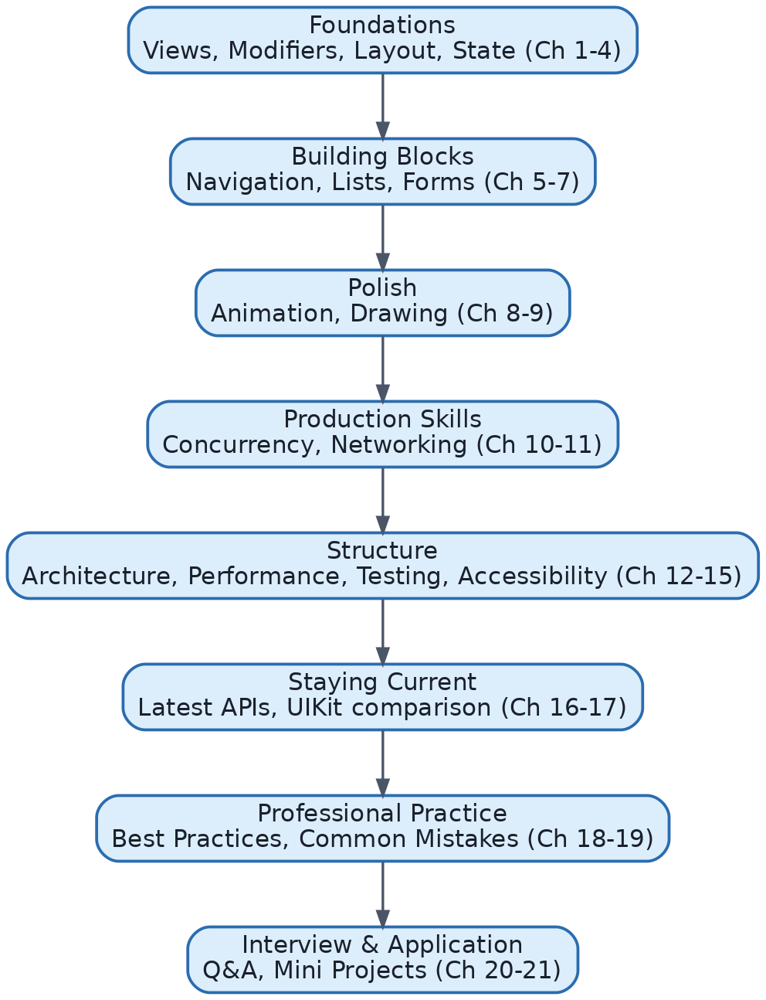{width=85%}

## 22.2 Senior Developer Checklist

- Can explain SwiftUI's rendering/diffing model (view identity, invalidation) without notes.
- Defaults to `@Observable`/`@State`/`@Bindable`/`@Environment`; recognizes and can migrate legacy `ObservableObject` code.
- Models async state as an explicit enum; never scattered booleans.
- Builds networking/persistence behind protocols; injects dependencies via initializers.
- Chooses MVVM/TCA/Clean Architecture deliberately based on team size and app complexity, not by default habit.
- Profiles performance with Instruments before optimizing; understands `.equatable()`, lazy containers, and identity's role in performance.
- Writes unit tests against view models (not view rendering), uses previews for visual states, reserves UI tests for critical flows.
- Never ships icon-only buttons without accessibility labels; tests at large Dynamic Type sizes and with VoiceOver on.
- Tracks WWDC changes yearly and can explain *why* each significant API change happened, not just that it happened.
- Knows concretely when UIKit interop is still the right call.

## 22.3 Common Interview Tips

- Expect "why," not just "what" — be ready to explain the *reasoning* behind a pattern (e.g., why `@Observable` is more efficient), not just recite syntax.
- When asked to compare old vs. new APIs, structure your answer as: what changed → why → old code → new code → migration → interview-relevant subtlety. This guide's Chapter 16 models that structure.
- For system-design-style SwiftUI questions (e.g., "design a navigation system for a large app"), narrate trade-offs out loud — interviewers care about your reasoning process as much as the final answer.
- Bring a concrete example from your own experience (or a mini project from Chapter 21) when discussing architecture — abstract answers alone are less convincing than a real example you can describe in detail.

## 22.4 Best Practices Checklist (Consolidated)

1. Small, focused views; extract subviews once `body` grows past ~30-40 lines.
2. Stable, meaningful `Identifiable` conformance everywhere `ForEach`/`List` is used — never array indices.
3. `@State` always `private`; view models own business logic and are injected, not created inline in `body`.
4. Async UI state modeled as one enum (`LoadState`), not scattered booleans.
5. Networking/persistence behind protocols for testability.
6. Design tokens (color/font/spacing) centralized, not hardcoded per-view.
7. Accessibility labels on every icon-only control; semantic fonts everywhere; test at large Dynamic Type sizes.
8. Profile before optimizing; use `.equatable()`/lazy containers deliberately, not by default.
9. Feature-based folder structure once an app grows beyond a handful of screens.
10. Track and migrate legacy APIs (`ObservableObject`, `NavigationView`) proactively, not reactively.

## 22.5 Migration Guide for Older SwiftUI Code

| From | To | Steps |
|---|---|---|
| `NavigationView` | `NavigationStack` | Replace container; convert `NavigationLink(destination:)` push patterns to value-based links + `.navigationDestination(for:)` where possible. |
| `ObservableObject` + `@Published` | `@Observable` | Remove protocol conformance and `@Published`; add `@Observable` macro to the class. |
| `@StateObject` | `@State` | Change property wrapper once the underlying class is `@Observable`. |
| `@ObservedObject` | plain reference / `@Bindable` | Use a plain `let`/`var` for read-only access; add `@Bindable` only where you need `$object.property` bindings. |
| `@EnvironmentObject` | `@Environment(Type.self)` | Change injection to `.environment(object)`; change consumption to `@Environment(Type.self)`. |
| Core Data | SwiftData | Replace `NSManagedObject` subclasses with `@Model` classes; replace `@FetchRequest` with `@Query`; plan a data migration path for existing user data. |
| `.animation(_:)` valueless | `.animation(_:value:)` | Add the explicit `value:` parameter matching the specific state driving the animation. |

Migrate incrementally, file by file, verifying behavior at each step — both legacy and modern systems can coexist during a transition period.

## 22.6 Recommended Resources

**WWDC Sessions** (search by title on Apple's developer video library):

- "What's New in SwiftUI" (yearly, watch every year's edition for the deltas)
- "Demystify SwiftUI"
- "SwiftUI Performance" / "Optimize SwiftUI performance with Instruments"
- "Discover Observation in SwiftUI"
- "Meet SwiftData" / "What's New in SwiftData"
- "Bring Navigation to your SwiftUI app" (NavigationStack deep dive)
- "Animate with springs" / "Explore SwiftUI animation"

**Apple Documentation:**

- The official SwiftUI API reference — check every symbol's "Available when" platform/version notes.
- Human Interface Guidelines (HIG) — for platform-appropriate UX conventions referenced throughout this guide.
- The Swift Concurrency documentation for async/await, actors, and Sendable deep dives.

**Books and Ongoing Learning:**

- Apple's own guided SwiftUI tutorials, for hands-on practice.
- Community resources such as Swift with Majid, Hacking with Swift, and objc.io's SwiftUI-focused publications for practical, frequently-updated deep dives that track each yearly SwiftUI release.
- The Composable Architecture's official documentation and GitHub repository, if pursuing TCA further.

## 22.7 Closing Note

This guide has moved from "what is a View" to designing navigation systems, migrating legacy state management, and reasoning about performance at scale — the same arc a SwiftUI engineer travels over several years of real project work. Revisit Chapters 4, 13, and 16 periodically: state management, performance, and "what's new" are the three areas that most reward continual review as both your projects and SwiftUI itself keep evolving.


